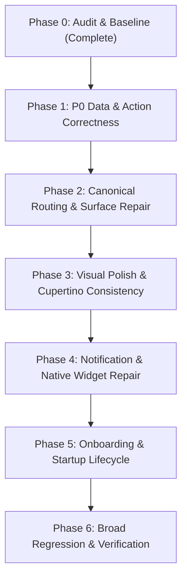

# NoteKar: Bug & UX Audit Report and Antigravity Repair Specification

**Audit Date**: October 8, 2026  
**Workspace**: `Notekar - Flutter`  
**Branch**: `dev`  
**Verification on 2026-10-08**: `flutter test --reporter compact` completed with **248 tests passing**; `flutter analyze --no-pub` completed with **no issues**; `flutter build apk --debug --no-pub` succeeded. This verifies the Flutter test/analyzer baseline and a debug Android build, not runtime/OEM behavior.  
**Resolved Android SDK configuration**: compile SDK 36 | target SDK 35 | **min SDK 24** (from the generated debug merged manifest). Verify release build configuration separately if it differs.  

---

## 1. Executive Summary & Audit Methodology

The source-backed audit and binding implementation decisions are contained in this single document. `DESIGN_SYSTEM.md` is an existing in-project design reference, not a second audit or implementation report.

This is a source and route audit, supplemented by the Flutter test suite, analyzer and one successful debug APK build. It is not a claim that every screen was manually exercised on physical hardware. Visual/OEM/native behaviors needing screenshots or runtime reproduction are explicitly marked as such.

The audit examined:
1. **Core Data & Logging Paths**: `lib/screens/note_kar_home.dart`, `lib/dialogs/history_dialog.dart`, `lib/models/history_timeline_models.dart`, `lib/dialogs/manual_entry_dialog.dart`.
2. **Settings & Analytical Destinations**: `lib/dialogs/settings_dialog.dart`, `lib/dialogs/settings/*.dart`, `lib/screens/executive_intelligence_hub_screen.dart`, `lib/dialogs/settings/life_audit_page.dart`, `lib/services/user_profile_service.dart`.
3. **Android Native Subsystems**: `android/app/src/main/kotlin/app/notekar/notekar/MainActivity.kt`, `QuickNoteActivity.kt`, `NoteKarWidgetProvider.kt`, `SobrietyWidgetProvider.kt`, `LifeAuditWidgetProvider.kt`, and `AndroidManifest.xml`.
4. **Startup & Onboarding Lifecycle**: `lib/screens/welcome_screen.dart`, `lib/widgets/zen_doodle_splash.dart`, launch themes, and initialization callbacks.
5. **Shared notice-feed integration only**: the live campaign feed and guides in the sibling `NotekarN` folder, plus the feed consumer in the `Notekar` PWA. This is not a general website redesign; it is included because the Android app, in-app Bulletins, PWA and remote campaign file all consume or document the same notification feature.

---

## 2. Confirmed Defects & Detailed Root Cause Analysis

Deterministic source defects are marked **Confirmed in source**. User-reported visual symptoms, Android/OEM behavior and any impact that requires an installed-device reproduction are labeled **Needs reproduction** or **device verification**; those are not represented as observed facts.

### Defect A.1: Gap "Log" Discards Prefilled Start/End Interval
* **Status**: **CONFIRMED**
* **Severity**: **P0 (Data Integrity / Broken Interaction)**
* **Affected Code Path**: [`lib/dialogs/history_dialog.dart#L1593-L1598`](file:///C:/Users/dheer/OneDrive/Documents/dv/Android%20Projects/Project%20YABP%20DigitalSuraksha/Notekar%20-%20Flutter/lib/dialogs/history_dialog.dart#L1593-L1598) and [`lib/dialogs/history_dialog.dart#L554-L562`](file:///C:/Users/dheer/OneDrive/Documents/dv/Android%20Projects/Project%20YABP%20DigitalSuraksha/Notekar%20-%20Flutter/lib/dialogs/history_dialog.dart#L554-L562).
* **Reproduction**:
  1. Open History $\rightarrow$ Life Ledger view with an untracked gap between sessions (e.g. 10:00 AM – 11:30 AM).
  2. Tap "Log" on the `TimelineGapCard`.
  3. The `ManualEntryContent` appears.
  4. Notice the start and end time fields show the current clock time instead of 10:00 AM and 11:30 AM.
* **Observed Result**:
  `_handleOpenManualEntry` accepts `prefilledStartTime` and `prefilledEndTime`, but only calls `setState(() => _inSheetView = 'manual')`. It never saves the parameters to state fields. When `ManualEntryContent` is constructed at line 554, `prefilledStartTime` and `prefilledEndTime` are not passed.
* **Expected Result**:
  ManualEntry opens in session mode with start and end times pre-populated to the exact gap boundary selected.
* **Proposed Fix**:
  Add `DateTime? _manualPrefilledStartTime` and `DateTime? _manualPrefilledEndTime` to `_HistoryDialogState`. Set them inside `_handleOpenManualEntry`, pass them to `ManualEntryContent`, and reset them upon submission or cancellation.

---

### Defect A.2: Rest Claim Has Dual Divergent Writers with Different Moment IDs
* **Status**: **CONFIRMED**
* **Severity**: **P0 (Data Integrity / State Desynchronization)**
* **Affected Code Path**: [`lib/dialogs/history_dialog.dart#L1553-L1590`](file:///C:/Users/dheer/OneDrive/Documents/dv/Android%20Projects/Project%20YABP%20DigitalSuraksha/Notekar%20-%20Flutter/lib/dialogs/history_dialog.dart#L1553-L1590) and [`lib/screens/note_kar_home.dart#L2444-L2474`](file:///C:/Users/dheer/OneDrive/Documents/dv/Android%20Projects/Project%20YABP%20DigitalSuraksha/Notekar%20-%20Flutter/lib/screens/note_kar_home.dart#L2444-L2474).
* **Reproduction**:
  1. Open History, locate an untracked gap card, and tap "Rest".
  2. The sheet shows a notice with an "Undo" action.
  3. Tap "Undo" or inspect database records.
* **Observed Result**:
  `HistoryDialog._claimRest` optimistically instantiates and adds an IN/OUT pair using `math.max(maxId + 1, startMs)` and wires its Undo callback to those local moments. Then it calls `widget.onClaimRest!(start, end)`. The parent callback `NoteKarHome._claimRestGap` separately generates *another* pair with `_nextId++` and saves that separate pair to `_repository.saveMoment()`. If the user taps Undo in HistoryDialog, `_removeSession` attempts to delete moments with the optimistic IDs, which do not match the database IDs. The database records remain undeleted! Additionally, rapid taps can invoke the method twice.
* **Expected Result**:
  Single authoritative write path: parent creates the moments, persists them to the repository, returns the authoritative moments (or a future completes), and the sheet updates its local state with the exact persisted IDs. Debounce/idempotency guard prevents duplicate writes.

---

### Defect A.3: Calendar View Fails to Render Gap Items (Parity Loss)
* **Status**: **CONFIRMED**
* **Severity**: **P1 (UX / Visual Inconsistency)**
* **Affected Code Path**: [`lib/widgets/history_calendar_view.dart#L682-L824`](file:///C:/Users/dheer/OneDrive/Documents/dv/Android%20Projects/Project%20YABP%20DigitalSuraksha/Notekar%20-%20Flutter/lib/widgets/history_calendar_view.dart#L682-L824).
* **Reproduction**:
  1. Have sessions with a >15-minute gap on a given day.
  2. In History, view the day in Life Ledger: the `TimelineGapCard` renders.
  3. Switch to Calendar view: the gap is missing; only `TimelineSessionItem` and `TimelineSingleItem` are rendered.
* **Observed Result**:
  `HistoryCalendarView` receives `TimelineDaySection` containing `TimelineGapItem` instances, but only branches on `if (it is TimelineSessionItem)` and `else if (it is TimelineSingleItem)`. `TimelineGapItem` is discarded.
* **Expected Result**:
  Calendar view supports `TimelineGapItem` with parity: renders a calm gap indicator card with duration and an action to claim Rest or manually log.

---

### Defect A.4: Gap Generation Boundaries & Multi-Day Safety
* **Status**: **CONFIRMED**
* **Severity**: **P1 (Data Presentation)**
* **Affected Code Path**: [`lib/models/history_timeline_models.dart#L280-L330`](file:///C:/Users/dheer/OneDrive/Documents/dv/Android%20Projects/Project%20YABP%20DigitalSuraksha/Notekar%20-%20Flutter/lib/models/history_timeline_models.dart#L280-L330).
* **Analysis**:
  `buildTimelineDaySections` groups moments by date key, sorts ascending by timestamp, and inserts gaps when `currentStart - previousEnd >= 15 minutes`. Gaps are clamped within the single calendar day boundaries. Open/overnight sessions without matching 'out' endpoints default `endTimestamp` to `startTimestamp`. The threshold (15 min) and single-day scoping are correct for day ledger presentation, but safeguards must protect against negative or 0-duration gaps caused by clock alterations or corrupted database timestamps.

---

### Defect A.5: Active Live Session Separation from Historical Rest Claims
* **Status**: **Historical claim does not mutate the Home session in the inspected callback; cross-surface widget/notification state still requires device verification**
* **Severity**: **P0 (State Integrity)**
* **Affected Code Path**: [`lib/screens/note_kar_home.dart#L2444-L2474`](file:///C:/Users/dheer/OneDrive/Documents/dv/Android%20Projects/Project%20YABP%20DigitalSuraksha/Notekar%20-%20Flutter/lib/screens/note_kar_home.dart#L2444-L2474).
* **Analysis**:
  A historical Rest claim must never modify the currently running live session (`_sessionStart`, `_inout`, pause state, or notification chronometer). The inspected `_claimRestGap` callback adds the historical pair without changing those Home fields. The remaining risk is cross-surface refresh: verify the widget and persistent notification continue to use the active session state rather than infer it from the latest historical database moment. Treat stale display as unconfirmed until reproduced.

---

### Defect B.1 & B.2: Destination Duplication (Dashboard vs Executive Intelligence Hub vs Life Audit)
* **Status**: **CONFIRMED**
* **Severity**: **P1 (Information Architecture / Navigation Trust)**
* **Affected Code Path**:
  - `lib/dialogs/settings/settings_dashboard_page.dart`
  - `lib/screens/executive_intelligence_hub_screen.dart`
  - `lib/dialogs/settings/life_audit_page.dart`
* **Analysis**:
  - `SettingsDashboardPage`: Serves as the high-level, compact overview in Settings. It summarizes today/week statistics and provides entry cards.
  - `ExecutiveIntelligenceHubScreen`: Serves as the full-screen, deep-dive analytical destination with detailed activity rings, 90-day consistency heatmap, and circadian rhythm.
  - `LifeAuditPage`: Serves as the philosophical Memento Mori and conscious time partition ledger (sleep/essentials sliders, void calculation, age horizon).
  - **The Issue**: Links between these surfaces were ambiguous and inconsistent. In `ExecutiveIntelligenceHubScreen`, tapping to configure personal profile pushed an ad-hoc route wrapping `PersonalProfileSettingsPage` instead of routing cleanly.
* **Canonical Routing Resolution**:
  - Retain all three screens with distinct, focused purposes.
  - Tapping "Open Full Intelligence Hub" from Dashboard pushes `ExecutiveIntelligenceHubScreen.route()`.
  - Tapping "Life Audit" from Dashboard or History opens canonical `LifeAuditPage`.
  - Tapping "Calibrate" / "Configure Profile" from anywhere routes to canonical `PersonalProfileSettingsPage`.

---

### Defect B.3: Life Audit Text Collisions & Truncations ("The Cost of the Vo...")
* **Status**: **User-reported; source exposes constrained layout; exact device rendering must be captured**
* **Severity**: **P1 (Visual Quality / Apple HIG Craft)**
* **Affected Code Path**: [`lib/dialogs/settings/life_audit_page.dart#L426-L442`](file:///C:/Users/dheer/OneDrive/Documents/dv/Android%20Projects/Project%20YABP%20DigitalSuraksha/Notekar%20-%20Flutter/lib/dialogs/settings/life_audit_page.dart#L426-L442) and [`lib/dialogs/settings/life_audit_page.dart#L1018-L1055`](file:///C:/Users/dheer/OneDrive/Documents/dv/Android%20Projects/Project%20YABP%20DigitalSuraksha/Notekar%20-%20Flutter/lib/dialogs/settings/life_audit_page.dart#L1018-L1055).
* **Reproduction**:
  The steps below are a reproduction procedure, not a claim that the compact-device rendering was captured during this source audit.
  1. Capture Life Audit on a compact-width device and again at 1.3x and 2.0x system text scale.
  2. In the empty state card, observe the header: `'THE COST OF THE VO...'` is truncated due to `maxLines: 1` alongside `'0 DATA AVAILABLE'`.
  3. In the daily ledger list, observe `Row(mainAxisAlignment: MainAxisAlignment.spaceBetween)` where date title and `'Fully Accounted' / '... lost'` collide and can cause RenderFlex overflow.
* **Proposed Fix**:
  Allow headers to wrap or reflow cleanly without `maxLines: 1` truncation. In the daily ledger row, wrap the title row in `Expanded` with proper overflow handling so items never push each other off-screen.

---

### Defect B.4: Life Audit Time-Partition Sliders Use Material `Slider` with Raw Colors
* **Status**: **CONFIRMED**
* **Severity**: **P1 (Design System Inconsistency)**
* **Affected Code Path**: [`lib/dialogs/settings/life_audit_page.dart#L274-L293`](file:///C:/Users/dheer/OneDrive/Documents/dv/Android%20Projects/Project%20YABP%20DigitalSuraksha/Notekar%20-%20Flutter/lib/dialogs/settings/life_audit_page.dart#L274-L293) and [`lib/dialogs/settings/life_audit_page.dart#L317-L336`](file:///C:/Users/dheer/OneDrive/Documents/dv/Android%20Projects/Project%20YABP%20DigitalSuraksha/Notekar%20-%20Flutter/lib/dialogs/settings/life_audit_page.dart#L317-L336).
* **Analysis**:
  The sliders use Material `SliderTheme` and `Slider` with hardcoded `Colors.blueGrey.shade600` and `Colors.amber.shade700`. This directly violates NoteKar's Apple HIG Cupertino design guidelines and `Palette` token contract.
* **Proposed Fix**:
  Replace Material Slider with a Cupertino-inspired or tokenized `NkSlider` that uses `CupertinoSlider` (or semantic `p.accent`, `p.surface3`, `p.text` tokens) with haptic feedback, accessible increment/decrement, and live label readout.

---

### Defect B.5: Calibrate Callback Dead-End in HistoryDialog
* **Status**: **CONFIRMED**
* **Severity**: **P1 (Broken User Flow)**
* **Affected Code Path**: [`lib/dialogs/history_dialog.dart#L617`](file:///C:/Users/dheer/OneDrive/Documents/dv/Android%20Projects/Project%20YABP%20DigitalSuraksha/Notekar%20-%20Flutter/lib/dialogs/history_dialog.dart#L617) and [`lib/dialogs/settings/life_audit_page.dart#L1225`](file:///C:/Users/dheer/OneDrive/Documents/dv/Android%20Projects/Project%20YABP%20DigitalSuraksha/Notekar%20-%20Flutter/lib/dialogs/settings/life_audit_page.dart#L1225).
* **Reproduction**:
  1. Open History $\rightarrow$ Menu $\rightarrow$ Life Audit when no DOB has been configured.
  2. Tap the "Calibrate" button.
* **Observed Result**:
  Nothing happens. `HistoryDialog` instantiates `LifeAuditPage` without providing `onOpenPersonalProfile` (`null`).
* **Proposed Fix**:
  Provide `onOpenPersonalProfile` callback in `HistoryDialog` that opens `PersonalizationSetupDialog` (or routes to Personal Profile) and refreshes state upon return.

---

### Defect C.1: Category Preference Key Mismatch Between Flutter and Kotlin
* **Status**: **CONFIRMED**
* **Severity**: **P0 (Native/Flutter Desynchronization)**
* **Affected Code Path**:
  - `lib/utils/category_service.dart:128`: `static const String keyCustomCategories = 'notekar.custom_categories';` (stored in SharedPreferences as `"flutter.notekar.custom_categories"`).
  - `android/app/src/main/kotlin/app/notekar/notekar/QuickNoteActivity.kt:112`: `flutterPrefs.getString("flutter.custom_categories", null)`
  - `lib/utils/category_service.dart:129`: `static const String keyActiveCategory = 'notekar.active_category';` (stored as `"flutter.notekar.active_category"`).
  - `QuickNoteActivity.kt:212`: writes `"flutter.active_category"`.
* **Observed Result**:
  `QuickNoteActivity` always reads null for custom categories and falls back to a hardcoded list ("Work, Study, Gym, Reading, Personal, Health, Routine") instead of displaying the user's real configured categories!
* **Proposed Fix**:
  In `QuickNoteActivity.kt`, inspect `"flutter.notekar.custom_categories"` first with fallback to `"flutter.custom_categories"`. Sync active category to both `"flutter.notekar.active_category"` and `"flutter.active_category"`.

---

### Defect C.2: Notification Action Duplication (Redundant "+ Note" Action)
* **Status**: **CONFIRMED**
* **Severity**: **P1 (UX Inconsistency)**
* **Affected Code Path**: [`android/app/src/main/kotlin/app/notekar/notekar/MainActivity.kt#L1497-L1511`](file:///C:/Users/dheer/OneDrive/Documents/dv/Android%20Projects/Project%20YABP%20DigitalSuraksha/Notekar%20-%20Flutter/android/app/src/main/kotlin/app/notekar/notekar/MainActivity.kt#L1497-L1511).
* **Observed Result**:
  Persistent notification displays `[Log IN / ⚡ Log]`, `[🏷️ Modes]`, AND `[+ Note]`. This creates 3 actions where the user is confused between logging and adding a note.
* **Expected Result**:
  Consolidate into one clear **Log** action (`Log IN` or `⚡ Log`), **Modes** action, and session controls (`Pause/Resume` / `Log OUT`). The single Log action opens the quick composer with optional note and tag entry, eliminating the redundant separate `+ Note` CTA.

---

### Defect C.3: Keyboard Covers Native Quick Composer (Missing `adjustResize` & ScrollView)
* **Status**: **CONFIRMED**
* **Severity**: **P0 (Accessibility / Blocking Defect)**
* **Affected Code Path**:
  - `android/app/src/main/AndroidManifest.xml:278-283`: `QuickNoteActivity` lacks `android:windowSoftInputMode="adjustResize"`.
  - `android/app/src/main/kotlin/app/notekar/notekar/QuickNoteActivity.kt:46-55`: Card is a 320dp fixed-width `LinearLayout` centered in a `FrameLayout` without a `ScrollView`.
* **Reproduction**:
  1. Trigger Quick Note from notification or tile.
  2. Tap note text field so keyboard opens.
  3. The card remains centered and the bottom action buttons ("Log OUT Now" / "Log IN Now" / "Save") are pushed behind the keyboard and completely unreachable.
* **Proposed Fix**:
  Add `android:windowSoftInputMode="adjustResize"` in `AndroidManifest.xml`. Wrap the dialog card inside a vertical `ScrollView` with max-height constraints and top/bottom padding so the entire dialog scrolls smoothly above the IME.

---

### Defect C.4: Hashtag Auto-Suggestions Missing While Typing `#` in Quick Note
* **Status**: **CONFIRMED**
* **Severity**: **P1 (Feature Polish)**
* **Affected Code Path**: [`android/app/src/main/kotlin/app/notekar/notekar/QuickNoteActivity.kt#L370-L440`](file:///C:/Users/dheer/OneDrive/Documents/dv/Android%20Projects/Project%20YABP%20DigitalSuraksha/Notekar%20-%20Flutter/android/app/src/main/kotlin/app/notekar/notekar/QuickNoteActivity.kt#L370-L440).
* **Analysis**:
  QuickNoteActivity only renders a static horizontal scroll view of chips. When typing `#work` into the `EditText`, there is no popup or filtered suggestion view.
* **Proposed Fix**:
  Add a `TextWatcher` to `input` that detects `#<query>`, filters user's custom tags, and renders dynamic suggestion chips above the keyboard for one-tap insertion.

---

### Defect D.7: Goal Timeframe Segmented Control Cramped on Narrow Displays
* **Status**: **CONFIRMED**
* **Severity**: **P2 (Visual Density)**
* **Affected Code Path**: [`lib/dialogs/goals_sheet.dart#L1253-L1285`](file:///C:/Users/dheer/OneDrive/Documents/dv/Android%20Projects/Project%20YABP%20DigitalSuraksha/Notekar%20-%20Flutter/lib/dialogs/goals_sheet.dart#L1253-L1285).
* **Analysis**:
  5 enum options (`Weekly`, `Monthly`, `Yearly`, `Custom Date`, `All Time`) crammed into a single `CupertinoSlidingSegmentedControl` cause label clipping on narrow phone widths.
* **Proposed Fix**:
  Use individual selectable Apple HIG pills or a clean 2-row wrapped segmented pill layout.

---

### Defect E.1 & E.2: Startup Onboarding Race Condition Before Repository Initialization
* **Status**: **CONFIRMED**
* **Severity**: **P0 (Lifecycle / Architecture)**
* **Affected Code Path**: [`lib/screens/note_kar_home.dart#L769-L785`](file:///C:/Users/dheer/OneDrive/Documents/dv/Android%20Projects/Project%20YABP%20DigitalSuraksha/Notekar%20-%20Flutter/lib/screens/note_kar_home.dart#L769-L785).
* **Observed Result**:
  `await _showWelcomeIfNeeded(prefs)` is called *before* `await _repository.initialize(...)`. If a user is on WelcomeScreen, the database is uninitialized, meaning any background broadcast or widget log races with empty repository state.
* **Proposed Fix**:
  Initialize `_repository` *before* evaluating and presenting `_showWelcomeIfNeeded`.

---

## 3. Complete Deliverable 1: Screen & Route Inventory

| Screen / Dialog / Sheet | Current Entry Point(s) | Canonical Destination | Retained State | Data Source | Accessibility & Constraints | Proposed Consistency Fix |
| :--- | :--- | :--- | :--- | :--- | :--- | :--- |
| **NoteKarHome** | App launch, launcher icon | `NoteKarHome` | Timer, session status, moments list | `MomentRepository`, `SharedPreferences` | Full screen, 48dp touch targets, semantic live regions | Initialize repository prior to any onboarding presentation. |
| **HistoryDialog (Ledger)** | Swipe up on Home, Ledger icon | `HistoryDialog(initialView: null)` | Scroll position, active filters | `_entries`, `MomentRepository` | Apple HIG bottom sheet, TalkBack labeled entries | Fix Rest single-authority writing; fix gap prefill forwarding. |
| **HistoryDialog (Calendar)** | Calendar tab in HistoryDialog | `HistoryDialog(initialView: 'calendar')` | Selected day index, filters | `TimelineDaySection`, `_entries` | Day-swipe calendar view, 24h timeline blocks | Add parity rendering for `TimelineGapItem`. |
| **HistoryDialog (Goals)** | Goals tab, or Settings Dashboard | `HistoryDialog(initialView: 'goals')` | Goals list, active category | `GoalsService`, `MomentRepository` | Inline goal creation, progress gauges | Already routed from Settings Dashboard; keep canonical. |
| **SettingsDialog** | Gear icon on Home | `SettingsDialog` | Navigation category stack | `SharedPreferences`, `AdaptiveEngine` | Apple HIG modal sheet, Cupertino navigation | Standardize subpage transitions and avoid duplicate nested wrappers. |
| **SettingsDashboardPage** | Default view of SettingsDialog | `SettingsDashboardPage` | Selected timeframe (day/week/month) | `DashboardMetricsService`, `_entries` | Inset grouped cards, metric badges | Keep role as concise overview; all deep-links route to canonical destinations. |
| **ExecutiveIntelligenceHubScreen** | "Open Full Intelligence Hub" button | `ExecutiveIntelligenceHubScreen` | Selected timeframe | `MomentRepository`, `LifeAuditService` | Full-screen push route, activity rings | Replace ad-hoc profile sub-route with canonical profile navigation. |
| **LifeAuditPage** | Settings menu, Dashboard card, History menu | `LifeAuditPage` | Timeframe, sleep/essential sliders | `LifeAuditService`, `UserProfileService` | Memento Mori projection, 24h allocation | Fix width/text collisions, replace Material Slider with Cupertino slider, wire calibrate callback. |
| **PersonalProfileSettingsPage** | Settings menu, Life Audit calibrate button | `PersonalProfileSettingsPage` | User name, DOB, avatar, lifespan | `UserProfileService` | Form inputs, Cupertino date picker | Canonical single source for user identity; refresh dependent listeners on save. |
| **ManualEntryContent** | History "+" button, Gap card "Log" | `ManualEntryContent` | Start/end times, category, note, tags | `CategoryService`, `GoalsService` | Form sheet, Cupertino time selectors | Forward `prefilledStartTime` and `prefilledEndTime` from gap cards. |
| **QuickNoteActivity (Android)** | Notification action, Widget button, QS Tile | `QuickNoteActivity` | Note text, selected mode, tag chips | Android SharedPreferences | Translucent activity overlay | Add `adjustResize`, wrap in vertical `ScrollView`, fix category SharedPreferences keys, add `#` auto-suggest. |

---

## 4. Complete Deliverable 2: Settings Interaction Inventory

| Setting Domain | Setting Title | Control Type | Persistence Key | Options Count | Live Preview | Apply Timing | Fix / Polish Needed |
| :--- | :--- | :--- | :--- | :--- | :--- | :--- | :--- |
| **Personalization** | Theme Mode | Segmented Control | `m-theme` | 3 (Dark, Light, AMOLED) | Yes (immediate) | Immediate | Source offers Dark, Light and AMOLED; do not label a System theme that is not present. |
| **Personalization** | Accent Color | Visual Swatch Grid | `m-accent-color` | 20 Colors | Yes (representative) | Immediate | Source has 20 named accents, not 8. Exercise all 20 across theme/contrast combinations; keep success, warning and destructive semantics distinct from accent. |
| **Personalization** | App Icon Style | Preview Cards | `m-app-icon-style` | 8 Launcher Aliases | Yes (icon graphic) | Immediate / Launcher | Keep alias switching; verify delay feedback. |
| **Personalization** | Translucency | Adaptive Switch | `m-translucency` | 2 (On / Off) | Yes | Immediate | Show honest capability badge based on `AdaptiveEngine().supportsBlur`; do not show a fake one-second modal spinner for this local preference. |
| **Display & Clock** | Clock Typography | Segmented Control | `m-clock-font` | 4 Families | Yes | Immediate | Add tabular figures preview card. |
| **Display & Clock** | Time Format | Adaptive Choice | `m-use-24-hour` | 2 (12h / 24h) | Yes | Immediate | Reflect live time preview; this is the actual load/save key. |
| **Logging Defaults** | Default Mode | Segmented Control | `m-default-mode` | 3 (Two-way, Single, Last Used) | No | Immediate | The existing UI and app support all three values; test each launch and widget/notification path. |
| **Advanced** | Background Safeguards | Action Row + Status Pill | CircuitBreakerService | Dynamic | Status Pill | On Tap | Displays `Healthy` vs `Action Needed` with feedback. |
| **Life Audit** | Sleep Hours | Slider | `time_audit_sleep_hours` | Continuous (4-12h) | Live 24h bar | Immediate | Replace Material `Slider` with Cupertino-styled slider. |
| **Life Audit** | Essentials Hours | Slider | `time_audit_essentials_hours` | Continuous (1-8h) | Live 24h bar | Immediate | Replace Material `Slider` with Cupertino-styled slider. |
| **Update Center** | Build Track | Track Select Dialog | `m-build-track` | 3 (Stable, Beta, Nightly) | Warning Dialog | On Confirm | Backup warning dialog with circular "Don't ask again" toggle. |

---

## 5. Complete Deliverable 3: Notification & Widget Behavior Matrix

| Surface / Action | Trigger / Owner | Required Permissions | Action Result | Keys Modified | Android Constraints | Error Feedback |
| :--- | :--- | :--- | :--- | :--- | :--- | :--- |
| **Persistent Notification (Log)** | Persistent notification in shade | `POST_NOTIFICATIONS` | Opens `QuickNoteActivity` with optional note/tags | `flutter.notekar.active_category` | Android 13+ runtime permission | Falls back to system notification error |
| **Persistent Notification (Modes)** | "Modes" button in shade | `POST_NOTIFICATIONS` | Opens `QuickNoteActivity(showModes=true)` | `active_category`, `m-default-mode` | SingleInstance activity | Toast / visual picker |
| **Persistent Notification (Pause/Resume)** | "Pause/Resume" button | `POST_NOTIFICATIONS` | Toggles live session running/pause state | `is_session_running`, `pause_timestamp` | Background broadcast receiver | Updates notification chronometer instantly |
| **NoteKar Main Widget (1-Tap Log)** | User taps widget surface | None | Logs instantaneous Moment or toggles session | `NoteKarWidgetProvider.PREFS_NAME`, broadcast | RemoteViews background execution limit | Haptic click + RemoteViews immediate repaint |
| **Sobriety Widget** | User taps "Urge Surfed" | None | Increments urge streak counter | `sobriety_milestone`, `sobriety_start` | RemoteViews repaint | Visual counter increment |
| **Life Audit Widget** | Periodic update / app log | None | Displays lived % and conscious weeks | Reads `UserProfileService` DOB | Glanceable widget layout | Empty state if DOB uncalibrated |
| **Quick Settings Tile** | System notification shade pull | `BIND_QUICK_SETTINGS_TILE` | Launches `QuickNoteActivity` | Same as QuickNote | Android 7.0+ TileService | System tile state reflects active/inactive |

---

## 6. Complete Deliverable 4: Compatibility Matrix

| Dimension | Specification | Verification Strategy | Observed Compatibility Risk | Remediation |
| :--- | :--- | :--- | :--- | :--- |
| **Compile SDK** | 36 (Android 16 preview/release) | Gradle build | Compatible with modern Android APIs | Retain |
| **Target SDK** | 35 (Android 15) | Manifest / build | Stricter background broadcast & edge-to-edge rules | Set each manifest component's exported/permission attributes correctly; use the correct exported/not-exported flags for dynamically registered receivers |
| **Min SDK** | 24 in the successful debug merged manifest | Generated debug manifest | Supported app baseline is Android 7.0; verify release variant separately | Run the Android build and test API 24 plus representative newer APIs |
| **Edge-to-Edge & Insets** | Android 15 Enforced | `SystemUiOverlayStyle` & SafeArea | Bottom navigation bar overlap on gesture nav | Verify `SafeArea` and `WindowInsets` on Android 15 |
| **Predictive Back** | `android:enableOnBackInvokedCallback="true"` | Manifest | Hardware back button dismissing modal sheets | Flutter's `PopScope` handles predictive back cleanly |
| **Font Scaling** | System accessibility 1.0x - 2.0x | MediaQuery `textScaler` | Text overflow in cards and buttons | Use `FittedBox(fit: BoxFit.scaleDown)` and `Expanded` with wrapping |
| **Foldables / Tablets** | Multi-window / Split-screen | MediaQuery layout | Centered 320dp cards look unconstrained or clip | Ensure responsive max-width bounds (e.g. `clamp(320, width * 0.9, 520)`) |

---

## 7. Complete Deliverable 5: Flow-Based Bug Matrix

| User Journey | Observed Result | Expected Result | Severity | Test Coverage |
| :--- | :--- | :--- | :--- | :--- |
| **Gap $\rightarrow$ Manual Log** | Prefilled start/end times dropped | Start/end times pre-populated in form | P0 | Needs new widget test in `test/gap_prefill_and_rest_test.dart` |
| **Gap $\rightarrow$ Claim Rest** | Dual moment creation with differing IDs | Single authoritative moment creation with valid undo | P0 | Needs unit test verifying exact returned moment IDs |
| **Calendar $\rightarrow$ View Gaps** | Gaps completely omitted from day view | Gaps rendered consistently with Ledger | P1 | Needs widget test in `test/calendar_gap_parity_test.dart` |
| **Notification $\rightarrow$ Quick Log** | Keyboard covers action button; wrong categories | Keyboard resizes sheet; real categories shown | P0 | Kotlin layout unit & manual smoke test |
| **Life Audit $\rightarrow$ Calibrate DOB** | Tapping "Calibrate" in History is a no-op | Opens Personal Profile and updates horizon | P1 | Needs widget test verifying callback execution |
| **Life Audit $\rightarrow$ View Ledger** | "THE COST OF THE VO..." truncated; row text collision | Clean text wrap; no RenderFlex collisions | P1 | Needs widget test with 320dp screen constraints |
| **First Launch $\rightarrow$ Welcome** | Repository uninitialized during onboarding | Repository fully initialized prior to Welcome | P0 | Lifecycle ordering test in home test suite |

---

## 8. Severity-Ranked Implementation Roadmap



### Phase 1: P0 Data and Action Correctness
1. Store and forward `prefilledStartTime` and `prefilledEndTime` from `_handleOpenManualEntry` to `ManualEntryContent` in `HistoryDialog`.
2. Refactor `HistoryDialog._claimRest` and `NoteKarHome._claimRestGap` into a single authoritative write path: parent saves moments and passes exact instances back to child, with idempotency guards and functional Undo.
3. Add `TimelineGapItem` rendering support to `HistoryCalendarView` for full parity with Ledger.
4. Move `_repository.initialize(...)` prior to `_showWelcomeIfNeeded(...)` in `NoteKarHome`.

### Phase 2: Canonical Routing & Overlapping-Page Repair
1. Unify Personal Profile navigation from `LifeAuditPage` (in both Settings and History) and `ExecutiveIntelligenceHubScreen`.
2. Ensure back navigation always returns to the exact calling surface with refreshed `UserProfileService` state.

### Phase 3: Visual Polish & Selector Consistency
1. Fix Life Audit card width constraints and `maxLines: 1` truncation of "The Cost of the Void".
2. Fix `Row` text collisions in `LifeAuditPage` daily ledger items using `Expanded` and text wrapping.
3. Replace Material `Slider` with Cupertino/tokenized sliders in `LifeAuditPage`.
4. Refine Goal timeframe selector into responsive Cupertino pills.
5. Standardize live preview cards across Accent Color and Display settings.

### Phase 4: Notification and Native Widget Behavior Repair
1. Fix `QuickNoteActivity.kt` SharedPreferences category keys to read `"flutter.notekar.custom_categories"` and sync active category.
2. Update `MainActivity.kt` to present one clean **Log** action plus **Modes**, removing the duplicate `+ Note` CTA.
3. Make `QuickNoteActivity` layout scrollable inside a vertical `ScrollView` and add `windowSoftInputMode="adjustResize"` in `AndroidManifest.xml`.
4. Add dynamic `#hashtag` suggestion filtering in `QuickNoteActivity`.

### Phase 5 & 6: Onboarding Polish, Regression & Verification
1. Verify cold start, onboarding dismissal, and returning user upgrades without duplicate splashes.
2. Run `flutter test --reporter compact`, `flutter analyze --no-pub`, and Android build/device checks relevant to changed native paths. The 2026-10-08 Flutter baseline is 248 passing tests and no analyzer issues; do not treat it as native/device proof.
3. Provide summary of verified fixes and changed files.
# Unified source audit and implementation plan (2026-10-08)

## Binding implementation brief — decisions are made; implement, do not re-plan

This report is the product/design decision. Antigravity is the implementer, not the auditor or product owner. Do not respond with another audit, options comparison, design proposal, or plan asking the user to choose. Do not stop after inventorying the repo. Implement the decisions below in the stated order, inspect only the files needed to make each change safely, and report completed files/tests plus concrete blockers. If a symbol or filename differs, locate its equivalent and continue with the same behavior. If a device-only acceptance case cannot be run, implement the defined behavior, add automated coverage, and mark only that check pending.

Only pause for a demonstrated risk of losing/changing existing user data, an irreversible migration, or a conflict where two existing shipped behaviors cannot both be preserved. Styling uncertainty is not a reason to ask: follow the decisions below. Preserve current feature inventory, data, visual identity and meaning. Do not add unrelated features or remove features; the one notification change is to remove duplicate `+ Note` CTA while preserving notes through `Log`. Hashtag suggestions are explicitly in scope.

**No separate audit/research/planning phase is requested.** The detailed audit in this document is the decision record already made for implementation. Do not create another audit deliverable, rank options, interview the user, or defer work pending a whole-app review. Read the named source seam only when you are about to change it, carry out the change, and run the directly relevant regression check. Where a later section uses words such as “audit,” “inventory,” “verify,” or “reproduce,” treat them as internal implementation/QA steps that support the specified changes—not as permission to stop and produce findings instead of code. Apply the binding choices consistently to the entire existing screen/settings inventory.

### Binding system architecture decisions: errors, design system, intelligence and truthfulness

These are implementation decisions, not candidate ideas. Extend the current architecture where possible; do not add a second state-management, styling, analytics, database or error framework beside the existing one.

#### 1. One app-wide error and recovery system

Implement/extend a single typed error boundary from repository/native bridge to UI. Every failure carries a stable internal category/code, safe user message key, recoverability (`retry`, `edit`, `open settings`, `restore previous value`, `contact/help`, or non-retryable), and diagnostic cause. Keep raw exception/stack only in sanitized developer diagnostics; never show it as user copy.

| Error class | User presentation decision | State/data rule |
|---|---|---|
| Validation (bad range, missing required value, overlap) | Inline beside the relevant field/control with exact correction instruction; focus the field when possible. | Do not write; preserve draft. |
| Permission missing/revoked or channel disabled | Contextual inline status near the feature with one direct system-settings/request action and why it is needed. Ask at point of use; no repeated permission loop. | Preserve settings and draft. The feature remains visibly unavailable/degraded until permission is restored. |
| Persistence/database/migration failure | Blocking Cupertino-style alert only when continuing risks losing an edit; otherwise inline/sheet error with Retry and safe Back. Explain whether saved data remains. | Never optimistically mark saved; roll back UI to last committed state. Never auto-clear/recreate the database. Keep migration source intact until verified success. |
| Native bridge/widget/notification action failure | Surface status in the initiating flow/app on next launch; offer retry/open app. Keep any queued action idempotent and bounded. | Do not duplicate operation on retry; record operation ID/result. Do not report success from a stale widget repaint. |
| Reminder/alarm scheduling failure | Show which reminder is affected, whether an approximate delivery is still scheduled, and the next available action. | Preserve reminder configuration; reconcile scheduled IDs and persisted state; do not silently drop or duplicate alarms. |
| Import/export/backup failure | Explain file/data issue and which existing data was not changed; allow choose another file/retry. | Validate then commit atomically; failed import leaves old dataset intact. |
| Unexpected/internal failure | Generic safe message, Retry or return-to-safe-screen, and diagnostic reference only if Diagnostics already supports it. | Catch at a top-level boundary, avoid crash loops, preserve last known good state, do not swallow silently. |

Presentation rules: validation belongs inline; recoverable non-blocking failure belongs near its feature; short successful actions use nearby status/undo; only destructive/irreversible or data-loss risks interrupt with confirmation. No modal alert for routine success. Loading is a real state with bounded timeout and cancellation where safe. Retry is enabled only when safe/idempotent. Every error state exposes a route back and preserves user input. Errors and successes must be screen-reader announced and not rely on color/haptics alone.

Add an error-code/catalog mapping and tests for every repository/platform boundary used by logging, goals, profile, categories, reminders, widgets, notifications, backup and settings. Include fault injection: disk full, malformed preference, migration interruption, permission revoked while app is open, scheduler exception, duplicate action, bridge timeout and process death. Redact notes, hashtags, profile data, sobriety data and precise history from logs/crash breadcrumbs; no telemetry upload or new data collection is authorized in this repair. Use existing Diagnostics if already available; do not add an external crash/analytics SDK.

#### 2. One governed design system (not just a Cupertino skin)

Keep current `app_tokens.dart`, Palette, `DESIGN_SYSTEM.md` and existing `NK*` components as the source of truth. Antigravity must update their documentation and the actual components used by existing screens together. Do not add another token file/component library. A new variant belongs in an existing shared component only when it is reused by at least two existing use cases; otherwise compose existing primitives.

Required component state contract: default, pressed, selected, keyboard-focused, disabled, busy, success, warning, error, empty and high-contrast. All semantic states have both visual and accessibility representation. Token changes propagate through Settings, Home, History, goals, Life Audit, Intelligence, sheets/dialogs, and preview cards. Raw `Colors.*`, custom per-page radii, one-off text styles and divergent card insets are replaced in app-owned UI by the corresponding semantic token. Document legitimate exceptions such as graphs/data visualizations and OS-owned Android surfaces.

Add/extend a component gallery/demo in the existing internal showcase if one exists; otherwise add widget tests/goldens for current shared primitives rather than a new user-facing screen. Include buttons, icon buttons, grouped rows, selectors, switch, slider, text field/validation, preview card, empty state, inline error/progress, destructive confirmation and both sheet sizes. Theme coverage: light/dark, all existing accents, translucency on/off and high contrast. Layout coverage: compact width, expanded width, large text, long labels, RTL if localization supports it, keyboard open and system insets.

#### 3. Intelligence: one trustworthy insight pipeline, not another dashboard

Keep Dashboard, Executive Intelligence and Life Audit as distinct presentation levels already defined in this report. Consolidate their *data calculations* so the same metric cannot produce conflicting values on different pages. Each computed insight must have: stable ID, source service/data, calculation rule/version, period/timezone, generated-at/freshness, data sufficiency state, display unit, and a destination/underlying records explanation. UI text states “based on …” or “last updated …” where required to prevent an inference looking like fact. Missing/low sample data is “not enough data,” never a fabricated zero, trend or conclusion.

Use deterministic, local calculations from existing app data for logs, goals, Life Audit, profile/Memento Mori, sobriety and reminders. No LLM-generated personal conclusions, medical/mental-health diagnoses, shame/fear-based copy, predictions about lifespan or sobriety, or claims that a correlation is causal. Preserve neutral, supportive language. Memento Mori remains a reflection tool based on the user's own configured assumptions, not a prediction. Every insight can be traced to its source and dismissed/edited only through existing behavior.

Add an **App & device readiness** summary inside the existing Executive Intelligence/Diagnostics destination (not a new top-level page or permission flow). It reports only actionable facts the app can actually observe from existing APIs/data:

- Notifications: runtime permission and relevant channel status, with Android-version-appropriate explanation.
- Reminders: whether the scheduler has the access it needs for the user's currently configured reminder types, whether the next reminder is registered, and when it is expected; describe exact vs approximate delivery honestly.
- Widgets: whether a Notekar widget instance exists when Android exposes that information, and whether the last state refresh succeeded; “not added” is neutral, not an error.
- App data readiness: repository/database initialization and last successful local save state; never run destructive “repair” automatically.
- App version/OS compatibility: only supported/unsupported state for features this installed version actually uses.
- Battery/background restriction: display only if it is materially relevant to a current reminder/background feature and can be read via supported public API; explain OS/OEM may delay work. Do not pressure users to disable optimization.

Call this “App & device readiness,” not “device health”: do not claim battery wear, physical device health, malware/security scan, memory optimizer or another app's health. Do not read sensors, location, installed-app inventory, private system logs or usage data for this card. Do not request a new permission. When a fact is unavailable, show “Can’t check on this Android version” rather than a guessed status. The only action is a direct route to the existing relevant setting/help and it must return to this card.

This bounded readiness summary is explicitly authorized by the user's latest request, within the existing Intelligence/Diagnostics area; it is the only new information card in scope. Do not expand it into device-cleaning, battery-killing, remote monitoring, account/cloud analytics or a broad device-health product.

#### 4. State, event and persistence contracts

All entry points for one user action call one domain/repository command; UI, notification, widget, tile and reminders must not each implement independent writes. Commands validate, commit, return canonical IDs/result, and publish one state change. The UI may optimistically animate only if it can roll back; durable success is announced after commit. External action IDs make delivery/retry idempotent. SharedPreferences keys/formats have one documented owner and migration adapter; database IDs are allocated only by their repository. No page owns a competing copy of canonical profile, mode list, session or timeline data.

Model explicit states for active/paused/ended session, pending/saved/failed write, permission available/unavailable, reminder scheduled/approximate/unscheduled, and loading/empty/error data. Avoid combinations of independent booleans that permit impossible UI states. Preserve existing DB schema where possible; if a schema change is unavoidable, create migration fixtures, interrupted-migration recovery, readback validation and rollback before deployment.

#### 5. Evidence-grounded AI implementation rules

- Before changing a behavior, quote the exact local class/method and explain in the code change or completion note how that path implements this directive. Do not invent filenames, APIs, preference keys, existing test results or device observations.
- Check pinned Flutter/Dart/Android plugin versions before choosing a widget/API. If the named Cupertino/API is unavailable, implement its specified visual and behavioral contract with existing project primitives; do not upgrade dependencies just to access a cosmetic widget.
- Do not silently reinterpret user reports as confirmed facts. Use the user's described expected behavior as acceptance criteria; device-only visual/OS results are reported as not run, never claimed as passed.
- Change only relevant files; keep current uncommitted work. No bulk rewrite, new architecture package, database reset, fabricated demo data, test deletion or snapshot update used to conceal a regression.
- Each change has a regression test named for the behavior. Run tests; report exact commands and output. Never write “all tests pass” without executing them. If environment blocks test/build, provide the exact failing command/error and still complete safe code work.
- When multiple existing callers share a component, fix the component once and update its callers. Do not create a duplicate page/component to bypass missing callbacks or styling.

Android references to apply against the project's actual target API: [adaptive app quality](https://developer.android.com/docs/quality-guidelines/adaptive-app-quality), [Android 16 orientation/resizability behavior](https://developer.android.com/develop/adaptive-apps/guides/app-orientation-aspect-ratio-resizability), [exact alarm guidance](https://developer.android.com/develop/background-work/services/alarms), [PowerManager battery allowlist status](https://developer.android.com/reference/android/os/PowerManager#isIgnoringBatteryOptimizations(java.lang.String)), and [notification permission guidance](https://developer.android.com/develop/ui/compose/notifications/notification-permission). Use these to respect OS limits; do not treat them as permission to add broad access.

### Binding design decisions for existing app-owned UI

1. Use the current strongest Notekar/HIG home and existing shared `NK*` components as the visual reference. Preserve the palette, accent choices, typography character, icon identity, radii and animation character. Do not restyle the app from scratch or copy iOS screenshots pixel-for-pixel. Extend the shared components once and reuse them; no page-specific Cupertino lookalikes.
2. Use Cupertino visual and interaction patterns for app-rendered screens, settings, dialogs, selectors, app-owned sheets and text entry. Keep Android-native OS surfaces native: permission prompts, notification shade constraints, launcher/widget lifecycle, IME, Back/predictive Back, system bars and system settings. Do not imitate controls the OS cannot display.
3. Full destinations use the existing Notekar navigation-bar pattern. A sheet is for one scoped task or short choice, not page navigation. It has a concise task title, clear Cancel/Back, one primary Save/Done action, retained draft, keyboard/safe-area handling and predictable dismissal. Do not nest sheets to navigate.
4. Use grouped inset rows for ordinary settings. Keep cards for coherent summaries, previews and distinct content blocks. Remove card-within-card and every-row-card repetition when it adds no meaning; retain `NKCard` styling for actual cards and align sibling cards to the same content edges.
5. Choose controls by option type:
   - Binary option: Cupertino-style switch in shared setting row; apply immediately; show new state on success, revert and explain on failure.
   - Two or three short exclusive choices: shared Cupertino segmented control only if all labels fit at the narrowest supported width.
   - Five goal timeframes: five individually labeled selected-state pills that wrap into two rows on compact widths; one row only when all five fit naturally. Keep Weekly, Monthly, Yearly, Custom Date, All Time and their existing values/semantics. This layout is decided; do not reopen the choice.
   - Other short exclusive sets: wrapping pills if all are visible; otherwise a selection sheet with one checkmarked row per value. Never hide options in horizontal scrolling.
   - Long/variable mode/category lists: scrollable selection sheet/list in configured user order, visible check state and stable selected value. Do not replace with hard-coded defaults.
   - Accent/icon choices: responsive selectable tiles, readable name, selected check/ring and preview using the actual app renderer. Retain choices and describe accurately which Android surfaces each choice changes.
   - Continuous value: shared Cupertino-style slider; preserve min/max/step/value; show value and units; expose accessible increments; persist once at drag completion, not on every frame.
6. Every app-owned button/row gets clear pressed, focus, disabled, busy and selected states; no Material ripple if it conflicts with current identity. One subtle haptic follows a meaningful successful action, never rebuilds or each slider frame.
7. Translucency stays an immediate switch. Apply the selected value to existing content/preview. If application is truly asynchronous, show a small inline Cupertino indicator plus “Applying…” beside the preview until complete (bounded timeout). On failure restore the prior value and explain. No artificial one-second delay, blocking popup spinner or fake progress.
8. Derive typography/spacing from existing design tokens and best current home/settings components. Let labels wrap; make label/value rows flexible; only truncate secondary text and let users inspect the full value. No blanket `FittedBox`, arbitrary text shrinking or fixed-width workaround. Preserve current chosen font and system fallbacks; do not bundle Apple's proprietary font without license. Meet Android's 48dp touch-target guidance.
9. Use the app's established icon family consistently. Icon-only actions require semantic labels and adequate hit targets. Do not mix emoji, unrelated glyph sets and differing stroke/filled weights within a component group.
10. Keep field labels visible independently of placeholder. Show validation next to the field with correction guidance. Buttons use action verbs. Choice rows show selection; navigation rows use disclosure; do not conflate them.

### Binding page and behavior changes

| Surface | Required change | Preserve |
|---|---|---|
| History style chooser | Keep visible in History header/control strip; do not move to three-dot overflow. Overflow contains only secondary actions. | Both current timeline styles, date/filter state and actions. |
| Target timeframe | Five wrapping selectable pills as above, selected state unmistakable, responsive to large text. | Five current timeframe values and calculations. |
| Gap → manual log | Pass tapped start AND end through History state; initialize editor in range mode with exact span. Permit deliberate edits; save the actual edited range. | Existing mode, note and logging semantics. |
| Rest claim/Undo | One repository/domain writer returns canonical persisted IDs; UI and Home use that result. Undo removes exactly those IDs. Disable duplicate submit while pending; failed save leaves original gap visible. | Rest option, duration, current undo capability and existing record schema unless safe migration proves necessary. |
| Calendar History | Render same untracked gap items/actions as normal timeline. Gap in either style opens same range-first editor. Save/Undo refreshes both immediately. | Existing date selection, sorting and event rows. |
| Life Audit/Horizon | Cards use full available content width, same edges as sibling Settings cards. Flexible rows; long title/summary wrap on separate lines rather than collide. Replace Material sliders with shared Cupertino slider. Calibrate from History, Settings, Dashboard and Intelligence opens canonical Profile. | All fields, values, formulas, horizon data and persisted settings. |
| Dashboard/Intelligence/Life Audit | Keep all three: Dashboard = brief overview/launch; Executive Intelligence = expanded analysis; Life Audit = detailed time allocation/calibration. Give each distinct title/one-line purpose. Remove only identical repeated summary presentation, not its underlying information or access. | All unique data, insights, cards and entry points. |
| Personal Profile | One canonical Settings destination. Replace direct `PersonalProfileSettingsPage` construction in Intelligence with navigation to canonical route. Every profile/Memento Mori/calibration link uses shared destination and returns to caller. | Profile data, fields and back-stack context. |
| Notification actions | In inactive logging states: one `Log` opening existing note-capable composer, `Modes` opening current configured modes, and single/multiple toggle/action showing current state. Remove separate `+ Note` CTA only. In active two-way state retain valid Log OUT and pause/resume controls. Never show invalid actions. | Notes, single/two-way semantics, active-session controls and all configured modes. |
| Native mode bridge | Read configured/in-use modes through canonical preference contract in stable user order. No unrelated hard-coded fallback. Read failure shows recoverable unavailable state; never overwrites user modes. | Existing custom categories/modes and selection logic. |
| QuickNote IME | Responsive bounded width; scrollable body; correct resize/insets; primary Log/Save reachable with keyboard open. Preserve note/mode draft across resize; deliberate focus; Back hides keyboard before abandoning; prevent duplicate submit and expose errors. | Composer purpose, fields and entry behavior. |
| Hashtags | Add matching suggestions to current tag entry. Insert selected tag at caret without deleting adjacent text; support touch/keyboard selection, no-match and dismiss. | Current tag model, search and note content. |
| Accent/App Icons | Keep pages/options; improve responsive tiles, selected state, accurate preview, apply/immediate clarity and rollback. | Choice set and platform-appropriate effect. |
| Onboarding/splash | Retain pages, copy and branding. No artificial delay; splash only through first useful Flutter frame/real initialization. Queue storage-dependent notification/widget actions until repository ready so onboarding does not lose them. | Existing first-run/update walkthrough. |

### Binding decisions for Settings pages and History overflow

Apply these page-by-page decisions without asking the user to pick a control style:

| Existing page/setting group | Presentation decision | Preview decision |
|---|---|---|
| Accent Color | Keep the current palette/options; present as labeled selectable color tiles with selected outline/check, wrapping to available width. | One live preview card for a representative existing Notekar screen surface, updated on selection. It must use the actual theme tokens and show light/dark behavior if both are supported. |
| App Icons | Keep all current icon choices in a responsive grid; each tile has icon name and selected state. | One dedicated live icon preview showing the selected adaptive icon treatment. Explain that launcher refresh/system masking may be OS-dependent; do not fake system-level recoloring. |
| Display/appearance, including translucency | Group appearance choices together using setting rows; binary options are immediate switches; finite choices use the choice rules above. | One shared appearance preview card per page, not a separate card after every row. It mirrors current pending/committed state and demonstrates the actual effect. |
| Personalization | Keep existing personalization options; use the same shared selection/switch/slider rules. Do not change profile data into appearance settings or vice versa. | Show a preview only for an existing option that changes a rendered UI surface; preview that actual surface. No decorative preview for non-visual settings. |
| Modes/Categories, Activity Tags, Search Notes | Use grouped lists with explicit selected/active state, accessible add/edit/delete actions and existing ordering. Use a selection sheet only when choosing among entries elsewhere. | No generic preview card. Show the real selected modes/tags in the actual logging/QuickNote preview only if that preview already exists as part of the requested composer fix. |
| Logging, Reminders, Sobriety, Privacy/App Lock, Integrations, Backup, Diagnostics, Legal/Help and other non-appearance settings | Use grouped rows, correct switch/segmented/pill/list control by value type, explanatory footer only when it changes a decision, and direct status feedback. | No appearance preview. For an existing schedule/backup setting, show its actual next-run/selected-file summary inline only if current data supports it; do not invent a new feature. |

Every preview uses one shared `NKPreviewCard`-style existing component (extend the current card rather than add a parallel system), with a label explaining what is being previewed and a clear “Preview” context. It tracks tentative values when options are staged, or immediately reflects committed values for live toggles. Use the app's existing Apply/Cancel contract; do not add a new global Save button to every settings page. Preview never writes unrelated settings or user content.

History overflow: retain the visible timeline style control beside the History title/date context. Keep the existing three-dot affordance for already-supported secondary operations only; arrange them in logical groups, put frequent non-destructive actions first, label unfamiliar actions, and isolate destructive actions with confirmation. Do not add/remove menu capabilities as part of visual cleanup, and do not duplicate a visible action in overflow unless current behavior intentionally offers both access paths.

### Antigravity execution order and completion contract

1. Begin code implementation, not another report/plan. Run existing baseline checks and inspect only named code seams needed to preserve interfaces. Do not conduct open-ended audit/replanning or ask user to select UI patterns.
2. Fix History range propagation, Rest single-writer persistence/Undo and calendar gap parity. Add regression tests alongside each change; run focused tests before moving on.
3. Fix canonical mode/category preference contract and notification/widget action parity; preserve note capture in Log; implement QuickNote keyboard behavior and hashtag suggestions. Add native/Flutter bridge tests.
4. Fix canonical routes, Life Audit sizing/sliders/calibration and goal-timeframe pills. Consolidate shared HIG controls and apply them to all app-owned Material-looking controls in the existing settings/screens inventory; do not leave later settings pages on a second visual system.
5. Fix startup/splash/permission/lifecycle defects in affected paths against actual supported SDK levels; do not redesign unrelated flows.
6. After each package, run formatter/analyzer/focused tests; at end run full tests/build and capture affected compact/default/large-text plus light/dark screenshots. Final response lists changed files, exact behavior, test commands and results, and only device-only checks not run. Returning another proposed plan instead of changes is not completion.

Only stop for concrete destructive-data/migration risk or an unavoidable contradiction in existing shipped behavior. For unspecified cosmetic details, use existing Notekar tokens/components and the binding decisions above; implement and note the assumption in completion notes.

This is the single handoff document for the Flutter app audit. Findings and work items below supersede conflicting statements in the original audit further down this file. Scope is repair and refinement of the existing app: preserve its current features, data, visual identity and intended behavior. Do not add unrelated features, remove existing features, or begin monetization work. A source review is not equivalent to device reproduction; every finding is confidence-labelled and must be closed with evidence.

## Evidence standard and project guardrails

Use these labels on every finding: **Confirmed in source** (the implementation directly demonstrates the defect), **Reproduced on device** (exact steps and device/API captured), **Risk / hypothesis** (plausible but not demonstrated), or **Needs reproduction** (visual/platform behavior cannot be proven from code alone). Static tests do not prove UX, background execution or device compatibility. Do not call the whole app audited until every coverage row below has a recorded disposition.

The user's non-negotiable boundary is repair-only: keep the current feature set and character; make Apple-HIG-inspired Cupertino behavior consistent on Android while respecting Android's system conventions for permissions, notifications, widgets, back navigation and lifecycle. Do not reset or discard existing settings, categories, notes, history, goals or profile data. Any key/schema migration must be additive, tested against old fixtures and rollback-safe. No paywalls or subscription gating in this work.

## Highest-priority source findings

| ID | Priority / confidence | Finding and source evidence | Required repair and proof |
|---|---|---|---|
| H-01 | P0, Implemented in current source; extended cases remain | The History gap action now stores both selected endpoints, passes them into `ManualEntryContent`, and initializes the form in session/range mode. Existing `gap_prefill_and_rest_test.dart` verifies the prefilled interval selects session mode. | Keep the implementation. Still verify edited endpoints, cancel, zero/invalid span, overlap removal from untracked time, cross-midnight/DST, persistence/reopen and parity from both timeline views. Do not reopen this as an absent-prefill defect. |
| H-02 | P0, Core repair implemented; lifecycle proof remains | Home now writes the Rest pair through `MomentRepository.saveMoments` in one Isar transaction, then returns those exact persisted moments to History for display and Undo. History no longer invents a competing ID pair on the normal app path; a repeat-claim guard remains. | Preserve the canonical returned IDs and transaction. Still test duplicate tap, transaction failure, exact Undo IDs, refresh/restart and live-session/widget state. A failed durable write must not produce success feedback or a partially updated UI. |
| H-03 | P0, Implemented in current source and widget test | `HistoryCalendarView` now renders `TimelineGapItem` through `TimelineGapCard`; `gap_prefill_and_rest_test.dart` verifies the calendar gap card and Rest action. | Keep the shared gap/action semantics. Still verify identical date sections produce equivalent gap intervals and actions in calendar and ledger views on device. Do not report calendar gap rendering as absent. |
| H-04 | P1, Original dead-end claim is stale; canonical destination still needs verification | History Life Audit now supplies an `onOpenPersonalProfile` callback, but it opens `PersonalizationSetupDialog`; Settings routes to its Personal Profile category. The callback exists, so “no callback/dead end” is no longer accurate. | Verify that History, Settings and Intelligence reach the same canonical profile data/editor rather than a setup-only or duplicate surface; preserve caller/back-stack context and test each route. Keep open only if this canonical-destination check fails. |
| H-05 | P1, Earlier direct-construction claim not found in current source; route audit remains | The current source search did not find `PersonalProfileSettingsPage` constructed from Executive Intelligence; the inspected direct construction is inside `SettingsDialog`. Dashboard, hub and Life Audit remain distinct surfaces with some overlapping summaries. | Re-run a complete route/call-site inventory before editing. Keep all three destinations and their distinct purpose; only remove duplicate rendering when the same datum repeats without additional context. Verify Memento Mori/profile/Life Audit links and back behavior. |
| H-06 | P1, Slider replacement appears implemented; remaining semantic review | Existing `life_audit_and_quick_features_test.dart` asserts the Life Audit uses `CupertinoSlider` instead of Material `Slider`. The old control mismatch is therefore stale. | Preserve value ranges, steps, labels, storage keys and calculations. Still audit remaining literal colors and TalkBack value/adjust semantics, contrast, persisted-value tests and compact/large-text rendering. |
| H-07 | P1, Hard-coded unrelated fallback repaired; native verification remains | QuickNote now starts with the app's two built-in modes, adds configured custom categories from the Flutter preference representation, de-duplicates them, excludes `All`, and keeps the saved active mode only when it remains configured; otherwise it selects the first valid mode. The earlier claim that the prefixed Android SharedPreferences keys alone prove a contract mismatch was not valid. | Preserve the actual Flutter plugin key/serialized-list contract and user ordering. Verify legacy values, malformed JSON, deleted active mode, process restart, notification and every widget entry path on device. Do not restore the unrelated seven-mode fallback. |
| H-08 | P1, Confirmed in source | Notification currently exposes separate logging/note actions in some states, even though the requested interaction is one `Log` action, `Modes`, and a single/multiple switch. QuickNote supports note capture and must not lose it. | Remove only the redundant separate `+ Note` notification CTA. `Log` must retain note-capable logging. Preserve two-way active controls (`Log OUT`, pause/resume where currently supported), mode choice and notes. Produce a state/action table first so no current behavior disappears. Test all modes and session states. |
| H-09 | P1, Earlier missing-scroll/resize claim is stale; keyboard UX needs device reproduction | `QuickNoteActivity` currently uses a `ScrollView`, `SOFT_INPUT_STATE_ALWAYS_VISIBLE`, and the Android manifest declares `adjustResize` for `MainActivity`. Those source facts do not prove the native QuickNote save action stays reachable with real IMEs or short windows. | Do not re-add an already-present scroll container blindly. Test portrait/short device, landscape, split screen, large font, gesture navigation and multiple keyboards; keep save reachable, retain draft/focus/mode on resize, define Back behavior, prevent duplicate submit and expose save errors. |
| H-10 | P1, Confirmed in source | QuickNote displays static tag chips rather than suggestions that match the user's hashtag/tag input. User explicitly requested suggestions. | Connect autocomplete to existing tag/note store; define prefix normalization, ranking, tap/keyboard selection, insertion/cursor behavior, no results, malformed input and performance. This is a bounded repair to existing note entry, not a new search feature. |
| H-11 | P1, Confirmed in source | `goals_sheet.dart` currently uses `CupertinoSlidingSegmentedControl` with five timeframe choices; the prior description of a divider-list selector is stale. | Replace it with five individually labeled selected-state pills that wrap into two rows on compact widths and remain one row only when all five fit naturally. Keep Weekly, Monthly, Yearly, Custom Date, All Time and their existing values/semantics. Test 1.0–2.0 text scale, long locale strings, keyboard/screen-reader selection and persistence. |
| H-12 | P1, Startup ordering now appears corrected; queued-action risk still needs reproduction | Current `_load` initializes and migrates `MomentRepository` before calling `_showWelcomeIfNeeded`. The earlier claim that Welcome is scheduled before repository initialization is stale. This does not prove every notification/widget action survives cold start, lock state, onboarding or process death. | Preserve initialization-before-onboarding. Reproduce fresh install/upgrade, queued notification/widget action, locked app, slow initialization, onboarding completion and process death; queue actions only where a reproduced path needs it. Do not claim data loss from the old ordering description. |
| H-13 | P2, Needs reproduction | Life Audit/Horizon width, “The cost of…” truncation, breakdown/recorded-days title collisions and other clipping are reported by user but cannot be established conclusively by source alone. | Reproduce screenshots at compact width, large display/font scale, light/dark/accent colors and long locale strings. Fix parent constraints, flex, spacing, wrapping and explicit truncation affordance. Do not hide overflow with arbitrary text shrinking or blanket `FittedBox`. |

### Implementation status — 2026-10-08

The following repair work is present in the current local source. This status supersedes earlier open/confirmed wording only for the exact behaviors listed; it does not mean the whole-app audit or device matrix is complete.

| Area | Implemented now | Automated evidence | Still required |
|---|---|---|---|
| Accent selection | All 20 displayed accent choices now map to distinct theme-aware palette values. Selection controls are labeled and expose selected semantics; a live preview uses the selected color and contrast-aware foreground. | `test/accent_palette_test.dart`; `test/settings_visual_choices_test.dart` at 320dp. | Verify all app surfaces and system-owned Android surfaces separately; complete full-locale screen-reader review. |
| Launcher icon selection | Settings uses a responsive labeled grid. The selected/persisted icon changes only after the native alias call succeeds; Settings and onboarding share a success-aware callback and show failure feedback without claiming success. | `test/settings_visual_choices_test.dart`; `test/god_mode_test.dart`. | Native MethodChannel failure and launcher-refresh behavior still need device verification. |
| Native mode picker | QuickNote offers the built-in modes plus the configured custom modes, removes duplicate/`All` entries, and preserves the configured active choice when valid. An invalid/`All` choice safely resolves to the first real mode; the unrelated hard-coded suggestion list is removed. | Android debug build compiles the Kotlin implementation. | Verify stored preference serialization, ordering, removed/renamed active mode, process restart, notification and every widget entry path on device. |
| Rest & Recovery | Repository batch-write persists the two session endpoints in one Isar transaction. Home updates in-memory history only after persistence, returns the canonical persisted pair, and History uses those IDs for Undo. Persistence errors do not produce success haptics or success copy. | `test/under_the_hood_upgrades_test.dart`; `test/gap_prefill_and_rest_test.dart`. | Verify injected database failure, rapid taps, Undo after refresh/restart and active-session/notification/widget isolation. |
| Reminder alarm compatibility | Daily maintenance uses an inexact idle-compatible alarm because it is not user-time-critical. If a user reminder's exact alarm is denied/revoked, scheduling falls back to an inexact idle-compatible alarm rather than silently dropping the reminder. | Android debug build compiles the Kotlin implementation. | Test grant/revoke/restore, Doze and delivery timing on supported Android versions; explain approximate timing when exact access is absent. |
| Accessibility/layout smoke coverage | The icon picker is exercised at 320dp and 2× text scale; the accent selector is exercised on a narrow screen. | `test/settings_visual_choices_test.dart`; full Flutter suite: 260 tests passed. Targeted analyzer reported no issues. | TalkBack focus/order/actions, larger platform font scales, RTL and every supported language still need full review. |

Build artifact from this source state: `build/app/outputs/flutter-apk/app-debug.apk`. No Android device/emulator was connected in the environment (ADB was unavailable), so do not describe any Android/OEM behavior as device-reproduced. Changes are local and uncommitted until separately reviewed.

## Whole-app source audit coverage — completed inventory and implementation boundary

The source audit and route decisions are recorded in this report, including the route/flow findings in “Source-verified whole-app route and journey audit.” Antigravity must not restart discovery, create another audit, or defer implementation while producing a new inventory. Before changing a seam, it may locate the current symbol and confirm it still matches the finding; if the implementation differs, record the exact conflicting source and use the nearest behavior-preserving equivalent. A genuinely unresolved data-loss or incompatible shipped-behavior conflict is the only reason to pause for the owner.

### Flutter screens and flows

Completed source scope: home/logging and both modes; active/pause/end/undo; manual entry; both History timelines, goals/timeframes and untracked gaps; Dashboard, Executive Intelligence, Life Audit/Horizon/calibration, Memento Mori and Personal Profile; sobriety; reminders; QuickNote and tags; settings search; integrations and digital wellbeing; first-run/upgrade onboarding, splash and startup; personalization, app icons and translucency; app lock/privacy; backup/import/export; diagnostics; help/legal/about; changelog, trash, advanced/God Mode; and native notifications, widgets, tile, shortcuts and process-text entry. Concrete route breaks and binding repairs are listed below. The implementation task is to make those repairs and add proof, not rediscover the product.

The Settings source inventory already covered these destinations: Activity Tags, Advanced, App Icons, App Lock, App Philosophy, Capture, Commits, Data Backup, Diagnostics, Display, Feedback/Changelog, God Mode, Help/Guides, Integrations, Legal/About, Life Audit, Logging, Modes/Categories, Moments, Personal Profile, Personalization, Privacy/Security, Reminders, Search Notes, Settings Dashboard, Sobriety Companion, Time Reflection, Trash Bin, Upcoming Features and Update Center. Implement the exact route and discoverability corrections below while preserving all existing destination behavior. Record changed source locations as implementation evidence; do not create a second inventory deliverable.

### Android and Flutter/native boundary

Completed native entry-point coverage includes MainActivity, QuickNoteActivity, notification action receiver, reminder receiver, remote notice receiver, automation receiver, main/sobriety/life-audit widget providers, Quick Settings tile, floating timer service, process-text entry, digital wellbeing manager, notification consistency manager, boot/update handling and activity aliases. Implement the per-component decisions below: keep legitimate Android/system entry points available, but do not leave custom state-changing broadcasts externally callable without the documented integration guard and input validation.

The manifest and checked-out Gradle configuration were inspected; compile SDK 36 and target SDK 35 are recorded above. The successful debug merged manifest resolves min SDK 24; verify the release variant separately. The source findings specify expected behavior for notification permission/channel disabled, exact-alarm denial/grant, reboot, timezone changes, Doze/background limits, force-stop, app lock, killed process, install/upgrade/restore, widget resize, font/display scaling, locale/theme, offline, rotation, split-screen, edge-to-edge/cutouts and navigation modes. Execute the device-only checks where hardware/emulators are available and report unavailable cases; they are verification of named repairs, not permission to reopen product decisions.

## Specific implementation plan for Antigravity

### Stage 0 — Safe baseline and implementation evidence

1. Record branch/commit and `git status`; preserve all existing user modifications. Do not reset, clean or overwrite unrelated files.
2. Use the completed route, settings, native-entry and preference findings in this report. Locate only the concrete source seams needed for each fix; do not generate another route graph or audit report.
3. Record the command/environment/results before implementation. The 2026-10-08 Flutter baseline above is freshly verified; native build and device/OEM results are not claimed.
4. Track implementation against H-01 through the added finding IDs below. Prioritize P0 correctness/data integrity, then P1 action/navigation/IME, then P2 visual/compatibility. Do not mark visual/native behavior closed on unit tests alone.
5. Use disposable emulator profiles and fixture data for migrations. Keep representative backup and verify rollback before modifying storage behavior.

### Stage 1 — History, interval math and single-writer correctness (P0 ship gate)

1. Document current event model: IN/OUT pair rules, open sessions, orphan events, sort order, date/timezone rules, minimum untracked threshold, same-time behavior, and whether gaps cross midnight. Derive expected behavior from current intended product semantics; do not change thresholds/grouping casually.
2. Make one pure interval/gap calculation implementation used by ledger and calendar. Verify `nextStart - previousEnd` boundaries, open session handling and date boundaries. Gaps must be deterministic and must not overlap logged sessions.
3. Thread selected range from the gap action through History state into ManualEntryContent. Range form defaults to start and end from the tapped gap (not current time); users can intentionally edit it. Reject invalid ranges and resolve overlap explicitly with helpful feedback.
4. Centralize claim-rest/log-entry persistence into a single idempotent repository command. Return canonical stored objects/IDs; update UI from that result. Undo uses exact persisted IDs and cannot remove unrelated entries. On failure, preserve gap and show retry/error.
5. Calendar and ledger render the same source interval items and offer the same actions. Save/undo should refresh both immediately without app restart.
6. Regression suite: adjacent sessions; 15-minute boundary; just below/above threshold; gap at midnight; overnight session; DST skipped/repeated clock; open IN; orphan OUT; same timestamp; overlapping intervals; empty day; claim rest once/twice; undo after view rebuild/restart; database failure; manual save/edit/delete.

### Stage 2 — Notifications, widgets and action/preferences contract (P0/P1 ship gate)

1. Create a truth table for notification, expanded notification, QuickNote, each widget, tile, shortcuts and reminders crossed with single/two-way mode, active/inactive/paused session, selected mode(s), notes, permissions, locked/foreground/background/killed states. Record which actions exist now and preserve them unless the user's specific notification request explicitly consolidates redundant buttons.
2. In the notification use `Log`, `Modes`, and a single/multiple switch as requested. Remove a duplicate `+ Note` CTA only; the Log flow remains capable of including notes. Preserve correct active-session Log OUT and pause/resume behavior. Ensure no control is shown if its action is invalid in that state.
3. All notification/widget mode menus derive the configured/in-use mode list in stable user order, not a fixed unrelated default list. Define selection state, single vs multiple behavior, empty list, deleted mode and stale preference behavior consistently across Kotlin and Flutter.
4. Define one serialization/key contract for categories/modes/log state and implement compatible reads for existing installations. New writes use canonical contract. Validate representation, type, prefixing and migration against actual `shared_preferences` behavior. A bad parse/read must not silently replace user content.
5. Make QuickNote responsive and keyboard-safe: content scrolls; safe-area/insets are respected; save remains visible or reachable without hiding required choices; focus/IME opens intentionally; resize does not reset content; back dismisses keyboard before abandoning draft; saving disables repeated taps; success/error is visible. Test short device, landscape, large font, split window and keyboard variants.
6. Hashtag suggestions query the existing tags, display matching results at the current caret, insert predictably, support keyboard/touch navigation, hide when inappropriate, and keep existing note text unchanged if dismissed. Add a small data/query test suite including empty/large tag sets and special characters.
7. Audit widgets: preview image/layout matches live state, resized cells avoid clipped controls, accessible labels/content descriptions, tap targets and stale-state behavior. Every tap persists once, refreshes affected UI and produces truthful acknowledgment. Check app update/reboot/time change and denied permissions; do not promise execution Android cannot guarantee.
8. Audit notification channels, permission rationale/retry, PendingIntent uniqueness and mutability, action validation, lock-screen privacy, boot restore, exact-alarm eligibility, foreground-service constraints, background queue processing and app force-stop. Route protected action failures into recoverable app state.

### Stage 3 — Settings and visual-system coherence (P1/P2)

1. Use current system primitives/tokens from `app_tokens.dart`, Palette, HIG widgets and `lib/widgets/design_system/`. Map inconsistencies before changing components. Avoid ad hoc color literals and one-off style overrides.
2. Selection interaction rules: a small finite choice can be labeled pills; use Cupertino segmented control only where every choice remains readable; long lists use a sheet/list (with search only if existing option count warrants it); colors/icons use selectable previews with clear selected state; continuous values show label/current value and accessible increments. Keep each control's existing semantics and saved values.
3. Provide preview cards for existing appearance/customization controls when they materially help users assess the selected value. Preview should use the real app components/token renderer, update on tentative selection, state whether change is immediate or requires Apply, and support Cancel/Reset without losing previous value. Do not add new settings.
4. Translucency: inspect whether applying is synchronous and device-supported. Only show a short accessible applying state if work actually blocks/asynchronously completes; include timeout/failure and preserve/restore prior setting. No decorative spinner for instant toggles.
5. Accent-color page and App Icons page: retain all existing options; refine spacing, selected check/ring, labels/contrast, responsive item grid, live accurate preview, commit feedback and failure rollback. Profile remains canonical identity data; references from Memento Mori/intelligence route to it rather than constructing a duplicate.
6. Life Audit/Horizon: align card width to available parent width; use flexible row layouts; ensure title and summary can wrap or truncate intentionally at large scale; fix exact reported strings only after reproducing. Replace Material sliders with HIG/token controls; connect calibration from all launch routes.
7. Goal timeframe: compare five existing options at compact width and large font/locales. Choose a visible and unambiguous pills/wrapping/current segmented presentation based on screenshots; preserve five options and logic. Do not apply unsupported “single card with lines” diagnosis if source and installed UI disagree.
8. For every selector/setting verify preview accuracy, selection feedback, haptic frequency, apply/cancel semantics, persistence error, accessibility value/hint, focus/back, safe areas, no clipping in light/dark/accent modes, text scale up to 2.0 and locale expansion. Keep existing controls that already work.

### Stage 4 — Navigation purpose and canonical routes (P1)

1. Build a source-backed route graph from dashboard, settings, history, notifications/widgets and Executive Intelligence. Assign one canonical destination per semantic page and use route helper/callback rather than directly instantiating nested page widgets.
2. Dashboard remains compact overview, Executive Intelligence remains expanded analysis, Life Audit remains detailed time ledger/calibration. Clarify title/subtitle/action semantics and reduce only exact repetitive summaries. Keep all information and launch paths that provide distinct value.
3. Verify every card/menu/button actually works, passes the right context, returns to the previous page, reflects updates and handles errors/empty state. Specifically trace Personal Profile, Memento Mori, Life Audit, calibration, goals, timeline chooser and settings links.
4. Verify modal and sheet nesting, back gesture/predictive back, outside tap, keyboard dismissal, rotation/recreation and in-progress data. There must be no hidden second copy of profile or destination-specific callback silently absent.

### Stage 5 — Onboarding, splash and OS/lifecycle compatibility (P1/P2)

1. Trace cold start from native splash to first Flutter frame, preferences/DB ready state, deferred notification/widget action, welcome/onboarding and home. Splash lasts only while genuine setup/first frame is pending; do not add a timed pause to disguise slow initialization. Returning app must not replay welcome.
2. Reproduce onboarding ordering with a pending background log, app update, slow store initialization, app lock and process recreation. Ensure intents are queued and applied once after repository readiness. Do not claim data-loss fix until data loss is reproduced or a race is demonstrated with deterministic test.
3. For each Android API, verify permission flow and feature degradation: notification permission/channel, exact alarm, usage access, overlay and battery-optimization request. Ask in context, explain why, support retry, check state before use and do not loop prompts.
4. Check edge-to-edge insets, cutouts/navigation modes, notification action limits, receiver execution, foreground services, alarm restrictions, widget update policy, PendingIntent rules and exported surfaces on actual min/target API. Add graceful fallbacks where OS policy prohibits a behavior.
5. Test upgrade over seeded old preferences/database and restore. Verify no duplicate entries/reminders, no lost categories, correct widget snapshots and no repeated welcome. Record unsupported OEM/platform behavior separately instead of using broad compatibility claims.

## Apple-HIG-inspired component system for the existing Android app

“Make it iOS style” must become a concrete component contract, not a blanket instruction to sprinkle Cupertino widgets across screens. The target is the app's existing Apple-HIG-inspired identity, implemented consistently in Flutter on Android. Preserve its established visual character and shipped behavior; improve the controls that already exist. Use Cupertino patterns for app-owned UI where the pattern fits, but retain native Android behavior for OS-owned surfaces such as runtime permission prompts, notification shade/actions, launcher widgets, system settings, IME, predictive back and Android lifecycle.

### Component mapping and usage rules

Before editing, inventory app-rendered controls and classify each as (1) system-owned Android surface, (2) app-owned Cupertino/HIG component, or (3) custom app component that intentionally extends Cupertino style. For every Material widget found in app-owned pages, record whether it is a visual mismatch, functionally justified, or only an implementation detail invisible to the user. Replace visual/interaction mismatches with shared app design-system components; do not do a blind global replacement or alter business logic.

| Existing UI role | Preferred app-wide expression | Required use rule and behavior |
|---|---|---|
| Page structure and navigation | Existing shared Notekar page/sheet wrappers with Cupertino navigation-bar hierarchy, back affordance, safe-area behavior and app tokens | Use a navigation bar for destination hierarchy, not as decoration. Keep title and leading/trailing actions stable across sibling pages. Do not migrate the entire app root merely to make a screenshot look iOS-like; preserve route/deep-link/lifecycle behavior. |
| Primary/secondary buttons | Existing `NKButton` variants or one canonical wrapper styled with Cupertino button states | One visually primary action per context; secondary actions quieter; destructive actions semantic and explicit. Ensure press/focus/disabled/busy states and minimum Android touch target. Buttons execute instant actions; navigation rows should not masquerade as buttons with ambiguous labels. |
| Icon buttons | Shared icon-button wrapper using one approved icon family and consistent visual weight | Icon-only actions need accessible names and adequate hit target. Use labels or tooltips where meaning is not universal. Do not mix filled, outlined, emoji and platform icon styles arbitrarily. |
| Boolean setting | Cupertino-style switch (or shared equivalent) with descriptive row label and current state | Use only for immediate on/off state. Tapping label behavior must be consistent. Persist once; show changed state only when write succeeds or provide rollback. Never use a switch for a multi-choice setting or destructive action. |
| Continuous numeric input | Cupertino-style slider/shared HIG slider | Show meaningful label, units and current value; use discrete divisions only if domain values are actually discrete; support keyboard/screen-reader adjustments and stable min/max. Avoid writing/persisting on every drag frame if costly; commit once on interaction completion and restore on failure. |
| Small mutually exclusive choices | Cupertino segmented control only when every label remains legible in actual available width; otherwise wrap as individually labeled pills or use a selection sheet | Preserve all current options. Selected state must be visible without color alone. No hidden horizontal scrolling, truncated choices or tap ambiguity. Five-option timeframe control must be evaluated on smallest width and large text before deciding whether the current segmented control remains appropriate. |
| Long/variable choice list | Grouped inset-style list or scoped selection sheet, with checkmark for selected value and disclosure for navigation | Place current selection in the row; update parent visibly; preserve order and search only when list size warrants it. Do not force long lists into horizontally scrolling chips. |
| Related settings rows | Grouped list sections with clear section labels/footers, subtle separators and sufficient spacing | Use cards sparingly for genuinely distinct preview/content groups. Avoid card-inside-card, every-row-card and divider overload. A navigation row uses disclosure; a selection row uses checkmark/state; an info affordance is not a navigation substitute. |
| Appearance/color/icon selection | Existing Notekar preview component with selected outline/check and actual app renderer | Preview reflects pending or committed choice correctly. Show scope (which app surfaces change) and apply/cancel semantics. Do not imply Android launcher or system notification colors are controlled if OS does not expose that control. |
| Short contextual choice | Cupertino-style action sheet/confirmation dialog where the choice belongs to the current action | Keep options concise and non-scrolling where practical; cancel is clear; destructive option is visually and semantically distinguished. Do not use an action sheet as primary navigation or hide frequent actions in nested overflow. |
| Multi-field task / edit flow | Purpose-built sheet or page using Notekar navigation, clear Cancel/Done-or-Save actions and keyboard-aware scrolling | Use modality only when the user has a scoped task. Maintain context, draft, focus and validation; primary action stays reachable with IME open. Avoid nested sheets that obscure parent state. |
| Text entry | Shared Cupertino-style text field/form row with visible external label, helper/placeholder and inline validation | Placeholder is not the only label. Preserve selection/cursor during suggestions; handle IME actions, autofill where relevant, errors beside the field and text scale. QuickNote retains note/mode choice when keyboard opens/closes. |
| Date/time selection | Cupertino-style date/time selection treatment consistent with existing date model, with explicit date and time range labels | Preserve current calendar/timezone and stored precision. Show start and end as a range in gap logging. Never let a picker imply a different date due to locale or 12/24-hour format. |
| Loading/empty/error feedback | Inline status for local state; Cupertino-style activity indicator only for genuine pending work; accessible text and retry/undo action | No decorative indefinite spinner, no spinner for synchronous translucency toggle, no optimistic “Saved” before persistence. Empty, zero and unavailable data are distinct. Error feedback says what was preserved and what can be retried. |
| Cards and summaries | Existing `NKCard`/shared summary patterns using common radius, insets, surface tokens and semantic hierarchy | Cards are for coherent grouped information, not the only container. Align card edges across neighboring sections. A card is tappable only if its action is clear and it exposes button semantics. No text/value collisions at supported scales. |
| Menus/overflow | Consistent three-dot menu using grouped, ranked actions and text labels for less familiar actions | Most frequent/relevant first; destructive last/clearly separated according to app conventions. Do not hide timeline style switching in overflow without discoverability/usability comparison. Use uniform icons within a group or no icons. |

### Design tokens and component ownership

1. Designate one source of truth for semantic colors, surface hierarchy, type roles, spacing, insets, corner radii, icon sizes, control heights, elevation/blur and animation. Reuse existing `app_tokens.dart`, Palette, HIG widgets, `NKButton`, `NKCard`, list/empty-state components and `DESIGN_SYSTEM.md`; inspect before adding abstractions. If duplicated definitions exist, map them first and consolidate without changing intended appearance unexpectedly.
2. Define semantic tokens (primary text, secondary text, separator, grouped background levels, accent, destructive, success, warning, disabled, focus, selected) with light/dark variants. Accent color is an input to semantic roles, not a replacement for success/error meaning. Verify contrast and selection remain clear for color-blind users and increased contrast.
3. Define typography roles (large navigation title, page title, section heading, row title, body, secondary/caption, numeric metric, button) from the app's current chosen font. Avoid arbitrary per-widget sizes/weights. Prefer platform-neutral system fallbacks that render reliably on Android; do not bundle Apple's proprietary SF fonts/assets without licensing. Support system font scaling; never solve clipping by reducing font below readable size.
4. Define spacing/radius scale with content inset consistency across settings, sheets, History, dashboard, cards and previews. Set responsive max width for larger windows and avoid fixed-width assumptions. Align row baselines and metric columns intentionally.
5. Define motion/feedback conventions: short purposeful transitions, pressed states, no Material ripple if it conflicts with the established Cupertino identity, one semantically appropriate haptic per completed action, respect reduced motion and Android back/IME behavior. Never play feedback from rebuilds.
6. Every shared component must document purpose, variants, states, accessibility semantics, supported width/text-scale constraints and screenshot tests. Refactor repeated one-off implementations into shared components only when their behavior truly matches; avoid a universal component with dozens of inconsistent flags.

### Existing-control migration and review procedure

For each Flutter screen, Antigravity must report: current widget/control; visible behavior; why it conflicts (or does not) with chosen HIG pattern; proposed shared component; unchanged callbacks/values/keys; state coverage; before/after screenshot; tests. Maintain a migration ledger with `not reviewed`, `matches`, `mismatch confirmed`, `fixed`, or `not applicable`. Review existing reusable widgets first so pages do not create local Cupertino variations.

Search the full app (including dialogs, settings, custom painters, widget previews and nested routes) for Material-specific visible UI such as `Scaffold`, `AppBar`, `Card`, `ListTile`, `ElevatedButton`, `TextButton`, `OutlinedButton`, `IconButton`, `FloatingActionButton`, `Switch`, `Slider`, `SegmentedButton`, `DropdownButton`, `Radio`, `Checkbox`, `showModalBottomSheet`, `AlertDialog`, `CircularProgressIndicator`, default `TextField`, `InkWell`/ripple and raw `Colors.*`. For every match, inspect user-visible result and semantics rather than automatically replacing the code token. Some Material/Flutter infrastructure may be needed internally while rendering an intentionally custom surface; record the reason. Ensure Cupertino-specific dependencies are supported by the project's pinned Flutter SDK.

### Apple-HIG-inspired design acceptance checklist

- Consistency: same action role, selected state, row spacing, corner treatment, icon weight, title hierarchy, feedback and back behavior across equivalent pages.
- Clarity: every control's label names its action/value; primary action is obvious; no label is truncated without a useful alternative; summaries specify timeframe/unit/source.
- Familiarity: use established switch, segmented selection, list, picker, button, sheet and back interactions; do not invent hidden gestures as the only way to perform an action.
- Simplicity: every visible component has an identified task; repeated data is justified; overflow contains secondary actions; no new screen or option is created to polish an existing one.
- Craft: intentional spacing, aligned baselines, consistent surfaces, clear state transitions and no clipping/collision; verify compact and expanded layouts.
- Forgiveness: destructive edits confirm scope; undo where currently supported; cancel/back preserves committed data and explains unsaved drafts.
- Accessibility: screen-reader role/name/value/hint; touch targets at least Android's recommended minimum (target 48dp); contrast checked in light/dark/accent; text scales to at least 200% where Flutter layout allows; reduced motion; keyboard/focus traversal and TalkBack tested.
- Feedback: state changes are acknowledged near the affected content; async work announces progress and completion; errors retain prior state and give next action; haptics are complementary, never the only feedback.
- Adaptability: safe areas, IME, compact height, landscape, larger display/font size, locale expansion, RTL, dark theme and OS navigation modes do not break layout or behavior.

Use Apple's HIG as design rationale, not as a claim that Android should imitate iOS system permission sheets or notification shade. Flutter's Cupertino library supplies iOS-style components; the project must verify actual widget APIs against its pinned SDK and wrap them in Notekar's shared design system. Source guidance: [Apple design principles](https://developer.apple.com/design/human-interface-guidelines/design-principles/), [buttons](https://developer.apple.com/design/human-interface-guidelines/buttons/), [controls](https://developer.apple.com/design/human-interface-guidelines/controls/), [layout](https://developer.apple.com/design/human-interface-guidelines/layout/), [color](https://developer.apple.com/design/human-interface-guidelines/color/), [accessibility](https://developer.apple.com/design/human-interface-guidelines/accessibility/), [feedback](https://developer.apple.com/design/human-interface-guidelines/feedback/), [sheets](https://developer.apple.com/design/human-interface-guidelines/sheets/), [modality](https://developer.apple.com/design/human-interface-guidelines/modality/), [writing](https://developer.apple.com/design/human-interface-guidelines/writing/), [lists and tables](https://developer.apple.com/design/human-interface-guidelines/lists-and-tables/), and [Flutter Cupertino design](https://docs.flutter.dev/ui/design/cupertino).

## Cross-cutting design and quality requirements

- App visual system: typography hierarchy and line height; spacing/radii; card widths; separators; icon size/stroke; accent/elevation/translucency; selected/focus/pressed/disabled/error/loading/empty states; transition and haptics. Reuse tokens and shared components. No Material control should be used accidentally where the product's Cupertino pattern exists; Android-specific system UI is exempt.
- Copy: use direct action language, consistent “Log” vocabulary, no duplicate calls-to-action, clear time spans/timezones, truthful permission and error messages, concise empty-state guidance. Do not change feature meaning while polishing copy.
- Accessibility: TalkBack order and labels/roles/values; meaningful slider increments; 48dp touch targets; font scale 1–2; contrast in all themes; reduced animation; hardware keyboard and switch access where possible.
- Reliability: single source of truth for intervals and preference contracts; one persistence writer per user action; await writes where user assumes saved; idempotent external actions; recover from malformed/legacy state; clear loading/success/error feedback.
- Responsiveness: compact and expanded width, landscape, split-window, IME, long translations, larger fonts, small-height devices. Fix constraints/wrap/scroll rather than shrink text globally.

## Verification gates and release definition

No item is complete until there is evidence for its acceptance criteria and a regression test where feasible. Run formatter, analyzer, unit/widget/integration tests, build and device smoke tests at package boundaries. Report actual test command and totals (pass/fail/skip), environment and known limitations; never substitute historic counts. Use goldens/screenshots for affected layouts but do not make brittle goldens of OS-owned IME surfaces.

Required gates:

1. Data integrity: old seeded data survives upgrade; log/edit/delete/undo/gap claim has correct canonical IDs; no duplicate events; import/export and recovery unaffected.
2. Timeline parity: ledger/calendar represent same date ranges, intervals, open sessions and gap actions; save/undo updates both immediately.
3. Action parity: notification/widget/tile state choices match configured modes and the in-app result; denied permissions and killed process have a truthful recoverable path.
4. UX: targeted selector/settings/layout cases pass compact/large text, locale, light/dark/accent; composer primary action stays usable with IME; route links reach canonical pages.
5. Accessibility and compatibility: screen reader semantics, contrast, touch sizes, font scaling, supported API matrix and manifest security review pass.
6. Scope check: no feature removed or unrelated feature introduced, no monetization gate, all previous user data retained, no duplicate profile destination, all known limitations disclosed.

The project is release-ready only when all P0/P1 findings are closed and the remaining P2 device-specific items are either fixed or documented with clear reproduced limitation/approved fallback. “Analyzer clean” or “tests pass” alone is not a ship decision.

## Source-verified whole-app route and journey audit (2026-10-08)

This section records the route and interaction audit already completed against the Flutter and Android source. “Current behavior” is a source observation; where a visual or device outcome has not been reproduced, it is explicitly labeled as such. Antigravity's task is to implement the binding repair and prove it with the named tests. It must not answer with a proposal asking the owner to choose between these routes.

### Binding route map: entry point to canonical destination

| User journey / entry point | Current source behavior and defect | Binding destination / implementation |
|---|---|---|
| Fresh install → app launch → WelcomeScreen → Home | Home schedules welcome before repository initialization. The initial visual can appear, but logging/readiness and queued external actions are not governed by one explicit readiness gate. | Start repository initialization immediately and in parallel with the existing welcome UI. Do not block the welcome animation on I/O. Keep notification/widget/deep-link actions queued until repository and app-lock state are ready; consume each complete action once, then render the ready Home. Preserve current onboarding pages and local data. |
| Welcome page → Skip / Start Logging | Skip pops the entire welcome flow; the caller marks the welcome and all walkthrough sections seen, including sections not actually shown. | Skip completes only the current onboarding session. Set completion/version flags only for content actually completed or explicitly skipped; never silently mark unseen upgrade guidance as viewed. Start Logging and Skip both lead to the same usable Home, with no second splash or duplicate welcome. |
| Existing install → app update → Home | When the welcome flag is already true but a version-specific walkthrough is missing, the existing method marks the new flags/version seen without presenting the walkthrough. | Keep returning users out of first-run onboarding. Present only the existing targeted upgrade walkthrough when its current version flag requires it; update the flag after display/completion, not before. Do not create additional onboarding pages. |
| Cold/warm/resumed launch → splash | ZenDoodleSplash uses a fixed 900 ms timer and can be tapped away independently of repository readiness; warm resume can show it again while a cold launch can outlast it. | Use the platform launch surface plus the existing app-owned splash only while initial readiness is genuinely pending. First useful interactive frame ends it; resume does not replay it. Keep tap-to-skip if it does not bypass required lock/readiness. No artificial minimum wait. |
| Notification/widget/deep link → reflection action | Home startup reads/clears the scalar launch action, while the later pending-action handler reads the separate payload. The same reflection request can therefore open twice. | One dispatcher owns the complete action + payload and acknowledges it atomically once. Defer to repository/lock readiness, route to the existing reflection surface, and clear only after dispatch or a deliberate safe rejection. |
| Home menu / Stats → settings category | Home requests the “Stats” category, but SettingsDialog has no Stats renderer; the page can open with a title and no matching content. | Route Stats directly to the existing full-screen Executive Intelligence Hub. Dashboard remains the compact overview; do not add a new Stats page. |
| notekar://open?page=stats and notekar://stats → Stats | Deep links use the same unsupported Stats name and therefore do not reach the intended analytics page. | Normalize both legacy URIs to the same canonical Executive Intelligence Hub route, including app-cold-start and already-running cases. Unknown page values must show a safe Home fallback, not an empty Settings page. |
| notekar://sobriety, widget sobriety action → “Sobriety Tracker” | The entry uses “Sobriety Tracker”; SettingsDialog’s renderer recognizes “Sobriety Companion” / “Sobriety”, not this label. | Keep old URI/action compatibility but normalize to the existing Sobriety Companion page. Test direct launch, locked launch, back, and widget refresh. |
| Settings root → feature settings | The root exposes a small subset (Appearance, Logging, Privacy & Security, Updates & Notices, About, Advanced, and the profile card). Important existing destinations are nested/search/deep-link only. | Preserve all pages. Re-group the existing root destinations into clear, searchable sections: Appearance & Personalization; Logging & Capture; History & Insights; Reminders & Notifications; Privacy & Security; Data & Backup; Integrations; About & Support; Advanced. Keep profile identity visible. Do not put every leaf in a card or create duplicate destinations. |
| Settings → Logging category | LoggingSettingsPage currently carries unrelated/high-value items such as Dashboard, Life Audit, Capture, Moments, Modes, Tags, Reminders, Backup, Trash and Sobriety. | Keep every target but move its existing row into the appropriate section above. A row is one canonical link to the existing page; its title, selected state and back action remain correct. |
| Settings search → Executive Intelligence Hub | Search currently resolves this result to Dashboard; the user must then locate/tap “Open Full Intelligence Hub.” | Search result opens ExecutiveIntelligenceHubScreen directly. Dashboard search result continues to open Dashboard. Test exact query, partial query, keyboard submit, result selection and back to prior search text. |
| Settings search / Settings categories → all leaf pages | SettingsDialog show() recognizes existing aliases for Personal Profile, Personalization/Accent Color, Display, App Icons, Logging, Dashboard, Life Audit, Capture, Reminders, Time Reflection, Moments, Sobriety Companion/Sobriety, Trigger Analysis, Milestone Theme/Milestones, Modes/Modes & Categories, Activity Tags/Tags/Quick Tags, Search Notes, Guides/Help, Update Center, Build Choose, Developer Options, Commits, Updates & Notices, Official Bulletins, Data & Backup/Backup & Export/Backup Status, Local Backups, Privacy & Security, App Lock/Configure Lock, About, App Philosophy, Upcoming Features, Advanced, Language, Accessibility, Reset, Diagnostics/Device Health/Network Monitor, Privacy Policy, Terms, Licenses, Feedback, What’s New, Changelog, Trash Bin, Integrations & Automation, God Mode, Search, Reminder Message and dynamic Mode: … | Preserve these aliases for compatibility and ensure each resolves to the one corresponding existing Settings page. Add a table-driven route test covering every alias and asserting the expected page type/title—not merely that a dialog opened. Do not silently route an unknown alias to a blank titled page. |
| Settings category → nested page → Back | _openCategory accepts a parent argument but navigation uses the actual category stack; the supplied parent is ignored. This is not itself a confirmed broken back action. | Preserve real entry context: from Settings Search, Back returns to the same results/query; from a category, Back returns to that category; from deep link, Back falls back to Home. Remove misleading unused parent arguments only if safe; test stack behavior rather than assuming a parent. |
| Settings → Integrations & Automation | Integrations page exists and is reachable by search/deep link, but is not an obvious Settings-root destination and is not under the Advanced rows observed. | Expose the existing Integrations destination in the Integrations section. Preserve current integrations and their instructions; make advertised Tasker/MacroDroid/Termux behavior actually callable under the guarded contract below. |
| Settings → Update Center → App Notices → Android shade / Bulletin sheet | Flutter stores the user toggle, calls the native receiver and requests a check; native notifications and in-app Bulletins consume the same NotekarN JSON feed through separate parsers, caches, filter rules and dismissal stores. The sibling PWA also references that feed. | Treat this as one existing cross-project feature with explicit per-surface behavior. Use one feed contract and consistent enabled/platform/build-channel/version/schedule rules; native and in-app display must not disagree about whether the same campaign applies. Keep the PWA work limited to making its existing notice consumer honor that contract. |
| NotekarN notification.json → Android/PWA campaign | The authored live file is a JSON array. Android and Dart accept arrays; the PWA parser treats the response as one object. Campaign records currently target Android, stable/beta and explicit version ranges. | Keep the existing array as canonical. Each consumer selects valid array entries for its platform/channel/version/time, then applies priority, max-show, cooldown, localization and destination rules. Never convert the authored campaign file to a single object just to satisfy one client. |
| Remote notice → tap / Dismiss | Android action is passed through MainActivity to the Home launch dispatcher; Dismiss persists a show count in a different SharedPreferences file from the receiver's counters. The authored guide promises permanent dismissal. | Keep the existing documented actions and route each to its real existing destination. Make Dismiss survive process death/reboot and prevent that notice from being selected again; migrate prior dismissal markers. Do not make an app-sheet dismissal imply notification dismissal unless the UI explicitly says those scopes are linked. |
| History → Timeline / Calendar → gap → Log or Rest | Ledger renders TimelineGapItem; calendar view does not. Log loses the selected gap start/end. Rest has two writers and local Undo IDs can differ from persisted IDs. | Both timelines use the same gap model and action semantics. Log opens the existing manual range form prefilled with the exact interval. Rest uses one idempotent repository writer and authoritative saved IDs; Undo reverses only that operation. Rebuild both views immediately. Never make a historical Rest claim silently end a live session. |
| History → Goals / timeframe selector | Current source uses CupertinoSlidingSegmentedControl with five timeframe choices; the older description of a divider-list selector is stale. | Keep all five existing timeframe values and the current semantics. Fix only clipping/compact-width usability proven by screenshot; use wrapping individual pills only if the current segmented control fails the stated width/text-scale/locale cases. Selection is visible, accessible, and retained on return. |
| Dashboard → Executive Intelligence → Life Audit / Memento Mori / Profile | Dashboard and Hub overlap in chart/summary content. The Hub constructs PersonalProfileSettingsPage directly in a new Navigator route; History Life Audit lacks the profile callback that Settings supplies. | Dashboard = concise current-state overview and launch point. Hub = expanded analysis. Life Audit = existing time-allocation ledger and calibration. Keep all capabilities; avoid duplicate full-card renderings; every Profile/Memento Mori/calibration link opens the canonical Settings Personal Profile destination, preserves source context/back, and refreshes derived data on return. |
| Settings → Accent Color / App Icons / Translucency | Existing customization exists, but apply-result/preview behavior is inconsistent; icon callback can fail without a visible failure and translucency preference may be stored where blur is unsupported. | Use live, truthful previews from the existing assets/options. Show committed vs pending selection and a clear applied/failure result; keep the prior valid setting on failure. For translucency, preview actual supported app-owned surfaces and say when blur is unavailable. No fake one-second spinner for a synchronous preference write. |
| Reminder setup → Android permission / channel → return | Exact-alarm denial can throw and only log; the Settings permission action checks immediately after launching Android Settings; active alarms are not reliably rechecked/rescheduled on return or permission-state broadcast. | Schedule inexactly when exact access is unavailable; keep the reminder configured and show truthful delivery precision/status. On resume and Android's exact-alarm access-changed event, recheck and reschedule every enabled reminder exactly once. Use exact alarms only for a user-configured reminder that needs that precision. |
| Notification shade → persistent notification / Modes / Log | MainActivity creates the single/multiple toggle PendingIntent but does not attach it as a displayed action. Some states expose + Note separately from Log. | In idle state expose the requested Log, Modes, and single/multiple switch; Log opens the existing note-capable composer. Keep active two-way Log OUT and Pause/Resume actions. Do not allow switching to an incompatible mode mid-session. No separate + Note action. |
| Notification / widget → QuickNoteActivity → save | The composer is fixed-width, non-scrollable, keyboard-first and can hide Save. It reads noncanonical category preferences, uses fallback categories, and selected category/goal is not persisted structurally with the queued log. | Use the same configured/in-use modes and canonical category/goal identities; make the composer resize/scroll with IME and keep Save reachable. Preserve note/tags and selected data through configuration changes. Save category/goal as structured fields using a backward-compatible queue/repository contract, not a truncated note prefix. |
| Native background action → Flutter history/widget/notification | Queue uses pipe-separated fields, truncating notes containing “|”; there is no stable event ID/ack, and retry after partial persistence can duplicate entries. When Flutter is absent, visible next-action/session state can remain stale and a rapid tap can enqueue a duplicate. | Use a versioned length-safe payload with stable event IDs, idempotent repository commit and per-event acknowledgement. Parse legacy queued rows without loss. Keep queued distinct from saved in the UI, update native surfaces from committed state, and prevent repeated state-changing taps until acknowledged. |
| Notification/widget lock screen → privacy | Persistent notification and reminder builders mark full notifications PUBLIC; the ongoing content may include tracked/wasted time and sobriety summary, and reminder body can be user-authored. | Set sensitive app content PRIVATE and provide a generic publicVersion. Respect Android's user channel choice; never put notes, sobriety or personal time summaries in the lock-screen public text by default. Test collapsed, expanded, lock screen and Recents separately. |
| Settings error / crash feedback → external issue URL | Settings installs app-wide Flutter/platform error handlers while mounted; crash reports can be presented repeatedly. The GitHub issue URL embeds exception and stack in query parameters. | Install one app-lifetime error boundary, queue/debounce reports, show a stable safe message and recovery. Keep raw diagnostics local/sanitized; user reviews/redacts before any external handoff. Do not auto-submit or put raw stack/user content in a URL. Restore handler ownership independent of Settings lifecycle. |
| God Mode → relock | The relock callback identifies matching moments by note-text substrings (“god mode unlocked” / “#godmode”) and deletes matching user data. A user-authored note can match. | Relocking changes unlock state only. Never delete arbitrary records based on note text. If a dedicated system record must be removed, identify it by a stored system-owned ID/type and prove that it cannot target user history; otherwise leave history untouched. |

### Cross-repository campaign-feed contract: implementation decisions

Scope is intentionally narrow: the Android app remains the primary product. Fix only the already-shipped remote-notice path shared with the PWA and authored JSON; do not redesign the website, change the notification campaign copy, or add a new notification product.

| Contract area | Binding implementation rule |
|---|---|
| Canonical input | Keep NotekarN/notification.json as the canonical JSON array. Android and Flutter already consume arrays; update the existing PWA reader to select from an array rather than treating the whole array as one notice. Preserve the single-object compatibility path only where it is already supported and tested. |
| Feed URL | Flutter's existing notificationFeed constant points to the NotekarN raw feed. The checked-in PWA defaults NOTEKAR_NOTIFICATION_FEED to an empty string and no in-repo assignment was found. Wire the PWA's existing setting to the same canonical feed URL (or an explicit checked-in deployment config that always supplies it); never silently report notifications enabled while its feed URL is empty. |
| Eligibility | Apply enabled, platform, stable/beta channel, min/max app version, showAfter and showUntil consistently. Android must use the actual installed build channel, not a hardcoded stable-only predicate. Unknown platform/channel/version values fail closed for bounded/targeted notices. |
| Version parsing | Use one SemVer-compatible comparison rule across Dart, Kotlin and PWA JavaScript. Correctly distinguish stable and prerelease suffixes (for example 5.1.1 and 5.1.1-beta); do not drop nonnumeric pieces and accidentally change eligibility. Beta receives beta and stable campaigns; stable receives stable only, matching NoticeService's current rule. |
| Platform targeting | Android app and in-app Bulletins accept android-targeted records; PWA accepts pwa-targeted records. For backward compatibility, an omitted or empty platforms field means all existing clients, matching the PWA example and the native receiver's current behavior. A record explicitly targeting only one platform must never display on another. |
| Copy and locale | Use title/body, then the localized title_<language> and body_<language> override where available, with the default-language fallback. PWA must use the same supported locale fallback as Android/Dart. Keep notice text authored in NotekarN; code must not rewrite campaign claims. |
| Candidate and frequency | Select one eligible candidate deterministically: priority first, then stable tie-break by feed order or documented timestamp/ID. Enforce maxShows and cooldown consistently. A high-priority campaign bypasses cooldown only as documented; it does not bypass enabled, platform/channel/version/schedule bounds or maxShows. |
| Action/destination | Keep the guide's existing Android actions (history, settings, whats-new, changelog, note, moment, releases) and route them through the existing Android dispatcher. PWA continues to use its existing URL/query-action subset; do not invent new PWA routes. Validate Android actions against the allowlist; otherwise use a validated HTTPS URL or safe app fallback. A moment action logs immediately, so its campaign title/body must clearly say that tapping will create a log and must not be used for an informational announcement. |
| Dismissal and surface scope | Native Dismiss is a permanent per-campaign dismissal as documented. Use one canonical native preference store/key for both sender and dismiss receiver and migrate markers written by the old store. Flutter Bulletin dismissal and browser localStorage remain separate scopes unless an explicit shared product decision is made; copy must not imply otherwise. |
| Permission/channel/offline | Do not consume a campaign show count when notification permission is denied or its channel is blocked. Respect the user's Android channel controls. A feed/network/TLS failure should use the last valid cache, never malformed or unauthenticated data; no feed/no eligible campaign is a quiet empty state, not a fake generic notification. |

**Observed live-feed state (not a delivery defect):** the app build is 7.5.7. In the checked-in NotekarN feed, the two enabled campaigns are bounded above by 7.5.0 and 5.1.1-beta, so neither is eligible for this build; no Android remote alert is expected at 7.5.7 unless the campaign owner publishes a matching campaign. Do not “fix” this by enabling an old campaign. The bundled Dart fallback duplicates the Life Ledger advisory but sets maxVersion to the current appVersion, so offline/no-cache in-app Bulletins can treat that bounded campaign differently from the live feed. Align its bound to the authored campaign (7.5.0) and test both sides of the bound; preserve the notice system and campaign file.

### Additional source-confirmed findings and required implementation

| ID | Priority / confidence | Source seam and exact defect | Binding fix and acceptance proof |
|---|---|---|---|
| H-14 | P0, confirmed in source | Home/deep-link callers in lib/screens/note_kar_home.dart use Stats and Sobriety Tracker labels that have no matching SettingsDialog renderer in lib/dialogs/settings_dialog.dart. | Normalize legacy labels as in the route table. Test menu, URI cold/warm launch, widget route, locked state and back stack; assert canonical screen class and non-empty content. |
| H-15 | P1, confirmed in source | Settings search maps Executive Intelligence Hub to Dashboard, adding an unnecessary second navigation step. | Search opens the full Hub directly; separate Dashboard result remains compact. Verify destination and return-to-query behavior. |
| H-16 | P1, confirmed in source | Settings root and LoggingSettingsPage hide or misclassify existing destinations; Integrations is not a visible root category. | Re-group existing rows without removing a page or capability; test discoverability with a complete route table and ensure each destination appears exactly once in its intended section (aliases do not count as duplicate pages). |
| H-17 | P1, confirmed in source | Welcome skip marks walkthrough flags seen even when those pages were not viewed; update flow can mark unseen version walkthrough complete without showing it. | Persist only honest completion state; add fresh-install, skip-at-each-page, completion, upgrade and process-death tests. Do not repeat first-run onboarding to existing users. |
| H-18 | P1, confirmed in source; device impact to reproduce | Reflection launch action and pending payload are consumed in separate startup paths, allowing duplicate handling. | Atomic one-shot dispatcher and tests for cold/warm start, app locked, repository slow/fails, duplicate intent, and process recreation. |
| H-19 | P0, confirmed in source | QuickNote selected category and goal are not included in background log persistence; goal title is encoded as a truncated note prefix, and the canonical Flutter category key differs from the Kotlin key. | Align preferences and persist stable category/goal IDs in a backward-compatible structured record. Verify custom category, renamed/deleted item, long goal title, old queued records and exact once in History. |
| H-20 | P0, confirmed in source | MainActivity background queue splits on pipe, has no stable event ID/per-row acknowledgement, and may show stale native state until Flutter next launches. | Versioned safe serialization, idempotent commit, per-event ack, state refresh and tap debouncing. Test notes containing pipes/newlines/emoji, save failure halfway through a batch, retry, process death and rapid repeated taps. |
| H-21 | P1, confirmed in source | MainActivity builds toggleIntent/togglePending for notification single/multiple selection but never adds the action to the notification; current state also presents separate + Note. | Display the requested switch and one Log action with note-capable composer. Preserve active-session actions; test notification collapsed/expanded and all state transitions. |
| H-22 | P0, confirmed in source | Ongoing and reminder notification builders use public visibility while carrying sensitive app/user-authored content. | Private notifications plus safe generic public versions; test Android lock-screen settings “show all / hide sensitive” and user-customized channel settings. |
| H-23 | P1, confirmed in source; rendered priority needs device test | NotificationConsistencyManager and ReminderReceiver reuse the default-reminders channel ID but request conflicting channel importance/behavior; existing channel settings are user-owned and cannot be changed programmatically after creation. Ongoing notification channel importance and builder priority also disagree. | One centralized channel registry with stable purpose, name and intended default. Do not assume recreating an existing channel changes it. Preserve existing IDs and user choices; if a new channel is required, migrate posting once, document the old channel, prevent duplicate delivery, and deep-link to Android's real channel settings. Verify API 26+ and pre-26 behavior. |
| H-24 | P0, confirmed in source | ReminderReceiver uses exact alarms; SecurityException path only logs. UI can remain enabled while no alarm is scheduled. Settings checks access immediately after opening system Settings, not after return, and does not reschedule reliably after access changes. | Inexact fallback for configured reminders, visible precision/status, recheck on resume and access-changed broadcast, idempotent reschedule. Schedule daily internal maintenance inexactly. Test denied/granted/revoked, Android 13 fresh install, Android 14 restored install, reboot, timezone and Doze. |
| H-25 | P1 security, confirmed in source | Widget providers are exported and handle custom logging actions without a manifest permission; exported component can accept external action broadcasts. | Keep providers available for Android widget updates but route state-changing custom actions through a private receiver or an explicitly validated protected path. Test system widget update still works and arbitrary third-party broadcast cannot create a log. |
| H-26 | P1, confirmed contract mismatch | AutomationBroadcastReceiver requires a signature-level permission while the existing Integrations page advertises Tasker/MacroDroid/Termux and ADB as external broadcasters; unrelated third-party apps cannot obtain an app-signature permission. | Preserve the already advertised integration. Implement one explicit opt-in and documented external contract with strict action/field/size validation, replay-safe operation IDs and no sensitive read API; retain protection for unrelated broadcasts. Test from a separate test package signed with a different certificate and prove disabled-by-default/opt-in behavior. |
| H-27 | P1 trust/privacy, confirmed from source comparison | Welcome and privacy/security copy promises AES-encrypted Isar databases/secure-key protection, but MomentRepository opens Isar without an app-layer encryption key; other legal copy refers to Hive while this app opens Isar. | Correct all claims to match actual implementation. Do not claim protection against root or imply app-layer DB encryption exists. Do not migrate databases or add an encryption scheme in this repair without a separate backward-compatible, tested data-migration design. Audit every security/privacy copy string and backup/export statement. |
| H-28 | P0 data integrity, confirmed in source | God Mode relock deletes matching moments by user-visible note substrings; ordinary notes can be deleted. | Remove substring deletion. Relock only the access flag; preserve every record. Add a regression fixture with matching ordinary notes and assert no records/trash are deleted. |
| H-29 | P1 privacy/robustness, confirmed in source | SettingsDialog temporarily installs process-wide error handlers and external report URL includes raw error/stack parameters. | Central app-lifetime handler; redacted local diagnostic; one report at a time; review before external handoff; preserve retry/cancel and prevent duplicate dialogs. Add tests for secret-like text and long stack traces never entering URL/copy. |
| H-30 | P2 trust, confirmed in source | Settings data-health status treats last-save age over 24h as “Action Required,” even if local data is intact; null timestamps can be flagged similarly. | Report what is actually known: latest local save and backup status as separate facts. Do not label backup/recoverability healthy or broken without checking it. Test new install, inactive history, successful save, backup absent, backup stale and storage failure. |
| H-31 | P1, confirmed in source | App icon selection invokes the change without a reliable user-visible async completion/failure path; a failed launcher alias update can leave UI selection misleading. | Keep existing icon options. Show applying only during native work, persist the committed selection only after success, restore previous choice on failure, and explain launcher refresh delay truthfully. Test process restart and each existing alias. |
| H-32 | P2, confirmed by the 2026-10-08 debug build | The APK builds, but Flutter reports that the installed workmanager_android plugin applies Kotlin Gradle Plugin and that future Flutter versions will fail unless that plugin migrates to Built-in Kotlin. This is a forward-compatibility warning, not a current build failure. | Record the exact installed plugin/Flutter toolchain versions in implementation closure. Do not perform a broad Gradle/Kotlin/dependency upgrade during UI repairs. Before a Flutter toolchain upgrade, update only when a compatible workmanager_android release is available, then rerun clean debug/release builds and background-task regression tests; otherwise keep the currently passing toolchain and disclose the constraint. |
| H-33 | P1 security/integrity, confirmed in source | Both lib/utils/notice_service.dart and lib/utils/update_service.dart install a badCertificateCallback that returns true for every certificate. It affects bulletin content, release metadata, commit data, APK downloads and checksum fetches; the APK/checksum requests therefore do not get normal certificate-chain validation. | Remove the permissive callback and use platform TLS validation. Keep existing timeout, cache and retry behavior for offline users. Never accept an invalid/expired/untrusted certificate as a fallback. Verify valid HTTPS succeeds; self-signed, hostname-mismatch and expired-certificate feeds/metadata/downloads fail safely and cannot be surfaced as trusted or installed. |
| H-34 | P1, confirmed in source | RemoteNoticeReceiver reads/writes campaign counters in SharedPreferences file notekar_low_wisdom, while NotificationActionReceiver's permanent Dismiss writes the same key name in notekar_remote_notices. The receiver therefore does not see the dismissal marker and may show a dismissed campaign again. | Centralize file/key constants and migrate old markers from notekar_remote_notices into the canonical receiver store before lookup. Test dismiss → force-stop/reboot → fetch same campaign; it must remain suppressed. Keep Flutter Bulletin and PWA dismiss scopes explicitly separate as specified above. |
| H-35 | P1, confirmed in source; deployed injection must be verified | Notekar/index.html defaults NOTEKAR_NOTIFICATION_FEED to an empty string and no setter exists in the checked-in site. With no deployment injection, checkRemoteNotice returns without a request. If configured to the live feed, it treats the JSON array as one object and can show a generic title/empty body instead of an actual campaign. | Point the existing PWA setting at the same canonical feed used by Flutter and parse/select an eligible array entry. Keep single-object compatibility only as a tested fallback. Test both checked-in/default deployment and the deployed site; an enabled UI control must not imply an active feed if none is configured. |
| H-36 | P1, confirmed in source | Consumers disagree on targeting: Android checks stable only and ignores the feed's platforms field; PWA checks channel but ignores platforms, min/max version, localization and high-priority cooldown semantics; Dart filters platform/channel/version but its numeric parser strips prerelease suffixes. | Implement the shared contract above in all three existing consumers. Add table-driven fixture tests for stable/beta × android/pwa × below/in/above version bounds × dates × locale fallback × maxShows/cooldown/high-priority. Keep the live campaign content unchanged. |
| H-37 | P2 copy/eligibility consistency, confirmed by source comparison | At app version 7.5.7 the live feed's enabled campaigns are intentionally out of range, but NoticeService.defaultNotices sets the duplicated Life Ledger notice maxVersion to appVersion. Offline/no-cache Bulletins can therefore expose the campaign to a version that the authored feed excludes. | Match the bundled fallback's version window to the authored campaign (max 7.5.0) and preserve its content only within that window. Test current 7.5.7 returns no outdated campaign; test an eligible fixture version still receives it. Do not alter NotekarN campaign enablement or add a replacement announcement. |
| H-38 | P1 security/resource use, confirmed in source | AndroidManifest exports RemoteNoticeReceiver without a permission and its onReceive path starts a network check for any delivered non-boot intent; the app's private CHECK_REMOTE_NOTICES action is in the exported intent filter. An external app can repeatedly trigger network/log work when notices are enabled. | Make the check action app-private and validate all incoming actions. Keep BOOT_COMPLETED/package-replaced behavior working; use a separate permission-guarded receiver only if Android requires an exported system endpoint. Add a separately signed test app proving it cannot trigger repeated checks while system lifecycle delivery still reschedules normally. |
| H-39 | P2 clarity, confirmed in source | The only use of CHANNEL_LOW_WISDOM is RemoteNoticeReceiver, but Android creates it with the visible name “Daily Wisdom” and a neuroscience-tips description. Users cannot tell that this is the app's remote-notice channel. | Keep the existing channel ID and user-selected importance to avoid resetting controls; update its displayed name/description to accurately say app notices/bulletins. Keep it independently addressable from the in-app notification settings link and verify API 26+ without changing a user's muted state. |
| H-40 | P1 state feedback, confirmed in source | Home._setRemoteNotices flips and persists m-remote-notices before native configureRemoteNotices completes. On method-channel failure it shows an error but leaves the UI/preference true, so “enabled” can mean the receiver was never configured. | Treat enable as an async commit: on configuration failure roll the Flutter toggle and preference back to the last committed value and best-effort cancel native scheduling; show a retryable error. On success, show enabled and then trigger one check. Test channel unavailable, successful enable/disable, process restart and notification permission denial. |
| H-41 | P1 delivery reliability, confirmed in source | RemoteNoticeReceiver checks POST_NOTIFICATIONS permission but does not check global notification enablement or the notice channel's blocked state before incrementing maxShows/lastShown; a campaign can be counted as shown while Android cannot display it. | Check the app/channel posting state before consuming campaign frequency. Keep counts unchanged when permission or channel is disabled and retry only on the next existing check opportunity; never override the user's disabled channel. Verify counters with permission denied and channel importance NONE. |
| H-42 | P1 privacy, confirmed in source | lib/widgets/ios_emoji_text.dart converts every emoji rune sequence in rendered text—including user-authored notes—to a Unicode hex path under cdn.jsdelivr.net and calls Image.network. The complete note is not placed in the URL, but the CDN can observe each emoji codepoint requested, the device/network metadata, and request timing; this contradicts broad “no content leaves the device” assurances and makes normal rendering network-dependent. | Remove all network-backed emoji rendering from user/content text. Preserve inline emoji by rendering the Unicode sequence with the device font (or use already-bundled local assets only; no runtime fetch). Do not replace the CDN with another host or service. Add widget/unit coverage proving notes with single, joined, flag and skin-tone emoji create no HTTP/ImageProvider request while text/emoji still render and cache eviction/font scaling work. Include this in privacy copy: inspected app code sends no user-authored note text, and this fix ensures emoji content is not independently disclosed to a CDN. |

### Complete journey test scripts Antigravity must execute

These are executable acceptance scripts for implementation, not requests for another plan. Preserve fixture data and capture the named screen/state before changing code.

1. **Fresh install to first durable log:** clear only an emulator fixture; cold launch; complete welcome and separately skip at every page; deny notifications; reach usable Home; create a single-mode log and note; force-stop/reopen; confirm one record, correct timestamp, no second welcome/splash, and correct empty/ready state.
2. **Update and identity continuity:** install/seed an older-version fixture containing profile, custom modes/categories, tags, history, goal, reminder, icon/theme, lock and onboarding flags; install the candidate over it; verify flags and values; open Memento Mori, Dashboard and Life Audit; edit profile once; return to each and confirm derived data updates without a duplicate profile destination.
3. **Logging state machine:** from Home, notification, each widget, tile, shortcut and process-text route supported by source, execute idle single log, idle multi-mode log, start two-way session, pause, resume, end, undo where provided, optional note/tag/category/goal and duplicate rapid tap. Repeat foreground/background/killed/locked. Confirm one canonical durable record per accepted operation and identical state across Home, History, notification and widget.
4. **History repair:** create adjacent sessions, a 15-minute gap, a larger gap, a midnight boundary, open IN and orphan OUT. Open the same day in both timelines; confirm gap parity. Log the gap as a range, cancel, edit boundaries, save, reopen, claim Rest, undo and restart. Confirm no phantom gap remains, no unrelated record changes, and a historical claim does not close an active live session.
5. **Settings and route completeness:** for every alias in the route table, open destination, verify correct page type/title/content, modify one reversible setting, cancel/reset as relevant, reopen to check persistence, and Back to the originating context. Search Dashboard, Executive Intelligence, Personal Profile, Reminders and Integrations; verify direct destination, retained query and no empty page. Repeat deep links cold/warm and invalid URI.
6. **Customization and layout:** use each existing accent color/icon/translucency option; compare pending vs applied preview, cancel/reset, persistence, unsupported blur and failure. Screenshot Settings root and every settings page at compact phone, large phone/tablet width, font scale 1.0/1.3/2.0, long text, light/dark and each accent. Specifically capture Life Audit/Horizon, the “cost of…” copy, ledger/breakdown/day headings, goal timeframe, profile and App Icons; no collisions, hidden controls, clipped values or fake success.
7. **IME and notes:** launch QuickNote from notification and widget at compact height, landscape, split-screen and large font with at least two keyboards. Confirm selected mode/category/goal survives IME resize; Save stays reachable; tag suggestions follow caret and can be accepted/dismissed by keyboard/touch; draft survives rotation; back hides keyboard before discarding; pipe/newline/emoji notes persist exactly once.
8. **Reminder/notification OS states:** test API 25/pre-channel, API 26+, API 33 notification denial, API 33 exact-alarm denial, API 34 fresh and restored permission state, current target, reboot, timezone change, app force-stop, Doze and one vendor-restricted device if available. Check channel settings from app; deny/grant/revoke access; confirm enabled reminders remain configured, fallback/status is truthful, no duplicate alarms/notifications, and the alarm reschedules after return/access-change.
9. **Privacy/security/integrations:** inspect shade, expanded notification, lock screen, Recents, widget preview, clipboard/share/process-text, diagnostics and exported backup with private sample notes and sobriety data. Confirm generic public text, no raw exception URLs, no substring-based record deletion, custom widget broadcast rejection, and advertised automation works only after its opt-in from a separately signed test app.
10. **Failure/recovery:** inject repository save failure, malformed queued action, corrupt preference, denied permission, unavailable channel, native method exception and interrupted restore. Verify no false “saved” state; retain draft/data; show localized actionable error; expose retry or safe settings path; prevent duplicate retry; recover after relaunch.
11. **Shared custom-notice feed:** use a local JSON-array fixture with stable-only, beta-only, Android-only, PWA-only, bounded-version, future/expired, localized and high-priority campaigns. Test Flutter Bulletins, Android receiver and PWA independently against the same expected eligibility table. Verify PWA default configuration reaches the canonical feed, array parsing never creates a blank generic notice, notification/deep-link actions open the existing destination, native Dismiss survives process death, a disabled channel does not consume maxShows, invalid TLS is rejected, offline mode uses only the last valid cache, and app version 7.5.7 correctly receives no currently out-of-range live campaign. Do not enable or rewrite live campaign JSON to make this fixture pass.

### Evidence boundary and closure rule

The 248 Flutter tests and clean Flutter analyzer run recorded at the top are verified on 2026-10-08. They are not proof of Android receiver security, channel behavior, exact alarm delivery, IME ergonomics or OEM background behavior. H-13 visual clipping and any item explicitly marked device-reproduction-needed remain open until screenshots/repro steps exist. Antigravity must attach a closure row per H-ID with changed files, exact test command/output, screenshots or device/API evidence, data migration status and any unresolved platform limitation. It must not claim “perfect,” “all bugs fixed” or release-ready based only on source edits or passing widget tests.

## Deeper UX and correctness audit: end-to-end acceptance specification

The source audit below resolves the whole experience into concrete journeys and route decisions. The following checks are implementation acceptance tests—not an instruction for Antigravity to audit again or decide what should happen. Preserve the existing feature set and data; only repair the named defects, route inconsistencies and visual/interaction behavior.

### A. One interaction contract for every action

For every tap, gesture, setting, notification action and widget action, trace this complete chain and record the result:

```text
discoverable entry point -> immediate feedback -> validation -> state change -> persistence -> dependent UI refresh -> success/failure feedback -> retry/undo/back behavior
```

Fail the audit if any action has an ambiguous label, gives no visible response, appears successful before persistence succeeds, writes twice, loses context when opening a sheet, silently fails, cannot be retried, or leaves another surface stale. Distinguish “selected,” “applying,” “saved,” and “failed”; do not represent all four as the same checkmark/spinner. Every asynchronous action must prevent accidental repeat activation and restore an enabled state on failure.

### B. Logging and time data: state-machine and invariant audit

Treat time logging as the app's core data path and verify all entry points against the same domain rules. Produce an explicit state table for single mode, two-way mode, currently logging, paused, ended, pending notification action, and multiple mode selection. Identify allowed transitions and ensure UI controls describe the transition they will perform, not an ambiguous current status.

Required invariants to test:

- One user intent creates at most one durable entry/session. Repeated rapid taps, Activity recreation, duplicate notification delivery, widget update retries and process restart must not create duplicates.
- A two-way start has a corresponding end or is explicitly an open session. Pause/resume must not be represented as an unrelated second session. Ending stops active elapsed-time UI and all relevant timers/notifications/widgets.
- Single-mode logs remain valid standalone events and must not accidentally be interpreted as an unmatched half of a two-way pair.
- Editing start/end/mode/note recalculates derived duration, day grouping, streaks and summaries once, and all destinations read the same persisted result.
- Undo targets the precise operation and record IDs, expires or disables predictably, and never removes older/unrelated history. If persistence fails, do not present a fake undoable success.
- Time intervals use a documented boundary convention (prefer half-open `[start, end)` internally) so adjacent intervals do not overlap or leave artificial gaps. Display rounding must never change stored instants.
- Local date, timezone, DST repeated/skipped time, device timezone changes, locale 12/24-hour clock and midnight boundaries are explicit. Store stable instants/offset context as existing schema permits; do not silently reinterpret old records.
- An untracked period is derived from neighboring durable records; claiming it as Rest or manually logging it must replace that gap, not add a competing duplicate. User-visible gap start/end must equal the prefilled editable range.
- Invalid sequences (OUT without IN, second IN, overlapping sessions, equal endpoints, negative duration, stale action) have safe and comprehensible recovery consistent with current intended rules.

Run each transition via home, normal History, calendar History, notification, widget, Quick Settings tile and any shortcut that supports it. For every path test app foreground/background/killed, low storage/database failure, rapid duplicate action, dark mode, large font and app lock. Record differences and converge only where semantics are intended to match.

### C. Navigation, hierarchy, and surface purpose

Create a route/entry graph and a duplicate-content map. For every card and sheet ask: what question does this answer, why is it shown here, what is the primary next action, what state/context is carried, and how does the user return? Keep Dashboard, Executive Intelligence and Life Audit distinct as specified above, but give them unmistakable titles, introductory one-line purpose, hierarchy and appropriately distinct level of detail. Summaries should link to the canonical detailed destination instead of embedding parallel copies.

For the History sheet specifically, inspect the placement and discoverability of timeline-style selection, date navigation, filters, target/timeframe controls and overflow actions. Frequently used view switching should remain visible in the history context; overflow is appropriate for genuinely secondary or infrequent actions. Test both timeline styles for equivalent date range, filters, gap actions and selection state. Do not relocate the chooser based only on aesthetics; compare taps-to-switch, visual clutter and first-time discoverability on compact screens.

For every sheet/page verify: a clear title/context; one primary action; secondary actions visibly lower in hierarchy; stable drag/scroll behavior; no controls trapped below an inaccessible fold; safe-area and keyboard insets; predictable swipe/back/outside-tap behavior; state restoration when temporarily backgrounded; and no lost draft on child-route return. Ensure nested sheets do not become competing full-screen pages with duplicate navigation bars.

### D. Screen-by-screen refinement obligations

| Surface | Deep review questions | Acceptance outcome (preserve existing feature behavior) |
|---|---|---|
| Home / logging surface | Can a first-time and returning user identify current mode and whether logging is active? Is start/end action unambiguous? Does active duration update without jump/reset? Is the primary action reachable one-handed? Does empty history guide first log without duplicating onboarding? | Clear idle/active/paused states, immediate truthful feedback, one durable write, visible recovery, and correct refresh of history, summaries, notification and widgets. |
| Dashboard | Does each summary have a defined time range and data source? Are the most actionable current-state items first? Do stale/empty values look different from zero? Are cards repeated verbatim elsewhere? | Compact overview, meaningful empty/loading/error states, concise labels, clear links to the canonical detailed surface, no misleading zero/default data. |
| Executive Intelligence | Does each metric define period, unit and interpretation? Are insights stale or derived from missing data? Are cards tappable only where drill-down exists? Is the page distinct from Dashboard rather than a second dashboard? | Expanded analysis with clear provenance/context, stable scrolling, valid empty/low-data state, and canonical links for profile, Memento Mori and Life Audit. No duplicate page construction. |
| Life Audit / Horizon | Are units, denominator, time horizon and “cost” wording understandable without hidden assumptions? Do all cards align to the common content width? Can labels and values wrap at accessibility font sizes? Do sleep/rest/food/commute sliders look and respond like the app's HIG controls? Does Calibrate route work from every caller? | Same calculations and values, readable layout at compact/expanded sizes, no collisions, accessible controls, and calibration leads to the one Personal Profile page. |
| Normal History timeline | Are chronological order, day separators, session pairing, open sessions, editing and deletion clear? Is the timeline switch discoverable? Is gap styling distinguishable from a real entry but actionable? | Correct, accessible rows; no phantom untracked interval after save/end; consistent action sheet and immediate view update. |
| Calendar History | Can users understand dates with entries/gaps and distinguish no data from loading? Can every event/action available from normal timeline be found? Does switching style preserve selected date and filters? | Parity for underlying records and relevant gap actions with list timeline; dates/timezones accurate; no silent omission of TimelineGapItem. |
| Goals / new target timeframe | Are the five current timeframe choices all visible, readable and selected state obvious? Are custom date boundaries clear? Does changing timeframe alter only intended goal window? | No clipped/hidden choice at compact widths or large text; exact current semantics and values preserved; confirm action updates dashboard/history consistently. |
| Personal Profile | Are identity settings grouped in the order users need? Is each field optional/required clear? Does edit/save/cancel and validation preserve prior values? Are Memento Mori/Life Audit values derived consistently from this single source? | One canonical profile source and page route, secure/understandable field handling, preview where useful, no hidden duplicate form or stale copied profile state. |
| Accent color / App Icons | Does preview represent the actual app/widget/notification surfaces supported? Is selected vs applied clear? Do customizations survive restart/update and degrade on unsupported system surfaces? | Existing choices retained, preview is accurate and accessible, apply/cancel behavior explicit, immediate feedback, no false claim of system-wide theming. |
| Settings Dashboard and all settings | Is grouping based on user task rather than implementation component? Are related options discoverable without making every row a card? Do controls preview changes and explain restart needs? Are defaults/reset safe? | Consistent hierarchy and spacing; each control uses the appropriate interaction pattern; reset/cancel is reversible; each preference has a known owner/key and all consumers update. |
| Onboarding/welcome | Does each page explain one user benefit and show actual app behavior? Can user skip/continue/back without accidental data loss? Are permissions delayed to relevant context? Does update walkthrough show only applicable existing changes? | Concise value-first intro, visible progress/skip, no permission barrage, persisted completion state, deep links to help/setting, and correct returning-user path. Do not rewrite feature promise beyond shipped capability. |
| Splash / startup | Is branding visible long enough to avoid flash but not held by arbitrary delay? Are cold start, warm start and update distinct? Does any background action wait safely for stores? | Native splash transitions to first useful Flutter content; no fake progress; repository readiness/action queue is safe; onboarding does not block previously requested action. |
| Reminders | Do schedule, timezone, recurrence, pause/disable, permission failure and next-fire preview agree? Does edit replace rather than duplicate scheduled work? | Exactly one active schedule per intended reminder, truthful next trigger, recoverable alarm/notification permission path, correct reboot/timezone behavior within platform limits. |
| Sobriety companion | Are start date, lapse/reset/edit semantics, sensitive copy/privacy and notification visibility clear? Do widget and app use same persisted values? | Correct calculations, privacy-respecting lock screen, no misleading streak, deterministic edit/reset confirmation, and consistent widget refresh. |
| Search / hashtags / notes | Are query, result, no-results, highlighted tags and keyboard behavior coherent? Does insertion preserve cursor and existing text? Do delete/edit actions affect all derived search/index surfaces? | Fast bounded search, accessible suggestions, correct matching and insertion, no data loss on IME close/route change, and no stale index after changes. |
| Backup/import/export/trash | Is scope of destructive/import action clear? Are duplicates/conflicts/invalid files resolved safely? Does trash retain recoverable item and restore the same identity? | Explicit confirmation and preview, atomic validated import, understandable conflict policy, cancel-safe flow, no permanent delete until confirmed, backup compatibility test. |
| Privacy, app lock, permissions | Is private data exposed in notification previews, recent-app thumbnail, widgets, logs, search suggestions or share/process-text? Is lock behavior consistent across routes/resume? | Data exposure reviewed across every surface, permission asked contextually, system denial recoverable, lock cannot be bypassed by deep link or stale activity. |

### E. Settings control specification and preview behavior

Create a settings contract sheet for every setting page, not merely a list of screen names:

```text
Setting ID / visible copy / page and section:
Control type and complete option set/range/default:
Preview (none / inline / dedicated card) and what it demonstrates:
Apply timing (immediate / Apply button / restart) and rollback:
Read/write owner, key/schema, migrations and all consumers:
Dependencies/permission/device support and fallback:
Loading/saved/failure/disabled/reset feedback:
Accessibility role, label, current value and increment/action:
Tests for persistence, relaunch, failure, theme, scale and locale:
```

Preview cards should demonstrate realistic output, not decorative mockups. They must use the same component/tokens as the actual destination and react to the pending selection. If a setting applies immediately, label it or provide reliable undo/reset; do not show a misleading Save button. If Apply is explicit, Cancel must restore the last committed value. Defaults/reset must name the affected setting scope and never clear unrelated profile/history data. For asynchronous changes show progress only while work is genuinely pending, prevent duplicate commits, set a bounded timeout, and surface a retry/fallback.

For translucent backgrounds, accent color and app icons, verify separately what changes in Flutter content, dialogs, Android status/navigation bars, widgets and system notifications. Report unsupported surfaces honestly; a Flutter preview cannot promise the launcher/OS will adopt the same color or translucency. Check contrast and legibility on actual wallpaper/theme combinations. For icon choices verify adaptive icon mask/monochrome behavior supported by the installed app/OS and retain selected choice even if the launcher needs refresh.

### F. Notification, widget and system behavior matrix

Build and execute this matrix for each existing endpoint (persistent notification, expanded notification, QuickNote composer, each home widget, sobriety widget, Life Audit widget, Quick Settings tile, reminder notification and supported shortcuts):

| Axis | Cases to cover |
|---|---|
| Logging configuration | Single mode; two-way mode; configured current mode; deleted/renamed mode; zero configured modes; single vs multiple selection. |
| Session state | Idle; logging; paused; just ended; pending save; failed persistence; stale UI snapshot. |
| App/process | Foreground; background; activity absent; process killed; device rebooted; app force-stopped; app locked; pending first-run onboarding. |
| OS permission/state | Notification permission denied; channel disabled; exact alarm denied/not applicable; battery restriction; lock-screen hidden; widget pin/update restrictions. |
| Interaction | One tap; rapid double tap; system redelivery; cancel/back; IME open; rotation/recreation; stale PendingIntent after app update. |
| Result | Correct persisted event once; screen/notification/widget refreshed; truthful success or actionable error; no private data disclosure. |

Notification visual hierarchy: primary `Log`; `Modes` as a distinct mode selection action; visible single/multiple selection switch only where it changes the next action. Retain existing active session controls where appropriate. Do not cram every mode label directly into a collapsed notification if platform space makes it unreadable; the Modes action should open the existing selection surface with current configured modes. Keep note entry reachable from Log, not as a second redundant CTA. Test collapsed and expanded states because Android may reorder/truncate actions.

Widget contract: show a timestamp/summary that clearly communicates freshness; provide accessible action labels; update on every relevant persisted event and when reopened/resized; do not rely on prohibited high-frequency background polling. All mode choices must match current configured modes. A widget tapped during locked state or incomplete initialization must route safely and must not leak profile/sobriety/history details beyond privacy settings.

### G. Content, feedback and micro-interaction audit

Review all visible text and behavior, not just layouts. Keep verbs consistent (“Log,” “Start,” “End,” “Pause,” “Resume,” “Save,” “Cancel”); make range and units explicit; avoid internal implementation language; distinguish an empty value from zero; tell users when an action is immediate or delayed. Every destructive action must identify exactly what will be deleted/reset and provide a recoverable route when currently supported.

For buttons/toggles/sliders/cards verify pressed, selected, focused, disabled, busy, saved and error states; no control relies on color alone. Haptics should be one subtle, semantically appropriate response per successful user action, not firing from rebuilds/animation or every slider tick. Motion must be short, purposeful, interruptible, respect reduced-animation preferences and never delay action completion. Avoid decorative “success” animations before persistence.

Create a copy inventory of all dialogs, snackbars, permission rationales, validation errors and empty states. For each message specify trigger, action the user can take, whether data is preserved, and whether retry is safe. Never silently swallow errors or put internal exception text in user-facing copy. Ensure snackbars/toasts are not obscured by keyboard/navigation bars and stay long enough for accessibility.

### H. Data architecture, resilience and migration audit

For every persistent entity (log/moment, active session, mode/category, tag/note, goal, reminder, profile, appearance setting, sobriety data, Life Audit calibration, onboarding flag and widget snapshot), document canonical writer, canonical reader, validation, schema/key, default, cache, and refresh signal. Identify stale caches, duplicated keys, unawaited writes, inconsistent ID allocation, widget/native shadow state, broad catch-and-default code and partial-write failure.

Acceptance: a write either commits and all consumers converge, or it fails with prior committed state retained and an understandable retry path. Repeated delivery is idempotent. Migration must support existing older keys/formats without data loss; do not delete old keys until a verified successful copy/readback. Cache clear, app icon change, profile edit, category delete, app update and device reboot must not erase unrelated durable history. Test malformed values and partial import using fixtures; recover without crashing or replacing all user data with defaults.

### I. Risk-based regression and device test design

Use three layers for each high-impact journey: pure logic/unit test; Flutter widget/navigation test; Android integration/manual matrix. Add property/table-driven interval tests and preference round-trip tests. For native flows automate what can be deterministic and retain documented manual checks for OS surfaces the test harness cannot faithfully simulate.

Minimum manual screenshots per affected visual surface: smallest supported window/default text; same window with 1.5–2.0 font scale; light and dark; at least one long-string locale if localization exists; open IME for composer; active and empty data. Record model/API, resolution, font/display scale and steps. Compare visual hierarchy and tap target reachability, not only pixel equality.

Fault injection: repository initialization slow/fails; save fails; malformed preference; missing mode; notification permission revoked while app is open; widget action arrives twice; app process dies after action but before refresh; old app version data upgraded; reminder fires after timezone change; backup has unknown fields. Expected outcomes must preserve data and show truthful recovery.

### J. Work sequencing and stop/go rules

1. Complete route/settings/native/storage inventories and attach evidence to existing findings. Correct unsupported claims before changing code.
2. Fix interval/manual-entry and single-writer Rest/Undo correctness first. Stop release work if IDs/data cannot be reconciled safely; add compatibility tests before changing persistence.
3. Fix notification/widget preference/mode parity and IME usability next, with current behavior matrix in hand. Do not drop note capture while removing the duplicate button.
4. Repair canonical routes and dead callbacks, then selector/preview/design consistency. Every visual edit must cite the reproduced issue and maintain existing option/value semantics.
5. Validate onboarding, splash and OS integration against actual target SDK and device matrix. Treat OEM/platform restrictions as limitations with a safe fallback, not a promise to bypass Android.
6. Run all regression gates after each package and produce a concise closure table: ID, changed files, tests, device evidence, remaining caveat. Any P0/P1 without proof remains open; do not label the app fixed or ship-ready.

## Final cross-cutting release gates that were missing from the earlier plan

These gates are implementation requirements, not a request to create another audit document. They close risks that can remain even when individual screens look polished and unit tests pass.

### 1. Permission, privacy and data exposure

Produce and implement one manifest permission-to-feature table. For each declared permission/special access record the exact existing feature that needs it, code call site, API range, contextual user explanation, denial behavior and whether the feature still works without it. Specifically review `REQUEST_INSTALL_PACKAGES`, `SYSTEM_ALERT_WINDOW`, `PACKAGE_USAGE_STATS`, `REQUEST_IGNORE_BATTERY_OPTIMIZATIONS`, exact alarms, boot, notifications, internet, wake lock and every exported component. Remove a permission only if the corresponding shipped behavior does not use it; never remove its feature silently. Do not add new permissions for the readiness/intelligence card. Android recommends requesting the minimum permissions needed and asking in context; verify the app gracefully degrades when denied ([permission minimization](https://developer.android.com/privacy-and-security/minimize-permission-requests), [permission overview](https://developer.android.com/guide/topics/permissions/overview)).

Trace sensitive user content through every output surface: notification collapsed/expanded/lock screen, widgets, recent-apps screenshot, app switcher, clipboard, share/process-text, logs/diagnostics, backup/export and search/autocomplete. Keep existing privacy choices; default to not exposing note/profile/sobriety details on a locked surface unless the user explicitly selected that behavior. On lock/resume, clear/hide sensitive content before rendering. Sanitize diagnostic logs; do not send local history or device readiness to a server.

Acceptance: revoke each permission while app is open; disable notification channel; lock/unlock; open Recents; export/restore; trigger notes/tag suggestions. Confirm no crash, secret preview or data rewrite; permission recovery leads to the correct Android screen and returns to the same task. No new tracker, analytics SDK, device identifiers, sensor or broad package inventory is in scope.

### 2. Performance and battery/resource budgets

Set testable budgets on the existing device matrix rather than adding continuous monitoring: cold start to first useful interactive frame, warm resume, first render of large History, scrolling, manual log save, Settings page transition and widget/notification action. Capture baseline and post-change timings using local developer tools only. Avoid arbitrary splash delays, synchronous file/database work on UI thread, repeated whole-history scans on every build, rebuilding all timeline rows for one update, duplicate observers/timers, polling widgets, excessive haptics and always-running services.

Test with realistic seeded data (at minimum thousands of history events, many tags/categories, long notes, many reminders/goals) and malformed/large backup fixture. Paginate/window timeline rendering as needed without changing sort/history semantics. Cache only derived values with explicit invalidation when source records/profile/timezone change. Debounce hashtag suggestions, cancel obsolete queries, and ensure stale results cannot replace newer ones. Add performance tests/benchmarks for pure interval calculations and large list rendering where supported. Memory/performance regression is a blocker if UI janks or the app reprocesses all data for a local change.

Battery behavior must be an app quality feature: no per-minute exact alarms for non-time-critical jobs, no repeated wakeups, and no prompt to disable Doze/battery optimization as a blanket fix. Use the current supported Android scheduling mechanism appropriate to the user's configured reminder precision, check exact-alarm access immediately before scheduling, and preserve configured reminders if access is unavailable. Explain timing limits truthfully; Android recommends inexact alarms for most cases and exact alarms only where user-facing precision requires them ([alarm scheduling](https://developer.android.com/develop/background-work/services/alarms), [battery optimization](https://developer.android.com/develop/background-work/background-tasks/optimize-battery)).

### 3. Adaptive layouts and configuration/state restoration

Do not treat “Android compatibility” as phone portrait only. Preserve the app's visual system while using available width intelligently: constrain text/cards/sheets on wide windows; let icon and color grids increase columns; keep one-column reading flow on phones; ensure dialogs and sheets do not stretch edge-to-edge on tablets. No new product navigation model is required. Use size/window constraints, not device-brand checks.

Test phone compact/expanded, landscape, fold/unfold, tablet, ChromeOS/resizable window and split-screen where supported. On every size/orientation/IME/process recreation, retain entered note, chosen modes, unsaved form values, selected History date/timeline, scroll location when appropriate, and one-time pending action. Make draft-discard behavior explicit. Make focus visible and navigable with hardware keyboard/Tab/arrow keys where applicable; support mouse hover/context as appropriate for a desktop-size Android window. Android 16 targeting changes make responsive large-screen layout and retained state especially important; align tests with actual target SDK and official [adaptive layout guidance](https://developer.android.com/develop/adaptive-apps/guides/support-different-display-sizes).

### 4. Internationalization and semantic content

Even where current translations are limited, remove layout assumptions that make localization impossible: no concatenated sentence fragments, hard-coded AM/PM, English-only date range formatting, fixed label widths, embedded text in graphics, or forced LTR ordering. Use locale-aware date/time/number formats and Android/Flutter text direction. Test long labels, 12/24-hour setting, a locale with different date order, RTL if supported, plural counts, and expanded text. Do not translate data/user-created mode names or hashtag content.

Test visible copy by task and outcome: action names unambiguously say what happens; status describes persisted reality; errors tell what is retained and the safe next action; permission rationale says the feature and timing impact; insights distinguish facts from derived reflections. Remove duplicated button copy and internal developer terms without changing feature meaning. For sobriety, life horizon and mortality/reflection content, preserve a neutral, nonjudgmental tone and avoid presenting estimates as medical facts.

### 5. Restore, upgrade and release safety

Seed a previous-version installation with real-shaped fixtures (custom categories/modes, notes/tags, open and closed sessions, reminders, profile, goals and settings). Upgrade over it, restore from Android backup on a fresh install/device, deny a permission after restore, and interrupt/retry any migration. Verify exactly-once records and reminder rescheduling, canonical preferences, preserved onboarding state and clear behavior when exact-alarm access is not restored. Never claim access survives backup; read current OS permission state after restore.

Before release: clean build from the documented repository state; verify manifest permissions/exported components; verify backup rules do not unintentionally include transient secrets/locks; run all tests; smoke one supported low-end device and current Android; inspect crash/startup logs without user data; check app launch offline; confirm no stale icon/widget/notification state after upgrade. Record a short known-limitations list. Do not use a broad SDK/dependency/Gradle upgrade to fix UI styling unless needed for an actual compatibility fix; isolate upgrades and rerun full matrix.

### 6. Final completion definition (replace “perfect” with evidence)

The app cannot honestly be declared bug-free from static inspection. Completion means every source-confirmed P0/P1 defect in this report has a fix and regression test; every binding HIG decision is applied to existing app-owned surfaces; every high-risk path has a tested failure/recovery outcome; every supported API/layout matrix item has pass evidence or a clearly stated platform limitation; and no user data/feature regressed. Antigravity must return an implementation closure table with finding ID, changed files, test command/result, screenshot/device matrix, data migration status and unresolved limitations. “Plan created,” “looks good,” or “all tests pass” without test output is not completion.

## Source-verified website, app-help, legal and GitHub trust audit (2026-10-08)

This is a binding implementation brief, not a request for Antigravity to repeat the audit or choose a direction. Implement these evidence-backed corrections across the existing Android app, website/PWA, and repository docs. This documentation/governance work does not authorize new product features, removal of existing app capabilities, a new monetization model, fabricated staff, or alteration of the live notice campaigns. Keep this as part of this report; do not create a second audit/plan file.

### A. Confirmed trust defects and source-of-truth decisions

The public trust surface is currently inconsistent enough to mislead a careful user. Fix these exact contradictions together; do not polish only one page and leave the same claim in another language, repo, dialog, README, store field, or cached fallback.

| ID | Source evidence found | Binding correction |
|---|---|---|
| GOV-01 — P1, version/release trust | Flutter pubspec.yaml identifies local app version 7.5.7 with Android numeric build/versionCode input 26100401; Flutter CHANGELOG.md and versions/changelog.json identify a user-facing build tag 26BR1004 dated 2026-10-04, and the JSON marks 7.5.7 Beta. Android Gradle sets versionCode = flutter.versionCode; lib/utils/app_utils.dart separately exposes 26BR1004 as kAppBuildNumber. The changelog currently labels that human-readable tag “versionCode,” although Android’s numeric versionCode comes from pubspec. The [public GitHub Releases page](https://github.com/dheeraz101/Notekar-Android/releases) snapshot accessed for this audit showed v7.5.2-beta as newest visible; that page may lag, so public status of workspace-only 7.5.7 is not proven. Website README.md shows Android v7.5.6+; health.json says Stable 7.0.0 / Beta 7.0.0-beta.1 dated 2026-08-16; releases/stable.js says 7.2.0 dated 2026-08-23; releases/beta.js says 7.0.0-beta.1; website versions/changelog.json and the embedded changelog.html fallback top out at 7.3.2. The webpage tries its stale local JSON before the Android raw-GitHub JSON, so it normally renders old releases. | Distinguish Android numeric versionCode from the app’s human-readable build tag everywhere; correct “versionCode 26BR1004” to “Build tag 26BR1004” and do not change packaging/version-code logic as a docs fix. Treat 7.5.7 as a local source build until a matching public release artifact and actual channel are confirmed. Use published artifacts/releases as the only authority for public availability, channel, version, date and assets. Synchronize website badge, health.json, stable.js, beta.js, changelog data, embedded/offline presentation, Android CHANGELOG.md, in-app What's New and updater status from actual released artifacts; do not infer that the newest installed/beta build is also the newest stable build. Do not invent a release date, Stable/Beta designation, security fix, or availability. Keep product versions and build identifiers clearly distinguished and platform-labeled. |
| GOV-02 — P1, false encryption/storage assurance | Website privacy.html, PRIVACY.md and README.md claim Android Hive plus hardware-backed AES-256; Flutter README.md and CHANGELOG.md/versions/changelog.json also contain AES-256 encrypted Hive/Keystore claims. In-app legal_about_settings_page.dart says “encrypted-ready database (Hive)” and security_privacy_details_sheets.dart says databases are sealed with Keystore-generated AES-256 keys. The reviewed shipped MomentRepository uses Isar without an app-layer encryption key; settings/preferences are stored separately. | Remove all claims that logs/database are AES-encrypted, hardware-encrypted, “encrypted-ready,” or secured by a Keystore database key unless implementation is actually changed under a separate migration/security project. This task is documentation/copy correction only: do not migrate, wipe, re-encrypt or rename storage. State the verified storage technology by data category and be candid that local app lock/content hiding is not database encryption or protection from device compromise. Keep system/device encryption claims separate and conditional on OS/device configuration. |
| GOV-03 — P1, “offline/zero network” overclaim | Website privacy.html says zero backend sync and “your data never leaves”; README.md says “zero network calls,” “the only network call is an optional update check,” and “no cloud dependencies.” Android README.md says zero network calls; other copies list only update checks. Yet inspected app/PWA code makes requests for release/version metadata, GitHub release/API and commit data, remote notice/bulletin JSON, checksum and download resources, site assets and PWA resources. The PWA entry page loads Google Fonts and Dexie from external origins and the PWA uses GitHub APIs and the live notice feed. Android’s IosEmojiText additionally requests a jsDelivr image whose path contains the emoji codepoint found in rendered text. | Describe the actual design as offline-first for core logging/local analysis, with no user account or user-log cloud sync only if that remains verified. Separately enumerate every outbound request family and its trigger, purpose, destination/provider, request fields, response/cache, whether user-created records are included (they must not be), and offline behavior. The emoji-image request is a user-content-derived disclosure: remove it as specified in H-42 rather than treating an undisclosed emoji leak as acceptable. “No log-sync backend” must not be represented as “no server/network/service providers”: the website is hosted remotely and clients contact named remote services. Do not claim total anonymity or that no information is processed unless the request and hosting path prove it. |
| GOV-04 — P1, incomplete data map | Flutter PRIVACY_POLICY.md says Android stores timestamps/notes/preferences via Hive and describes Internet solely for release checks/bug announcements. Notekar/PRIVACY.md says local IndexedDB/LocalStorage and “Internet exclusively” for updates/announcements. These summaries omit multiple update/commit/notice routes, PWA external libraries/fonts and website hosting. App source includes local device diagnostics/network-request history, reminders, exports/imports, OS widgets/notifications and native surfaces. | Use the source facts below as the fixed inventory and make only bounded verification against them; this is not an open-ended request to rediscover the app. Distinguish user content stored locally, device-derived diagnostics computed locally, request metadata processed by network/hosting providers, downloaded public content, user-initiated exports/shares, Android OS backup (only to the extent the app manifest/config actually enables it), and local notifications/widgets. Correct claims based on code/config; no blanket “no personal data whatsoever” sentence. |
| GOV-05 — P1, inaccurate or overbroad legal framing | terms.html and both TERMS.md files rely on MIT “as is” language and a generic prohibition on illegal use. Website terms do not establish clear responsibility for user-supplied notes/exports, consent/rights in third-party information, the limits of timestamps/insights/reminders, or that sobriety/reflection content is not professional advice. The quoted MIT warranty/license disclaimer is not a substitute for a reviewed consumer-facing agreement. | Replace with clear, plain-language acceptable-use and user-responsibility sections plus narrowly drafted, jurisdiction-reviewed limitations. Do not state that users alone bear all responsibility, that the developer can never be responsible, or that the user waives statutory rights. Do not invent an indemnity or rely on an absolute waiver. Preserve mandatory consumer/privacy rights and the developer’s own non-waivable duties. |
| GOV-06 — P1, security/support promises not evidenced | Flutter and website SECURITY.md state “our team,” promise acknowledgement within 48 hours and periodic updates, while Flutter .github/CODEOWNERS names only @dheeraz101. Access/monitoring of yabp.support@gmail.com and actual response capacity have not been verified. Website SECURITY.md claims zero backend databases and “strictly local” without acknowledging the site hosting/network dependencies. | Publish only a real, private reporting path that the maintainer has verified, say who receives it truthfully, list supported released versions/channels based on actual maintenance policy, and explain what evidence to include without sending private logs/notes. Remove the 48-hour SLA and “team” language unless the owner can support and intentionally commits to them. Do not imply an active response rota, audit certification, or incident-response team that does not exist. |
| GOV-07 — P2, stale and overconfident Help content | help_guides_settings_page.dart labels a Roadmap/Upcoming Features section and preview text as upcoming innovations. help_guide_data.dart contains feature claims that must be checked against the current release, including automatic security scanning by 60+ VirusTotal engines, “every internet request,” “zero server connections,” absolute no-data-leaves claims, specific widget/notification behavior, and settings paths. | Keep the Help/Guides routes and existing feature behavior. Audit every guide against the current shipped implementation, actual settings labels, permissions, platform/API and current release. Replace incorrect paths/instructions with the canonical route; label roadmap statements clearly as nonbinding proposals and not shipped capabilities, without promising dates. Remove unsupported security/test/performance guarantees from copy; do not invent a replacement feature. |
| GOV-08 — P2, marketing/repository trust mismatch | Website README.md repeats 100% offline and Android encryption claims; badges and Android repository/version descriptions are stale. Flutter README.md repeats AES/network assertions, calls the app “F-Droid compliant” and claims VirusTotal review by 60+ engines; it includes a large “planned and in development” feature list that conflicts with the current repair-only scope and can make proposals appear shipped. Flutter CONTRIBUTING.md and PR template still call the database Hive and use an incorrect formatting command; bug template invites raw adb logcat without a redaction warning. Both CoC files refer to a “project team.” | Correct README facts from shipped code and published artifacts. Mark current versus proposed status unambiguously; never advertise a planned feature, certification, distribution channel, scan result, audit or benchmark as fact without current evidence. Make build/test/format instructions runnable against current configuration. Ask reporters to redact notes, names, tokens, device identifiers and other private data before attaching logs/screenshots. |
| GOV-09 — P2, legal/contact metadata not publication-ready | Privacy and Terms pages show an “Effective Date: June 2026” while several version/security records remain from August and the app release is October. Pages do not identify a verified legal operator/controller, address where legally required, governing-law choice, age/eligibility terms, or complaint/data-rights route beyond a generic email. | Do not guess these identity/jurisdiction facts or set a fictional effective date. Preserve the currently evidenced maintainer/project attribution, but mark operator, contact, target jurisdictions, governing law, age eligibility, and effective date as owner/legal sign-off facts. No legal page is approved for publication until those facts are confirmed by the owner and reviewed by qualified counsel for the intended markets. Complete all source-grounded code/copy fixes meanwhile. |
| GOV-10 — P2, unsupported “privacy guarantee” vocabulary | Website headers/footer say “100% Privacy Focused,” “Data Sovereignty Guarantee,” “zero tracking,” and no servers; app philosophy/privacy modals say “zero server connections,” data never leaves, “maximum user safety,” and total control. These are broader than the observable request, hosting, OS backup/export and device-storage model. | Replace guarantees and superlatives with bounded, checkable statements: which data is stored where, which requests occur, what the operator does not receive in the inspected app implementation, which third parties are contacted, and what remains outside app control. Avoid “guaranteed,” “unbreakable,” “maximum,” “anonymous,” “fully secure,” “military grade” and equivalent claims unless independently supportable and narrowly defined. |

These are source findings, not generic recommendations. Preserve evidence references in the edited files where appropriate, but do not copy private user data, secrets, stack traces or personally identifying data into issues, docs or tests.

### B. Binding Privacy Policy implementation

Full policy pages on the website are the canonical public, human-readable versions: Notekar/privacy.html and Notekar/terms.html. The website PRIVACY.md/TERMS.md and Flutter PRIVACY_POLICY.md/TERMS.md must remain accurate concise mirrors that link to those pages. The in-app legal page remains readable offline and summarizes the same truth, then links to the canonical full text. Update all copies in one coordinated change; do not leave an outdated short-form policy that contradicts the full page.

Implement the policy with these exact sections and distinctions:

1. **Who operates NoteKar and scope.** Identify the actual responsible person/entity only after owner confirmation; name NoteKar Android, the companion PWA and the public website separately. State the effective/revised date truthfully. Explain that Android, browser, hosting, app-distribution and external services may have separate practices. Do not imply YABP is a registered company/controller unless verified.
2. **What the app stores locally.** Inventory actual categories from source: moments/timestamps, modes/categories, notes/tags, active-session state, profile and preferences, goals/Life Audit and sobriety settings, reminder definitions, appearance/onboarding, trash, and derived local analyses. Identify the real storage technology per category (Isar, SharedPreferences, other verified stores, and browser IndexedDB/LocalStorage), and explicitly distinguish encryption-at-rest from app lock/content hiding. Do not advertise an encryption layer that is absent.
3. **What is not sent by app features.** State only what source verification proves—for example, no user log/note/profile/sobriety record is included in the inspected release/notice requests. Explain that a static public feed being fetched does not mean the feed operator receives user entries; also do not confuse this with network metadata visible to the contacted service.
4. **Network and service-provider disclosure.** Use this source-confirmed endpoint inventory; do not conduct another broad endpoint audit before implementing it:
   - Android update/notice: raw GitHub for NotekarN notification.json; raw GitHub version.json under the current app-version tag (with beta suffix when that channel is selected); GitHub Releases API at api.github.com/repos/dheeraz101/Notekar-Android/releases?per_page=10; GitHub commits API at api.github.com/repos/dheeraz101/Notekar-Android/commits?per_page=100; GitHub release assets for version.json, ABI/universal APK, sha256.txt and user-selected download/install; notekarapp.vercel.app policy/changelog pages and GitHub issues/releases links when opened; VirusTotal report URL only when the user opens the currently configured report; and cdn.jsdelivr.net emoji images only in the current code path (remove this path per H-42).
   - PWA: same-origin health.json, service-worker/site assets, versions/changelog.json; Google Fonts (fonts.googleapis.com/fonts.gstatic.com); Dexie from unpkg.com with the existing local fallback; GitHub Releases API; and the static NotekarN raw notification.json URL injected by releases/stable.js/releases/beta.js. changelog.html also tries its local release JSON and the Android raw GitHub changelog URL.
   - Website/legal hosting: notekarapp.vercel.app serves public HTML/JSON/assets. Identify the actual deployment and third-party requests from the PWA entry page separately from privacy.html/terms.html/changelog.html; do not imply every page makes the same third-party requests.
   
   For each listed path, disclose its purpose, surface, trigger, fields/query parameters, whether user-authored data is included, response/cache/offline behavior and provider link. The app sends a NoteKar/version User-Agent to GitHub; it must not send notes, profile, sobriety values, history, diagnostics or widget state to those feeds. H-42 is the exception today: the emoji codepoint is user-content-derived and must be stopped. Do not assert exact provider-side logs/retention without current provider terms and deployment configuration. Label external navigation as leaving NoteKar and governed by that provider.
5. **Diagnostics/device information.** Distinguish local-only device readiness/hardware metrics and local network-request history from telemetry. Name precisely which device properties and APIs are read, when, and where they remain. Verify there is no crash-reporting/analytics SDK or hidden upload in the dependency graph and native code before claiming “no analytics/crash reports.” Do not call local measurements “telemetry sent to us.” Do not send local diagnostics, network history or readiness reports without a separately approved feature (out of scope here).
6. **Permissions and OS-managed surfaces.** Link each current Android permission/special access to the actual feature and its denial/disabled behavior: notifications/reminders, precise alarms if present, boot restore, usage access/digital-wellbeing, sensor/device information, overlays, install flow, export picker and Internet. Clarify that Android controls notification channels, alarm delivery, battery restrictions and app backup; never promise a reminder will fire exactly. Explain lock-screen notification visibility and local widget data at the level actually implemented. Do not claim Google Drive backup unless the manifest and current Android backup rules prove it; describe backup as OS-managed/conditional and identify inclusion/exclusion only after verifying config.
7. **PWA storage and site hosting.** Say browser records are stored locally by the web app in IndexedDB/LocalStorage as confirmed in code; explain clearing site data/uninstall/browser eviction consequences and existing export/import behavior. Separate this from website delivery on Vercel and requests to Google Fonts/unpkg/GitHub/feed endpoints. State service-worker caching only for resources shown by sw.js; explain cache refresh/clear behavior only after it is tested. Do not market static hosting as “no server.”
8. **Export, backup, retention and deletion.** Document what export contains, where the browser/Android share or save flow can send it, who then controls it, and that the app does not receive an exported copy unless the user sends it. Explain in-app reset/trash/restore versus OS backup and browser storage clearing, and any retention window actually implemented. If there is no account/backend holding log data, state there is no remote log account to delete rather than promising a remote deletion action.
9. **Contact, rights and changes.** Provide verified privacy/security contact and what response users can expect without inventing an SLA. Explain how to ask a privacy question, make a legally applicable request or report a concern, and how material policy changes are dated/notified. Include age scope only after owner/legal decision. All major versions of policy copy must stay cross-linked and versioned consistently.

### C. Binding Terms of Use and lawful-use language

Keep Terms understandable and direct; avoid threatening boilerplate. Update Notekar/terms.html, Notekar/TERMS.md, Flutter TERMS.md and the in-app Terms summary together. Require all of the following:

- **Permitted purpose and lawful use:** NoteKar is a personal productivity, time-logging, journaling/reflection and utility tool; users must comply with laws that apply to them and must not use it to stalk, harass, unlawfully surveil, violate another person’s privacy/intellectual-property rights, distribute malware/tampered binaries as official, bypass security, or conduct other unlawful/harmful activity. Do not claim that software can determine whether a user’s use is lawful.
- **User responsibility:** users are responsible for content and records they choose to create/import/export/share, their authority/consent to include another person’s information, correct interpretation of their own timestamps/records, secure device/account/export destination, and maintaining backups of information they need. State clearly that the developer cannot reconstruct local records that were never transmitted, while not shifting responsibility for the operator’s own legal/security obligations to the user.
- **Non-professional/safety-critical limits:** Life Audit/Horizon estimates, memento mori reflections, mindfulness prompts and sobriety supports are informational/self-reflection aids, not diagnosis, medical/mental-health treatment, legal/financial advice, or emergency/crisis services. They can be incomplete or wrong; do not use them as a substitute for qualified care or safety-critical decisions. Give non-alarmist guidance to contact a qualified professional or local emergency resource when appropriate, especially for health/crisis needs.
- **OS and availability limits:** reminders, widgets, notifications, background actions, updates and backups depend on device settings, permissions, manufacturer behavior, network and third parties; describe the impact and avoid a promise of exact delivery, continuous availability, recoverability, compatibility with every Android version, or instant security response.
- **Open-source license boundaries:** explain that the MIT license applies to files/code actually covered by the repository’s LICENSE and does not by itself grant the NoteKar/YABP brand, third-party package/artwork/font rights, hosted services or warranties. Preserve attribution and link to the correct license in each repository.
- **Fair legal safeguards:** draft warranty/liability, suspension/termination, governing law/venue and any indemnity only after qualified counsel determines the operator and user markets. No blanket “the developer is never responsible for any illegal use,” absolute indemnity, waiver of non-waivable rights, or attempt to disclaim the operator’s own statutory duties. Do not assume MIT settles the separate consumer agreement.
- **Changes and contact:** show actual effective date and a short record of material amendments; provide a working support/privacy/security contact and links to canonical source, license and privacy page.

Specific result: a normal user understands what remains their responsibility without being told that NoteKar is legally consequence-free for its operator. Tone should be calm, trustworthy and plain—not faux-corporate, AI-marketing copy or intimidating legal theater.

### D. Binding in-app Help, Guides, Safety and Legal UX

Keep the existing Settings → Help & Guides, Privacy & Security, Terms, Privacy, Licenses and About routes and their capabilities; improve accuracy, structure and navigation only.

1. Audit every item in help_guide_data.dart against current code, actual labels, route dispatcher and Android API behavior. Correct every stale Settings breadcrumb and the promised behavior of widget logging, quick-note keyboard/save, notification actions/channels, reminder reliability, modes, restore/export/delete, privacy screen capture, system permissions, app updates and data-health diagnostics. Replace internal/marketing jargon with concise task-first instructions.
2. Each operational guide follows one consistent pattern: what this does; exact in-app path; steps; what changes or is logged; permission/OS/network requirement; what happens if denied/offline; how to undo/restore where currently supported; related canonical destination. Do not invent an undo path or promise successful delivery.
3. Preserve the currently shipped Guides/Help/Roadmap entries. For the existing Upcoming Features route, state plainly that roadmap entries are proposals and may change; do not present them as usable today or attach invented delivery dates. Current repair task must not build any listed roadmap item.
4. Replace the legal/about/privacy/security cards and showPrivacyDetailsSheet claims with the approved bounded privacy language above. “Safety Verified,” “100% Privacy Focused,” “Is NoteKar Safe to Use?”, “maximum user safety,” and similar labels must either be supported by a defined, reproducible check or be softened to exactly what the screen checks. A VirusTotal engine count is not a product safety guarantee; if the live per-release report is not verified at the time the text is rendered, remove the numeric assurance and link only to the current artifact’s real scan.
5. In-app Privacy and Terms must state that the summary is not the complete legal agreement and open the correct canonical URL with accessible loading/failure/offline handling. The summary must work without a connection and must never show stale encryption/network claims while the link is unavailable. Never make the user search another screen for the privacy/contact destination.
6. Localize all changed in-app strings through the existing localization system. Do not leave English-only policy descriptions or break long-language layout. Check screen-reader labels, large font size, line wrapping, link focus/tap targets, offline link failure and route-back state. Keep the page concise enough to scan; full detail belongs on the linked page.

### E. Website Privacy, Terms and responsive Changelog implementation

Website public trust pages: privacy.html, terms.html, PRIVACY.md, TERMS.md, SECURITY.md, README.md, CONTRIBUTING.md, CODE_OF_CONDUCT.md, changelog.html, versions/changelog.json, health.json, releases/stable.js and releases/beta.js. Update relevant index/landing navigation or feature copy only where it makes a stale legal/release claim. Do not alter current PWA logging features or add product features.

**Privacy and Terms page presentation:** retain the site brand while making the legal content legible on both desktop and mobile. Use a constrained reading width, comfortable line length, clear section hierarchy, visible effective/updated date, functional internal section links where already supported or directly added as part of this page refinement, readable link contrast, keyboard focus, semantic headings/lists, and no horizontal overflow at 320 CSS px or at 200% text zoom. Keep the same links/contact/legal dates in footer and header. Do not hide substantive clauses behind hover, collapsed-only, or mobile-inaccessible controls.

**Changelog layout (same data and existing functions, no new release-product feature):**

- Desktop: restrained max-width reading canvas; a clear top block with product/platform and current stable/beta context; the existing search and All/Stable/Beta filters grouped visibly; each release card has a clear version/channel/date/build hierarchy, readable summary and optional highlights/details; prevent metadata, long titles or badges from colliding. Use available width for a balanced highlights grid without turning the chronological release list into a confusing multi-column sort.
- Mobile: one-column release chronology; stack/wrap version/channel/date metadata; make filter controls wrap or scroll intentionally without clipping; keep search and clear controls visible above the list; allow long release text/URLs to wrap; maintain at least 44 CSS-pixel practical touch targets and safe-area spacing; never require hover, tiny horizontal scrolling, or desktop-only interaction. Test 320/360/390 px widths, landscape, tablet, laptop/desktop, 200% text zoom, and keyboard-only focus.
- Accessibility: fix the search input’s accessible label and the clear button’s name/state; provide visible focus; use correct button semantics and selected state. Current controls say role=tablist/tab; if they are not a complete keyboard-operable tab pattern, make them accessible buttons/filters rather than claiming tab semantics. Counts and no-results/offline status must be announced. Respect prefers-reduced-motion; do not rely on color/emoji alone for Stable/Beta/Security categories.
- Truth and loading: remove the three contradictory release-content copies or generate/synchronize the presentation fallback from the canonical release record. A stale embedded array must not win over newer valid site data. Preserve the existing search/filter and offline presentation without silently presenting old releases as current. Show a truthful timestamp/version/source freshness state only if supported by available metadata; on load failure render a clearly labeled cached/last bundled archive rather than implying live release status.
- Source alignment: establish Flutter versions/changelog.json as the release-record source for Android (or retain an explicitly documented release-publishing source only if the project actually uses one). Synchronize the website copy as a release publication step; validate schema, ordering, dates, channel, platform, build number and required text. Keep PWA/Web version separate from Android app version. Only show security/breaking-change/download labels that exist in authoritative release metadata; do not fabricate “latest” or “stable.”
- Content clarity: label this archive as Android release notes if it contains Android releases only. Do not invent a PWA history stream to fill space. Make descriptions understandable to users, not only implementation logs; preserve accurate technical details where they help with compatibility, data migrations, or security. Mark beta/prerelease status clearly.

Acceptance screenshots at minimum: 320 px phone, 390 px phone, 768 px tablet, 1366 px desktop; long German/French or other existing long locale text if localized; keyboard-only navigation; screen reader/semantic inspection; light/dark if site supports both; failed/offline changelog fetch. No text clipping, focus loss, horizontal page scroll, unreadable badge, wrong version/channel, or false-live state.

### F. GitHub/repository professionalization without pretending there is a team

Edit the existing files as one coordinated project documentation pass:

- Flutter repository: README.md, PRIVACY_POLICY.md, TERMS.md, SECURITY.md, CONTRIBUTING.md, CODE_OF_CONDUCT.md, CHANGELOG.md/versions/changelog.json if needed for truthful release data, .github/ISSUE_TEMPLATE/bug_report.md, .github/ISSUE_TEMPLATE/feature_request.md, .github/PULL_REQUEST_TEMPLATE.md and .github/CODEOWNERS.
- Website repository: README.md, PRIVACY.md, TERMS.md, SECURITY.md, CONTRIBUTING.md, CODE_OF_CONDUCT.md and the existing .github issue templates. Its currently inspected tree has no website .github/CODEOWNERS or workflow; do not suggest that those exist or claim checks run when they do not.
- Notice repository NotekarN: it currently contains notification.json and three example/guide JSON files only. Preserve the existing live campaign file and its delivery contract. Any clarification belongs in relevant existing docs in the app/site repo; do not add fake legal copy to a JSON campaign or add user-specific data to notices.

Repository content decisions:

1. README opens with a factual, calm product description, current supported platforms, actual current release/channel links, installation/update instructions, support/security/privacy/terms links, feature overview that exists today, and verified build/test commands. Correct the website's Android version badge. Keep Web PWA and Android version badges separate. Identify the one verified current maintainer in a neutral way; current Flutter CODEOWNERS says @dheeraz101. Do not add fictitious reviewers, “our team,” anonymous departments, certification seals, fake audit claims, fake community scale, invented response metrics or AI-authored-sounding hype. A truthful single maintainer with clear processes reads more professionally than a fabricated team.
2. Present current features separately from ideas. Rewrite or clearly label roadmap material that is not implemented; do not turn it into a work instruction for this repair. Remove claims like 120 FPS guarantees, “military-grade”/AES database security, zero network, every device supported, F-Droid compliance, automatic 60+ engine security scanning or no crash reporter unless direct current evidence proves the exact statement. Never use a marketing metric without test method/build/reproducible source.
3. SECURITY.md: define supported release/version policy from real maintained branches, list the verified private channel, warn not to disclose user data/secrets, collect only necessary reproduction details, explain responsible disclosure and what happens next. “Best effort” is the default until the maintainer intentionally commits to a realistic service level. Confirm mailbox delivery/access before publication. If GitHub private vulnerability reporting is enabled, link the actual repository page; otherwise do not pretend the feature is active. Do not promise an acknowledgement time or patch deadline unsupported by staff/capacity.
4. CONTRIBUTING.md and PR templates: align Flutter/Android/storage names and tested commands with current repo; correct the format command to the valid Dart tool; accurately describe test and build steps. Checklist should cover route/state preservation, no new permissions/network collection without explicit scope, storage/schema/migration and existing Android backup compatibility, privacy/help/Terms/changelog sync, accessibility/IME/window-size checks, screenshots for UI, and regression tests. A documentation-only change should not be forced to claim a device test it did not need.
5. Bug templates: request exact app/PWA version, build/channel, Android API or browser/OS, device/window/font scale, reproduction steps, expected/actual behavior and whether offline/permission/notification channel is involved. Tell users explicitly not to paste private notes, credentials, install IDs, unredacted screenshots or raw logcat. Explain how to redact and where to report security vulnerabilities privately instead of public issue.
6. Feature template: ask for problem, affected existing flow and acceptance outcome; state that a feature request is a proposal, not a commitment. This repair brief itself remains strictly bug/UX/trust correction scope and must not add features from unrelated requests.
7. CODE_OF_CONDUCT.md and support copy: retain the existing Contributor Covenant attribution and substantive standard, but replace fictional “project team”/“community leaders” assumptions with an accurate named maintainer/project contact and fair, realistic reporting process. No claim of multiple reviewers or guaranteed investigation timeline. Keep CODEOWNERS aligned to actual GitHub identities. Do not add an empty organization/team as decoration.
8. License notices: verify LICENSE in both repositories and third-party asset/font attributions. README must not imply the app name, icons, font, hosted site and every dependency are all licensed by one root MIT file unless that is true.
9. Changelog/release note style: use consistent version/build/date/channel/platform, group user-facing changes into Added/Changed/Fixed/Security/Compatibility only when applicable, state migration or action required, and explain known issues. Do not claim the repair is complete until the closure evidence in this report exists. Preserve the user’s product voice but remove generic AI-sounding superlatives and repetitive self-praise.

### G. Legal research boundary, factual sign-off and non-hallucination rules

This report specifies the product and copy decisions; it is not a lawyer’s opinion. India’s Digital Personal Data Protection Act, 2023 and Rules/commencement notifications have phased timing, so counsel must verify which provisions apply on the publication date and in each intended user market rather than Antigravity inferring effective law from an old template ([official Act](https://www.meity.gov.in/static/uploads/2024/02/Digital-Personal-Data-Protection-Act-2023.pdf), [official commencement notification](https://www.meity.gov.in/static/uploads/2025/11/c56ceae6c383460ca69577428d36828b.pdf), [official Rules index](https://www.meity.gov.in/documents/act-and-policies/digital-personal-data-protection-rules-2025-gDOxUjMtQWa?pageTitle=Digit)). If distributed on Google Play, the Data Safety declaration and in-app/full privacy policy must match the app, its libraries/SDKs and each release; Google describes its collection/sharing definitions and expects accurate developer declarations ([Data Safety form guidance](https://support.google.com/googleplay/android-developer/answer/10787469?hl=en), [prominent disclosure/consent guidance](https://support.google.com/googleplay/android-developer/answer/11150561?hl=en)). Do not assume the app is on Google Play; verify actual distribution channels.

No implementer or AI may invent or select these facts: legal operator/controller name/address, governing law/courts, age threshold, legal basis, complaint authority, support mailbox ownership, privacy/security response SLA, retention period, hosting plan/log configuration, store listing status, data-rights response process, or policy effective date. Use only repository/code/config/provider terms that were actually inspected; owner/counsel confirmation is a release gate for legal assertions. When a fact cannot be proven, use accurate limited wording or mark publication as awaiting named owner confirmation—never fill the gap with a plausible-sounding claim.

### H. Governance/documentation verification gates

1. Implement the decisions and exact confirmed source facts already recorded in sections A–F. Do not repeat the whole-app audit, ask Antigravity to rank alternatives, or prepare another plan. Verify only the remaining release-sensitive or owner-dependent fact (for example, actual published Stable artifact, service-provider policy wording, legal operator identity) before stating it publicly.
2. Use the exact endpoint inventory in section B, item 4, to update copy and add regression checks. The sole content-derived outbound request found in the source is H-42; eliminate it. Confirm at test time that log/note/profile/sobriety data never enters the listed remaining requests. No analytics, tracking, crash-upload, account, sync or new data collection may be added.
3. Run a phrase search across all three repos after the edits for: AES/encryption/Keystore, Hive/Isar, offline/100%, never leaves, zero/no network/server/cloud, anonymous, telemetry/analytics/crash, VirusTotal/60+, F-Droid/compliant, 48 hours/team, reminder guaranteed, “medical/diagnosis/therapy,” privacy/terms URLs, and every current/stale version string. Every remaining hit must be true in context or corrected; source/license wording should not be accidentally deleted when it is valid.
4. Compare full website policy, Markdown mirrors, in-app offline summary, settings Privacy/Security sheet, Help/Guides, website README, Android README, SECURITY, issue templates, release page and (if applicable) store privacy/Data Safety fields. Produce a simple parity checklist showing each surface, verified version/date, link result and claims checked. No claim may differ by platform without an explicit platform label.
5. Exercise live links, mailto, mobile navigation, PWA offline/online return, Android offline legal page, local export/reset/restore instructions, notice/update links and all report/issue links. Test links on the deployed site only after reviewed copy is published; do not send a user’s records in link parameters or bug-report URLs.
6. For changelog, validate JSON schema, selected stable/beta versions against the actual GitHub releases, release ordering, current badge, offline/cache behavior and exact platform. Test the site while the network is unavailable to ensure it does not label a stale fallback “latest.”
7. For visual acceptance, test privacy/terms/changelog at phone, tablet and desktop sizes and keyboard/screen-reader navigation; test in-app legal/help at large font scale, all existing locales, with/without network, and through canonical Settings routes.
8. After editing, run available current repo checks and record exact results; do not claim a site CI or automated release validation exists unless it is actually configured. Verify public links, source-code claims, license, security inbox, and every displayed version manually.
9. Keep release/campaign data immutable unless the matching specific prior report finding requires a correction. In particular, do not enable stale campaigns, change notice targeting to manufacture a “latest” experience, alter user data, add a fake scan/security status, or republish a legal claim before owner sign-off.
10. Closure record must list every modified file in Flutter, Notekar and NotekarN, each changed category of claim, remaining owner/counsel dependencies, screenshots at 320/390/768/1366 px, link/JSON validation, the privacy endpoint matrix, localization result, and the source test output. A professional tone or longer document is not evidence that the statements are true.

### I. Fixed implementation sequence for this workstream

1. **Privacy leak and factual source alignment first:** implement H-42; correct app version/channel metadata in the specified site release files from actual released artifacts; do not touch user data or live notices.
2. **Write and synchronize full Privacy/Terms:** update the two canonical website HTML pages, both website Markdown mirrors, Flutter Markdown mirrors and offline in-app summaries using sections B–C. Leave only actual owner/counsel-dependent legal identity, jurisdiction, age and effective-date assertions for sign-off; do not block source-grounded corrections on those details.
3. **Update in-app trust and Help:** revise help/privacy/security/legal copy and localize every changed string. Verify the currently listed guides against the specified routes and fixed source findings; label existing roadmap entries honestly without implementing their ideas.
4. **Update public repo trust:** correct both READMEs, SECURITY, CONTRIBUTING, Codes of Conduct, CODEOWNERS/PR/issue templates, and version badges as listed in section F. Confirm contact access and remove unsupported SLAs, encryption/scanning/certification/team claims.
5. **Rebuild/synchronize the website changelog:** make its archive render current verified data from the authoritative release records, remove/replace the stale duplicated fallback, preserve current search/filter and offline behavior, and implement the desktop/mobile/accessibility specification in section E.
6. **Run the governance gates and submit evidence:** search all repositories for contradictions, test endpoint silence while rendering private text, compare docs and versions, open every public/legal link, run existing test/build checks, capture required responsive screenshots, and provide the closure list. Legal pages remain marked awaiting owner/counsel sign-off until those facts are supplied; do not claim a legal review occurred.

## K. Supplemental source-verified decisions: offline contract, every setting, resets, localization and release trust

This section extends the same report; it is not a second audit file. It corrects the earlier Settings Interaction Inventory where it said 8 accents, described a System theme, omitted Last Used mode, and used two persistence keys that do not match the Flutter source. These are implementation decisions and acceptance requirements, not requests for Antigravity to re-open the product strategy or decide whether to fix them.

### K1. Offline compatibility: verdict and required behavior

**Current verdict:** the Android app's logging and analysis are designed around local Isar and SharedPreferences, and the PWA uses browser IndexedDB/localStorage with a local MiniDexie fallback. Core use is offline-first, but it is not accurate to say every app/site surface is fully offline from first launch. Android GitHub/update/commit/bulletin flows and PWA live release/notice data are network-dependent. The PWA needs one successful online visit/service-worker install to precache its shell; its service worker caches same-origin resources only. Google Fonts and Dexie are loaded from external origins by the PWA entry HTML and are not service-worker cached; the page has system-font and MiniDexie fallbacks. The current emoji renderer is another network-dependent Android path and is already required to be removed by H-42.

| Existing function | Offline contract to implement and test |
| :--- | :--- |
| Android logging, editing, deleting/restoring from Trash, normal and calendar history, search/hashtag indexing, mode/category selection, Goals, profile, Life Audit, sobriety tracking, dashboards and local analytics | Must open, read and write entirely on-device in airplane mode, including after process death and device restart. No account, log sync, cloud dependency or network gate may be introduced. Do not drop a save or show success before durable local save completes. |
| Existing widgets, notification logging/note composer, quick settings tile and already-configured local reminders | Continue to work offline after installation and required Android permission/channel setup. Online access must not be required to load the selected in-app modes or save the note. Exercise actual Android components, not only Flutter preview widgets. |
| Theme, accent, icon, locale, privacy lock, accessibility, reminder configuration, search and all other local Settings | Read/write local state offline. A device restart must not revert a selection; native side effects such as launcher aliases or scheduled alarms must report failure rather than silently claiming success. |
| Android version check/download/checksum, GitHub releases/commits, live public bulletins/notice feed and externally opened site/GitHub/mail links | These are intentionally online functions. They must fail quietly and recoverably offline, retain/show only a clearly labeled last-valid cache where one exists, and never prevent local app startup, local logging or navigation. Never label cached release data “latest” without a successful freshness check. APK install/checksum verification must retain H-33 TLS integrity requirements. |
| PWA logging/history/changelog shell | After a successful initial service-worker install, navigate offline, start the installed PWA offline and create/read/edit local records. Changelog/release/health/notice data may be stale or unavailable; clearly label bundled/cached data and provide a retry when online. The first visit or incomplete cache is not guaranteed offline. |
| PWA font/library resources | Keep the existing graceful fallbacks; verify Inter failure does not damage layout and Dexie CDN failure exercises the IndexedDB MiniDexie fallback. Prefer a local copy of a dependency only if the existing licensing and build setup supports it; do not make a new service mandatory. The service worker must not attempt to cache a third-party response as if it were a local trusted app-shell file. |
| Emoji inside user text | Apply H-42: no runtime image/CDN request derived from a note or other user text. Keep Unicode emoji visible using device fonts or already-bundled assets. Offline text rendering must be identical in function. |

Required offline test sequence: on a clean installed Android build, grant only the permissions needed for that test, enable airplane mode before cold launch, and verify Welcome completion, Settings, every history view, add/edit/delete/restore, note search and hashtag suggestions, modes/categories, profile, goals, analytics, widgets, notification actions and local reminders. Repeat after force-stop, process death, reboot and timezone/date change. Then re-enable connectivity and confirm no duplicate writes, false success, lost entries or surprise sync. For PWA, complete one online install/update so the service worker reports activation and all same-origin app-shell assets are cached, then disable network and test cold launch and CRUD; separately test first visit with the network blocked and state plainly that the PWA shell has not yet been installed. Simulate each online endpoint timing out, invalid TLS, empty/invalid data and successful recovery. Offline failure must not reset a local preference or erase a valid cache.

Network assertions are testable: instrument requests while creating/rendering private notes, names, DOB, sobriety events and profile images. None may appear in a URL, request body, header, crash report or external request. Retain the H-42 emoji silence test and the exact provider inventory in section B; do not broaden connectivity as a repair shortcut. Leave update, commit and bulletin discovery online-only, and make their status understandable without network access.

### K2. Exhaustive Settings contract and verified state flows

The previous table is a representative start, not evidence that every setting was tested. Antigravity must complete it in this same report's closure evidence by tracing every control in every existing Settings page, Settings search result and alternate entry route through its owning Flutter callback, preference/service key, native consumer and reload behavior. Include hidden/conditional/God Mode options. This is a bounded code census and regression pass, not an invitation to add, remove or redesign the purpose of settings. The existing page census in section 3 remains the required scope.

For every currently exposed switch, selector, slider, text field, action and reset control, record one row with: exact visible label and page/entry route; all existing allowed values/default; actual persisted key(s) or local/native service; owner and consumers; whether effect is immediate or staged; restart/process-death behavior; permission/network/device constraint; preview if visual; exact success, loading, disabled, denied, failure and recovery feedback; and which reset operation changes it. Test every selectable value at least once. Use the same canonical page and callback for category navigation, Settings search, dashboard shortcuts, help links, widgets/notification setup and return/back-stack behavior; no alias may open a cloned page, stale controller or duplicate settings state.

| Existing Settings family | Mandatory full coverage; preserve the existing choices and functions |
| :--- | :--- |
| Personalization, Display, Accessibility | Theme, all accents, all eight existing icon aliases, language, adaptive color, translucency, clock font/time format/seconds, large text/controls, contrast, motion, haptics/sound, history density, button labels, toolbar and home/menu presentation. Verify every setting against all actual surfaces and after restart. |
| Capture, Logging, Modes/Categories, Activity Tags, Moments, Search Notes | Two-way, Single and Last Used modes; in/out state, delay, tags, note-on-click, numbering/count behaviors, category and tag CRUD, active category, search, recent searches and every current notification logging action. Verify old log data stays interpretable. |
| Reminders, Time Reflection, Notification/widget/automation settings | Every existing reminder type, schedule, day/time/window, message, sound, enabled state, notification channel/permission, widget interaction and deep link. Verify schedule/cancel/reschedule across reboot, process death, DST/timezone changes, permission denial and channel blocking. |
| Life Audit, Personal Profile, Sobriety Companion, Goals and Dashboard/Intelligence routes | All existing inputs persist and are reflected by every existing consumer; calibrate uses the one canonical profile page; reset operations do not erase progress beyond their stated scope. Check malformed/missing profile data and narrow/large text layouts. |
| App Lock, Privacy/Security, Backup/Export, Trash, Diagnostics/Device Health/Network Monitor | Native permission/authentication success/failure, lockout, local-only export/import, backup validation, trash expiry/restore, diagnostics refresh and clear/reset behavior. Never export or show note contents in diagnostic output. |
| Update Center, Commits, Bulletins, Integrations, Help/Legal/About, Feedback/Changelog, Advanced and existing God Mode | Distinguish local information from online actions; preserve safe offline startup; validate every link/route/action, cache age, fallback, cancellation, retry and error state. Do not treat test/status buttons as successful solely because tapped. |

**State and feedback rule:** a reversible local setting can apply immediately with selection haptic/visual state and a brief non-blocking confirmation only where confirmation helps. Do not show a confirmation dialog for every ordinary toggle. For a persisted value, verify the write result; if the write or native side effect fails, restore the prior visible value (or preserve a clearly marked pending state), state what did not apply, and offer a meaningful retry. Do not display success before the owning service/platform confirms completion. Disable only the action that is in flight, prevent duplicate taps, and keep the rest of the app responsive. For quick local changes, do not force a spinner or delay. Use a Cupertino activity indicator/inline “Applying…” state only while real asynchronous work is running; remove artificial minimum wait times and fabricated progress percentages. Do not use a modal spinner for translucency, accent or time-format switches, which are local immediate presentation changes. A native launcher alias change, permission/authentication prompt, import/export, backup, actual update download/install or destructive data operation may use truthful, cancellable/bounded progress and a clear terminal result.

Preview-card scope is purposeful, not universal: the existing theme/display, accent, app-icon and clock/time-format visual choices should show a compact example rendered by the same shared component/tokens used in the app. Translucency preview must show supported vs unsupported/reduced-motion behavior honestly. Do not create preview cards for nonvisual actions, data switches or unrelated settings; those need a clear resulting state and concise explanation instead. Preview selection must accurately reflect applied vs pending state and preserve existing apply/cancel semantics. The user's earlier settings preview requirement is already present in section 4/HIG component specification; this section makes its acceptance test explicit.

### K3. Three reset actions: fixed data scope and source-confirmed defects

The three actions are distinct and must remain distinct. The current labels/promises and actual deletion code do not agree in several cases. Implement the following scope exactly, show it in the confirmation sheet before a destructive operation and read back/verify the result afterward.

| Existing action | Binding data contract |
| :--- | :--- |
| Reset Settings | Revert settings/preferences to their true fresh-install defaults, including resetting existing user-configured reminder schedules and reminder messages to disabled/default. Preserve every saved moment/note/session, Trash, user profile/DOB/avatar, goal, custom category/mode/tag definition and identity/progress value (including sobriety start, relapse history and streak shields). Preserve an in-progress logging session. The confirmation must explicitly say that reminder schedules and custom reminder messages will be reset, while records, profile, goals, categories and sobriety progress remain. Cancel the corresponding Android scheduled work before returning success; do not silently clear user progress as a side effect of resetting presentation. |
| Reset All Data | Keep the existing visible meaning: permanently remove saved moments/notes and active-session data from this device while leaving settings in place. Clear the app Trash and all derived search/snapshot copies of those records so a later restore/recovery cannot bring deliberately deleted entries back. Preserve the profile, goals, categories/modes/tags, settings, reminder schedule and sobriety/profile progress unless the user explicitly selects the separate Factory Reset action. Clear/reset the “last successful backup” freshness timestamp for the now-empty dataset and explain that backup-status change without changing the user's configured backup-reminder interval. |
| Factory Reset | Clear all NoteKar-owned local data and preferences: active and trashed moments, session state, profile identity and avatar, goals, custom categories/modes/tags and their color/icon maps, sobriety state/progress, reminders/messages and every scheduled app-owned alarm, local snapshot/cache/search/diagnostic/update state, settings, walkthrough flags and selected launcher alias. Verify database and preference state after completion. Explain that Android permission grants, notification channel choices and files the user exported outside NoteKar/app-controlled storage cannot be reset by the app; do not claim to erase those. |

The current code evidence and required repairs are recorded as the following new findings:

| ID / priority / confidence | Confirmed source behavior and exact implementation decision |
| :--- | :--- |
| H-43 / P1 / confirmed | In lib/screens/home/home_reset_lifecycle.dart, _resetSettingsOnly writes m-largeControls but the app loads m-large-controls; it never resets/persists m-adaptive-color, m-clock-font, toolbar_appearance, m-acoustic-feedback, notif_log_action or m-rainbow-cards although those settings are exposed. It changes acoustic-feedback state in memory without calling AppSound.setEnabled or saving that key. It sets buttonLabels and translucency to true even though a fresh install reads each as false. Thus a reset can show one value, retain another after process restart, and is not equivalent to first-run defaults. Build one authoritative setting-default catalog, route all reads/writes/resets through it without changing keys needed by existing releases, remove old typo/legacy keys safely, apply the actual side effects, and table-test every preference against clean-install defaults and after restart. |
| H-44 / P1 / confirmed | The Reset Settings confirmation in settings_dialog.dart promises saved history and notes are untouched, but _resetSettingsOnly also removes sobriety_custom_start_ms, zeros streak_shields and resets the last granted threshold; it also removes all reminder schedule, interval, custom-body and reflection-window preferences. The Reset All Data handler likewise clears sobriety_custom_start_ms, changes shields to 1 and resets the threshold even though its confirmation promises only moments/notes are deleted and settings stay the same; it also clears the last-backup timestamp, which must be presented as backup freshness being reset. Both paths therefore destroy recovery progress outside their stated scope; Reset Settings also removes user-authored reminder configuration without listing it. Preserve sobriety/profile progress under the contract above. Reset Settings still resets reminder schedules/messages as part of preferences, but name that exact effect before the user types RESET. Keep Reset Settings from ending or mutating a running logging session. |
| H-45 / P1 / confirmed source gap | Both _resetSettingsOnly and _factoryReset remove reminder preferences, but neither calls the native cancelReminder operation for the scheduler's app-owned reminder IDs. Factory-reset stage text says it is cancelling scheduled alarms, yet the only native operation called there is configureRemoteNotices(false), which configures public remote bulletins and is not local reminder cancellation. Route the reset through the existing reminder owner, cancel each scheduled daily/weekly/monthly/inactivity/reflection/test alarm and any repeating alarm, clear stored state, then verify no future notification fires after reset, reboot or reschedule. Keep OS notification permission/channel state and disclose that Android controls it. |
| H-46 / P1 / confirmed | Factory reset's hard-coded removal list clears an obsolete notekar.categories_v1 key, but CategoryService actually stores custom categories, active category, colors and icons under notekar.custom_categories, notekar.active_category, notekar.custom_category_colors and notekar.custom_category_icons. The list also omits UserProfileService's user_profile_name, user_profile_dob, user_profile_avatar_base64, user_profile_preset_avatar, user_memento_mori_years and user_profile_onboarding_done keys, GoalsService's notekar_goals_list_v1, MomentRepository's notekar.auto_rolling_snapshot/notekar.last_auto_snapshot_ms, and the local notekar_network_logs diagnostic store. It also omits exposed settings such as show_persistent_notification, notif_log_action, m-rainbow-cards, m-adaptive-color, m-clock-font and toolbar_appearance, so the notification/card/display state can survive. Factory reset therefore does not create the promised fresh local state. Audit every persistence owner/schema, not just SettingsDialog's keys, then clear precisely all app-owned stores/caches and emit an empty/reset snapshot; refresh the app-owned notification and widget after state is cleared; do not remove user-exported files outside the app. There is no source evidence that the rolling snapshot is currently used to restore a database, so do not claim it resurrects entries; it still retains erased user content and must be removed for a genuine reset. |
| H-47 / P1 / confirmed | The shared _saveSetting helper in note_kar_home.dart awaits SharedPreferences setters but discards their boolean success result. Accent, theme and multiple selectors optimistically change UI without a persistence-failure result. The app-icon callback writes the selected preference/state before invoking the native setAppIconStyle call; _setAppIconStyle catches native failure and shows a toast but does not roll back the selected preference/state. Centralize write/apply/error handling, restore prior visible/persisted state on failure (including native icon switch), and add injected write/platform-channel failures for every control family. |
| H-48 / P1 / confirmed | _factoryReset contains about five seconds of fixed staged waits independent of the actual storage/native work; its strings say “secure wipe”, “secure keys” and “Restore complete” although the operation is an application-level clear, no secure erase is implemented here, and nothing is being restored. Replace fake progress with actual work status, exact plain-language scope and completion verification; use an inline CupertinoActivityIndicator only while work genuinely runs. Do not claim secure erasure, cryptographic deletion or “complete” until every in-scope store and alarm is verified clear. If a stage fails, stop the false-success path, report partial state and a safe retry/recovery route; never hide a failed destructive operation. |

Apply these scope rules consistently to the Reset Settings confirmation, Reset All Data confirmation, Factory Reset confirmation, and their Settings-search equivalents. The user must see the exact affected data and whether it is recoverable before entering RESET. The destructive buttons must be distinct from cancel, accessible to TalkBack, protected from double taps, and localized. For Reset All Data and Factory Reset, verify database, Trash, SharedPreferences, snapshots, reminders and widgets independently. Update the widget/notification state after clear. Test cancellation leaves every byte/state untouched; simulate disk/native failure partway through and show actual partial outcome, never a success toast. Do not add a fourth reset or change the existing reset feature set.

### K4. Accent, app icon, selection preview and page flow

- The accent source list contains exactly 20 current values: blue, green, purple, pink, orange, graphite, teal, mint, cyan, indigo, violet, lavender, rose, coral, amber, sand, sage, olive, slate and brown. Retain all 20 identifiers and current persistence compatibility. Replace the old report count of 8. Audit selected accent from Settings callback and SharedPreferences through NoteKarApp, Palette/paletteFor, SettingsDialog and every existing screen, modal/sheet, chart, timeline/calendar, widget and app-owned notification surface. A preview changing while existing routes/components remain stale is a failure. Test all 20 at least on Light, Dark and AMOLED, with high contrast on/off, reduce motion and accessibility text scaling. Preserve semantic red/orange/green roles for error/warning/success; accent selection may not make meaning depend on color alone. Verify WCAG-relevant contrast and selected-state shape/label, not only swatch appearance.
- The existing icon selector has exactly eight stable choices/keys: default, black, blue, gold, green, orange, red and purple. Keep those choices, aliases and behavior. Redesign/refine the artwork as one coherent Notekar icon family based on the current brand mark: consistent optical scale, edge padding, contrast and visual weight across variants; a legible adaptive foreground/background, legacy launcher raster and Android themed monochrome asset where supported. Preserve alias-to-asset mapping and install/update compatibility. Show the real icon in the Settings preview under Android launcher mask shapes; selected state names the icon and does not imply the system launcher has refreshed until native success. Check every alias on API 24/26/33/35+ and supported launchers; no missing resource, duplicate icon or stale preference on failure.
- Keep the existing preview-card requirement in settings. Preview only a choice whose visual result needs evaluation before selection: actual theme/accent surface, clock/time sample, translucency capability and all eight launcher icon artworks. Use the same shared component tokens and live data-independent sample, not a mock card with different colors/fonts. For a local instantaneous preference, selection itself is the feedback. For native icon change, show real in-flight/apply/failed/completed status tied to the platform result, not a fixed-duration success animation.
- Audit every entry from Settings root, search results, dashboard, in-app help, history/dashboard/life-audit links and OS entry points. A link to personal identity must use the one canonical Personal Profile page and current UserProfileService data; no duplicate screen, stale state, orphan settings or route that silently drops the parent/back stack. Settings search and category pages must share the exact action callback and value owner. Check opening a subpage then backing out, changing a value then searching, and reopening through a second route.

### K5. In-app copy, localization, language and formatting

The app currently declares seven supported locales (English, German, Spanish, French, Hindi, Japanese and Russian). Each of the seven ARB files currently has 754 message keys, so basic generated-key parity exists; this is not proof every on-screen literal is translated or the translations are complete/correct. Runtime String.localized(context) in lib/utils/l10n_utils.dart looks up a normalized English phrase in a custom map and silently returns the original English phrase when that exact phrase is missing. Some Settings labels are direct English strings without .localized at all; for example LoggingSettingsPage's “Sobriety Companion”, “On” and “Off”, and DisplaySettingsPage's “Theme”. This produces mixed-language pages even when a user explicitly selects a supported locale.

Binding instructions:

1. Keep the seven current languages; do not add a new language or remote language-pack feature. For every currently visible user-facing title, subtitle, option/value, validation/error/loading/empty/permission message, notification action, accessibility label, help step, Privacy/Terms summary and changed copy, verify it resolves in all six non-English locales. Mark brand names/platform terms intentionally untranslated; do not treat arbitrary English fallback as a translation.
2. Replace phrase-key lookup for changed/new strings with stable ARB message identifiers and regenerate generated localization files using the repository's configured Flutter localization command. For existing .localized(context) callers, statically enumerate phrases used and fail a test/lint if any supported locale falls through to the original English unexpectedly. Do not hand-edit generated Dart. Keep English as an honest fallback only for an unsupported or intentionally untranslated term; never silently represent it as complete localization.
3. Correct every current mistranslation, truncated phrase, misleading product claim, inconsistent capitalization, punctuation, sobriety/recovery terminology, button/action label and menu/path breadcrumb found in existing strings, not just strings changed by the legal work. Maintain a glossary for existing product terms such as Moment, mode, session, Life Audit, Memento Mori, Sobriety, Goal, Log and Reset so the same concept does not change name between onboarding, Settings, notifications, Help and website.
4. Use ICU plural/select placeholders for counted items, durations and dynamic messages; never build translated sentences by concatenating English fragments. Preserve typed placeholders and test parameter parity. Format dates, month names, time, numbers and percentages with locale-aware intl/Flutter formatters; do not use English-only fixed month arrays where the active locale should supply month names. Keep existing Hindi numeral behavior unless tests show a regression. No clipping, overlapping, untranslated enum/status text or awkward forced uppercasing at long text scale.
5. Review all seven output locales on compact Settings, confirmation/notes/notification overlays with keyboard open, onboarding, legal/help and responsive changelog. Test 1.0/1.3/2.0 font scale, TalkBack names/values/actions, dates across month/year boundaries and one/many/zero plural cases. For legal, sobriety and health-sensitive copy, require a competent human language reviewer; if review is unavailable, do not claim a reviewed translation and use an honest English source/fallback for that exact critical clause rather than an invented machine-translation assurance.

### K6. Website trust, in-app policy and changelog completeness

The website Privacy/Terms and GitHub governance work is already a major required part of this one report: section GOV-01…GOV-10, the endpoint/privacy inventory, sections D–G, the GitHub file list, and fixed implementation steps 1–6 are binding. Keep those coordinated edits in their existing website/app/repository copies. Do not create a supplemental report, policy file, fake company/team voice, fictional legal identity, blanket developer immunity, or release claim.

Add these final policy/help acceptance decisions:

- Explain in plain language that NoteKar is a personal productivity/recordkeeping utility, not a medical, sobriety treatment, diagnostic, therapy, crisis-response, financial or legal service. Sobriety streaks, Life Audit and intelligence figures are user-entered/descriptive estimates, not professional assessment, guaranteed outcome or emergency support. Preserve useful product functions; do not use a disclaimer to excuse a known defect or unsafe notification.
- Make user responsibility specific and proportionate: users remain responsible for lawful use of their device, having required consent/authority before recording or sharing information about other people, their exported copies, Android permissions/notification channels and checking whether an entry is correct. Do not claim users alone bear every legal responsibility, waive mandatory rights, or disclaim the operator's own obligations. Counsel must review prohibited use, age, liability limits, indemnity, jurisdiction and consumer rights for the actual operator and user markets.
- Make an accessible offline in-app policy/help summary explain local storage and its limits, every inspected outbound-request family and its trigger, backup/export/restore and delete/reset consequences, reminder/widget permission and reliability limits, update/bulletin offline behavior, support/security reporting and where full current terms live. The link may need internet; the summary and route must remain useful when it is unavailable. Website policy text, app summary, README mirrors, issue-report safety text and any applicable store declaration must not contradict one another.
- Do not use “zero network”, “100% offline”, “never leaves this device”, AES/encrypted/secure erase, anonymous, private-by-design guarantees or user-responsibility disclaimers unless the exact current behavior and reviewed legal wording support each sentence. Apply GOV-03/H-42 corrections to Android and PWA copy together.

**Website changelog answer:** yes, a major PC/mobile changelog update is already explicitly in section E and fixed implementation step 5. Retain the version-source/truth rules, real chronological archive, existing search and stable/beta filters, accessibility and loading/offline states, and acceptance sizes of 320/390/768/1366 CSS pixels. The only additions here are regression gates: validate the live release record against a published artifact, distinguish Stable/Beta and Android/PWA versions, and prove a stale cached/bundled archive is labeled cached rather than “latest.” Do not add a new release channel, changelog feature or invented release history.

### K7. Required closure evidence for these supplemental items

The final handoff remains this single report. Add test results and modified-file links here, not to a second document. Closure is not “Antigravity reviewed the app” or “plan completed”; it requires:

1. Every existing settings control and alternate route has a source-backed row from K2; every valid value was changed, saved, process-killed/reopened and verified; failed storage/native operations roll back or clearly remain pending. No page or control may be omitted because it is hidden behind search or God Mode.
2. Reset confirmation copy matches K3 exactly. Seed separate records for each data domain, run each reset, cancel at the prompt, then restart/reboot and assert the expected retained/deleted state. Include reminders/alarm delivery, widget refresh, Trash, profile, goals, categories, sobriety progress, backups, snapshots and diagnostic storage. Test database/preferences write failure during each destructive path.
3. The full offline matrix in K1 passes; request capture shows private values never leave the device/PWA. Online-only features recover after network return with no duplicate entry or false “latest” claim.
4. Accent 20 x theme and accessibility checks, all eight launcher aliases and current accent/visual previews pass without overflow or stale surfaces. Record OS/API/launcher and screenshots from each supported size class; no new option/page was added or removed.
5. Seven-locale phrase/key/fallback/plural/format coverage is reported with human review status for legal-sensitive strings. No false claim of full localization based only on matching ARB key counts.
6. Website Privacy, Terms, guides, changelog, README/security/community docs and in-app summaries pass the existing governance parity, actual link, source/version and responsive/keyboard/screen-reader checks in section H. A deployed webpage being unavailable is a recorded limitation, not permission to invent its current content.
7. Report exact automated commands/results and device checks. Separate confirmed fixed behavior from an untested device-only case and from owner/counsel sign-off. Do not mark any item passed based solely on source edits or a rendered mock.

## Required finding record

```text
ID / priority / confidence:
Affected user and observable impact:
Source evidence (file/class/method/line at implementation time):
Entry route(s), settings key(s), database/native consumers:
Exact reproduction steps, Android API, device/window/font/theme:
Expected vs actual:
Root cause (proven vs hypothesis):
Fix boundary and behaviors/data that must remain unchanged:
Regression tests, screenshots and device-matrix evidence:
Migration/privacy/accessibility risks:
Acceptance evidence, unresolved caveats and status:
```
# Current implementation status (2026-10-08)

This status supersedes any earlier audit statements that describe the following source-level issues as still present. The source fixes are implemented; do not re-investigate or re-implement them unless regression evidence is found.

- Notification/widget mode choices now use configured app categories (built-ins plus user-defined categories) instead of an unrelated static fallback list. Validate actual notification/widget behavior on supported Android versions and manufacturer builds; source-level mode-list mismatch is fixed.
- Rest-gap claiming now persists the claimed entries as a single batch before the history UI adopts them. A failed durable write must remain visibly failed and must not appear as a successful claim. Verify on-device recovery, duplicate-tap behavior, and both timeline presentations.
- App icon selection now changes the active visual state only after the native launcher-alias operation succeeds. Native launcher behavior still requires device testing.
- Reminder scheduling retains exact alarms when allowed and falls back to an inexact idle-compatible alarm when exact-alarm access is unavailable. Routine maintenance no longer requests exact-alarm privileges. Verify notification permission, exact-alarm grant/revocation, reboot/time-change restoration, Doze, and OEM battery restrictions on devices.
- Accent choices have distinct palette mappings and a live sample; icon choices use responsive labeled tiles. This is a refinement of existing controls, not a new feature.
- The debug APK built successfully; the full Flutter test suite (260 tests) and targeted analyzer checks passed in the implementation session. No connected Android device/emulator was available, so these results do not establish real-device compatibility.

The following observations are not confirmed source defects and must not be presented as already verified fixes: reported life-audit text clipping/overlap requires rendered-device evidence; keyboard/inset behavior needs real-device verification despite scroll/resize support in source; profile-route consistency needs a canonical-destination trace; and language completeness, notification/widget behavior across OEMs, and all OS-version compatibility remain open validation work. Existing hashtag suggestion and notification-action behavior were not changed by this implementation pass.

## End-of-pass implementation boundary

No feature was added or removed. This pass addressed the scoped bugs and refinements above, not every item in the broader audit. Do not treat remaining device-dependent checks as complete, and do not infer that unrelated settings, routes, localization strings, notification actions, or website/GitHub governance work has been audited by these test results.
