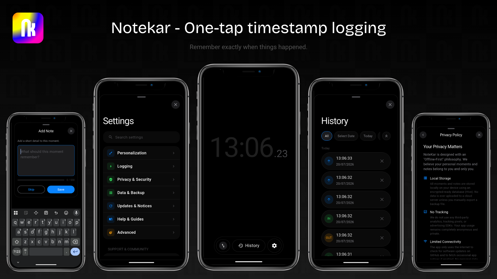

# NoteKar Android



> **The Official Native Android Application for NoteKar.** Instant tap timestamp logger. Zero friction. 100% Offline-First & Privacy-Focused.

      

---

> [!IMPORTANT]
> 🚀 **Official Release Hub for NoteKar**  
> **This repository is the official home for all new NoteKar version releases, Android APK downloads, and active app development.**  
> 📥 To download the latest stable Android APK release, visit the **[GitHub Releases Page](https://github.com/dheeraz101/Notekar-Android/releases)**.

---

## 🌐 Community Translations

Help make NoteKar available in your native language! We welcome translation contributions for any language.

- 📖 Read the **[Translation Guide (TRANSLATIONS.md)](TRANSLATIONS.md)** for a simple 3-step walkthrough on creating or updating `.arb` files.

---

## 🔒 Privacy & Legal Policy

NoteKar Android is built with **privacy-by-design**. Your logs, notes, and session history remain stored locally on your device.

- 🛡️ **[Privacy Policy](https://dheeraz101.github.io/Notekar/privacy.html)**: Full privacy policy detailing data handling, local storage, and permissions.
- 📜 **[Terms of Use](https://dheeraz101.github.io/Notekar/terms.html)**: Terms of service and open-source usage.
- 🌐 **[NoteKar Web PWA](https://dheeraz101.github.io/Notekar/)**: Official Web application & legal hub.

---

## ☕ Support

If NoteKar helps you, you can support the project here:

[](https://www.buymeacoffee.com/dheeraz)
[](https://buymeachai.ezee.li/dheeraz)

Your support helps keep NoteKar free, offline-first, and actively maintained.

---

## 🎯 Features & Highlights

- **Instant Tap Logging**: Tap anywhere on the main screen to log exact timestamps instantly.
- **Dual Operating Modes**: Switch seamlessly between **Two-Way mode** (IN/OUT session pairs for work/study) and **Single mode** (one-shot timestamp logging).
- **Rich Local Storage**: Fast, persistent local storage powered by [Hive](https://pub.dev/packages/hive) & `SharedPreferences`.
- **Android OS Auto-Backup Support**: Supports standard Android system auto-backup (Google Drive system backup), ensuring your data can be restored when switching Android devices.
- **Transparent & Minimal Permissions**:
  - `INTERNET`: Exclusively used to check for software releases (`health.json` / GitHub releases) and fetch bug fix announcements. No personal data or logs are ever transmitted.
  - `POST_NOTIFICATIONS`: Used locally to alert you about app updates, bug notices, or timestamp reminders.
- **Zero Backend / Zero Analytics**: No cloud databases, no user accounts, no tracking scripts, no third-party ads.
- **Data Control & Export**: Export all timestamp entries into standard CSV or JSON formats at any time.

---

## 🤖 F-Droid & Reproducible Build Compliance

NoteKar Android meets all official F-Droid inclusion requirements:

- **100% Open Source**: Code licensed under the OSI-approved **MIT License**.
- **No Proprietary Dependencies**: Zero Google Play Services, Firebase SDKs, or closed-source libraries.
- **No Trackers**: Zero telemetry scripts or analytics frameworks.
- **Fastlane Metadata**: Fully structured in `fastlane/metadata/android/en-US/`.

---

## 📦 Project Structure

```
Notekar - Flutter/
├── android/                # Android native project files & Gradle build scripts
├── assets/                 # App fonts (Inter) and icon resources
├── fastlane/               # F-Droid Fastlane metadata & graphics
│   └── metadata/android/en-US/
├── lib/
│   ├── main.dart           # App entry point, Hive DB init, and theme setup
│   ├── dialogs/            # Settings, confirmation & note dialogs
│   ├── models/             # Data models for timestamp entries
│   ├── screens/            # Home screen & history views
│   ├── utils/              # Database wrappers & helper functions
│   └── widgets/            # Custom UI components & interactive buttons
├── screenshot/             # GitHub banner graphic (notekar_banner.png)
├── CHANGELOG.md            # Version release history
├── CONTRIBUTING.md         # Developer contribution guidelines
├── CODE_OF_CONDUCT.md      # Community Code of Conduct
├── SECURITY.md            # Security policy & vulnerability reporting
├── PRIVACY_POLICY.md       # Privacy policy reference
├── TERMS.md                # Terms of use reference
├── pubspec.yaml            # Project dependencies & asset configuration
├── README.md               # App documentation
├── LICENSE                 # MIT License
└── .github/                # Funding & GitHub Issue/PR templates
```

---

## 🛠️ Building & Running Locally

### Prerequisites
1. Install [Flutter SDK](https://docs.flutter.dev/get-started/install) (`^3.12.0` or higher).
2. Install [Android Studio](https://developer.android.com/studio) with Android SDK (API 21+).
3. Connect an Android device (via USB Debugging or Wireless Debugging) or start an Android Emulator.

### Setup Steps
1. **Clone the Android repository:**
   ```bash
   git clone https://github.com/dheeraz101/Notekar-Android.git
   cd Notekar-Android
   ```

2. **Fetch Flutter packages:**
   ```bash
   flutter pub get
   ```

3. **Run on connected device:**
   ```bash
   flutter run
   ```

---

## 🔑 Building Release APKs & Keystore Setup

> [!IMPORTANT]
> Signing secrets and keystores (`*.jks`, `key.properties`) are ignored by Git to ensure repository safety.

To build a signed release APK or App Bundle (`.aab`):

1. **Generate a keystore** (if you don't already have one):
   ```bash
   keytool -genkey -v -keystore android/app/upload-keystore.jks -keyalg RSA -keysize 2048 -validity 10000 -alias upload
   ```

2. **Create `android/key.properties`** in your local copy:
   ```properties
   storePassword=<your-store-password>
   keyPassword=<your-key-password>
   keyAlias=upload
   storeFile=upload-keystore.jks
   ```

3. **Build Release APK:**
   ```bash
   flutter build apk --release
   ```
   The APK will be generated at `build/app/outputs/flutter-apk/app-release.apk`.

---

## 📄 License & Attribution

- **License:** Open source under the **[MIT License](LICENSE)**.
- **Initiative:** Part of the [YABP (Yet Another Boring Project)](https://yabp.netlify.app/) initiative.
- **Developer:** [Dheeraz](https://github.com/dheeraz101)
- **Made with ❤ in India.**