# NoteKar Android

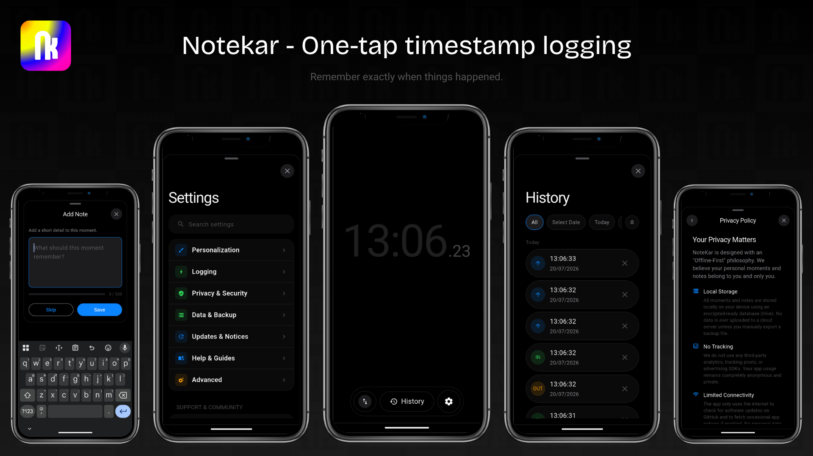

> **The Official Native Android Application for NoteKar.** Instant tap timestamp logger. Zero
> friction. 100% Offline-First & Privacy-Focused.

        

<a href="https://yabp.netlify.app/?verify=https://notekarapp.vercel.app/">
  
</a>

---

> [!IMPORTANT]
> 🚀 **Official Release Hub for NoteKar**
>
> **This repository is the official home for all new NoteKar version releases, Android APK
> downloads, and active app development.**
>
> 📥 To download the latest stable Android APK release,
> visit: **[GitHub Releases Page](https://github.com/dheeraz101/Notekar-Android/releases)**.
>
> 🌐 Website/PWA Notekar Repo **[Github](https://github.com/dheeraz101/Notekar)**.

---

## 📖 Table of Contents

- [📸 Screenshots / UI Preview](#screenshots)
- [🎯 Features & Highlights](#features)
- [🛠️ Tech Stack](#tech-stack)
- [🌐 Community Translations](#translations)
- [🔒 Privacy & Legal Policy](#privacy)
- [☕ Support](#support)
- [🚀 Version Release Scheme & Build Numbers](#version-scheme)
- [🤖 F-Droid & Reproducible Build Compliance](#f-droid)
- [📦 Project Structure](#project-structure)
- [🛠️ Building & Running Locally](#building-locally)
- [🔑 Building Release APKs & Keystore Setup](#release-apks)
- [📄 License & Attribution](#license)

---

<a id="screenshots"></a>

## 📸 Screenshots / UI Preview

Designed for speed, simplicity, and privacy. Every screen is optimized for quick timestamp logging
with minimal interaction.

|                                        Welcome                                        |                                        Premium                                        |                                      Permissions                                      |                                         Home                                          |                                        History                                        |
|:-------------------------------------------------------------------------------------:|:-------------------------------------------------------------------------------------:|:-------------------------------------------------------------------------------------:|:-------------------------------------------------------------------------------------:|:-------------------------------------------------------------------------------------:|
| 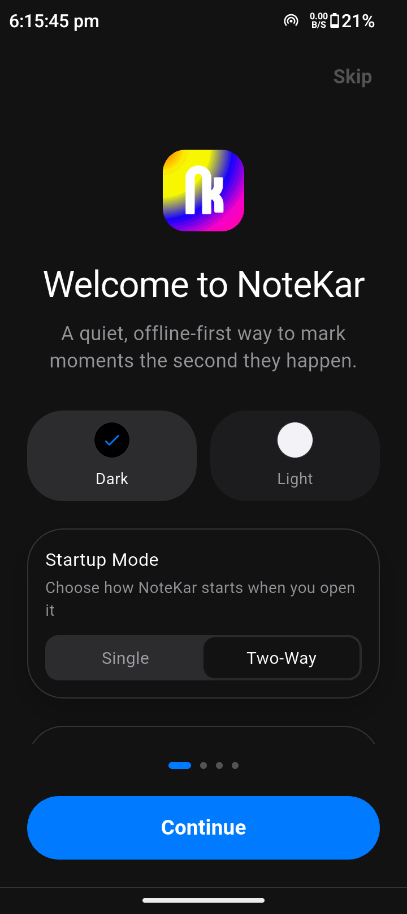 | 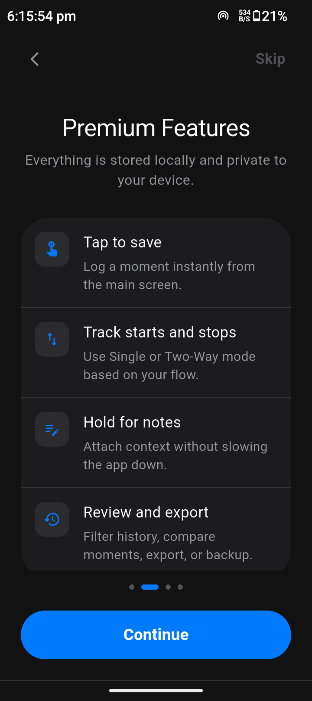 | 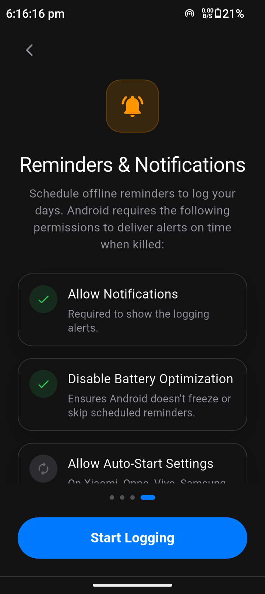 | 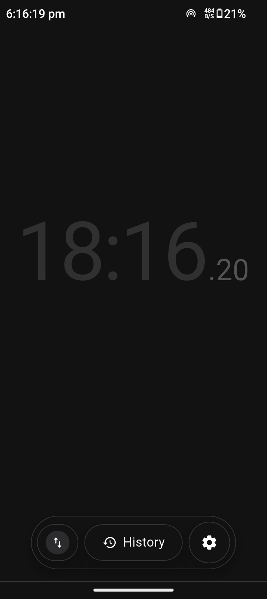 | 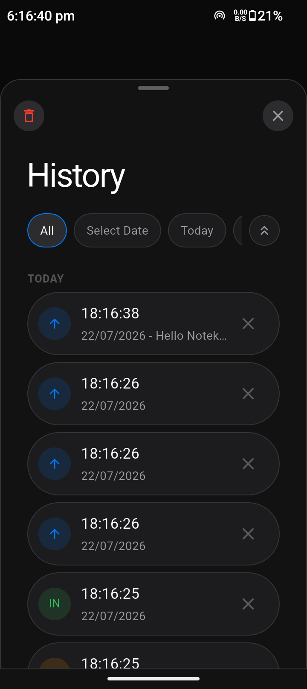 |
|                             _Quick onboarding and setup._                             |                            _Premium features at a glance._                            |                        _Configure permissions for reminders._                         |                          _Log timestamps with a single tap._                          |                          _Browse and manage saved entries._                           |

|                                       Settings                                        |                                        Privacy                                        |                                         Help                                          |                                      Statistics                                       |                                       Reminders                                        |
|:-------------------------------------------------------------------------------------:|:-------------------------------------------------------------------------------------:|:-------------------------------------------------------------------------------------:|:-------------------------------------------------------------------------------------:|:--------------------------------------------------------------------------------------:|
| 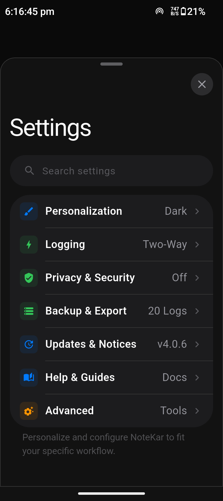 | 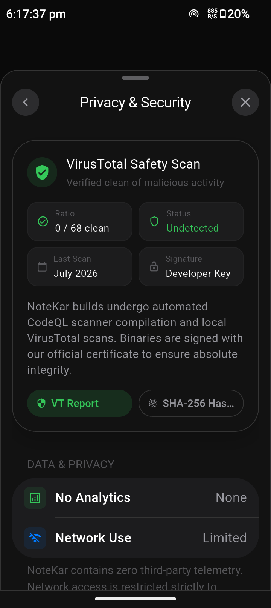 | 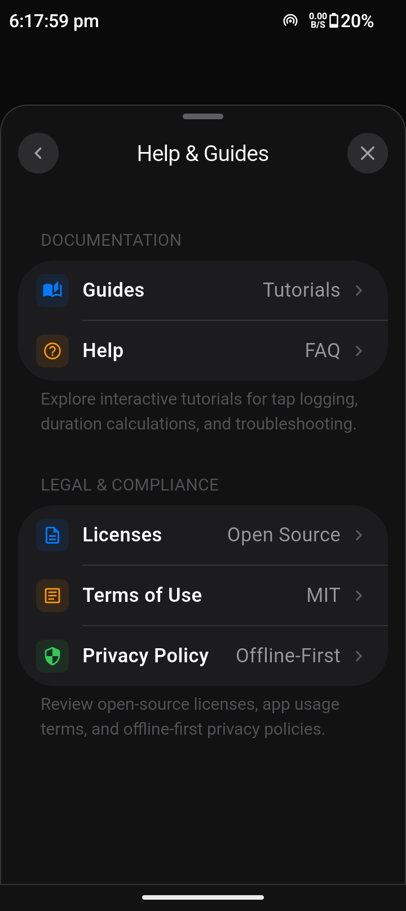 | 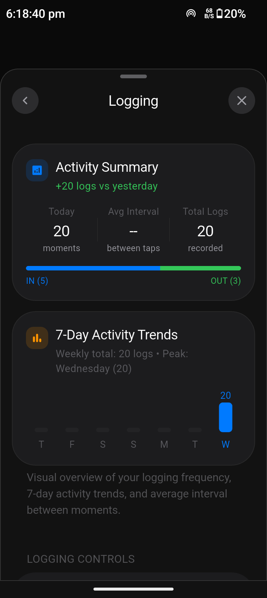 | 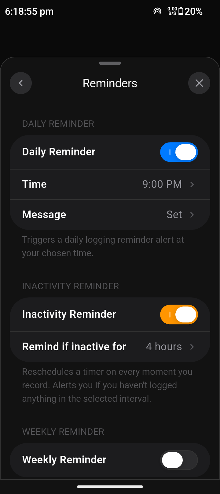 |
|                             _Customize app preferences._                              |                         _Privacy, security, and diagnostics._                         |                        _Guides, FAQs, and legal information._                         |                         _View activity insights and trends._                          |                       _Schedule daily and inactivity reminders._                       |

---

<a id="features"></a>

## 🎯 Features & Highlights

- **Instant Tap Logging**: Tap anywhere on the main screen to log exact timestamps instantly with
  tactile haptics.
- **Dual Operating Modes**: Switch seamlessly between **Two-Way mode** (IN/OUT session pairs for
  work/study) and **Single mode** (one-shot timestamp logging).
- **2-Digit Single Moments Numbering**: Clean sequence counter from `00` to `99` with automatic
  rollover back to `00`, optional daily reset, and "Count on Save" pulse badges (`00 saved`,
  `01 saved`...).
- **Full Multilingual & Global Support**:
    - **7 Live Officially Supported Languages**: 🇬🇧 English, 🇫🇷 French (Français), 🇪🇸 Spanish (
      Español), 🇮🇳 Hindi (हिन्दी), 🇩🇪 German (Deutsch), 🇯🇵 Japanese (日本語), 🇷🇺 Russian (Русский).
    - **50+ Upcoming Languages Initiative**: Dedicated onboarding and in-app language picker
      supporting worldwide community localization.
- **Sobriety Companion & Milestone Map**:
    - **21 Neuroscience-Backed Milestones**: Track sobriety with 34 narrative themes (Science,
      Warrior, Samurai, Anime, Cyberpunk, etc.).
    - **Shareable Milestone Peak Card**: High-resolution PNG image rendering and sharing via Android
      native share sheet.
    - **Research-Backed Confetti**: 85-particle celebration explosion with 3D paper flutter and
      gravity dynamics.
    - **Urge Surfing Breathing Guide**: Interactive 4-7-8 breathing circle for impulse control.
    - **Streak Shields**: Safety-net mechanics preventing frustrating streak breaks.
- **Dynamic iOS-Style Calendar Picker**: Calendar with iOS Red selected date circle, event dots for
  days with logs, and single-letter weekday headers.
- **Hourly Time Reflection & Mindfulness**:
    - **Standalone Lockscreen Alerts**: Full-screen mindful breathing prompts that wake up on
      lockscreen without exposing private moments or home screen.
    - **Sleep Protection & Active Hours**: Set customized active daily windows (e.g. 09:00 AM – 10:
      00 PM) with automatic rollover to protect sleep.
    - **Apple HIG Time Picker**: Seamless iOS Cupertino wheel time selector for scheduling.
    - **Customizable 60-Char Mantra**: Custom affirmation or motivational mantra displayed directly
      on the breathing aura view.
- **Battery-Friendly Background Architecture**:
    - Zero aggressive wake locks for routine logging reminders; fully compliant with Android Doze
      power management.
    - Isolated paint boundaries with `RepaintBoundary` for smooth 120 FPS rendering.
- **Hardware-Backed Privacy & Security**:
    - Encrypted local Hive storage with AES-256 Android Keystore keys.
    - Biometric authentication & custom SHA-256 encrypted PIN lock.
    - Recent app switcher obfuscation (`FLAG_SECURE`).
- **Android 2x2 Interactive App Widget**: Log moments and monitor sobriety progress directly from
  your Android home screen.
- **Zero Backend / Zero Analytics**: 100% offline-first, no accounts, no ads, no trackers. Full
  local JSON/CSV backup and restore.

---

<a id="tech-stack"></a>

## 🛠️ Tech Stack

NoteKar is built using modern, performance-oriented technologies:

| Component            | Technology                                                                      |
|:---------------------|:--------------------------------------------------------------------------------|
| **Language**         | [Dart](https://dart.dev/) & [Kotlin](https://kotlinlang.org/)                   |
| **Framework**        | [Flutter](https://flutter.dev/) (SDK 3.12.0+)                                   |
| **Local Database**   | [Hive](https://pub.dev/packages/hive) (AES-256 encrypted NoSQL key-value store) |
| **State Management** | [ChangeNotifier / Reactive Singletons](https://flutter.dev/)                    |
| **Design System**    | Custom Apple HIG & iOS-inspired design system with AMOLED dark mode support.    |
| **Platform Support** | Android 5.0 (API 21+) and above                                                 |

---

## 📂 Project Structure & Modular Architecture

```text
Notekar - Flutter/
├── .github/workflows/          # Enterprise CI/CD pipelines (Lint, Test with coverage, Multi-ABI Release)
├── android/                    # Native Android platform layer
│   └── app/src/main/kotlin/    # Kotlin AlarmManager receivers, AppWidgetProvider & MainActivity
├── lib/
│   ├── dialogs/                # Apple HIG modal bottom sheets & dialogs
│   │   └── settings/           # 24 modular settings sub-pages (Language, Backups, Icons, etc.)
│   ├── l10n/                   # ARB translation files & static multilingual dictionaries
│   ├── models/                 # Immutable domain entities (Moment, Palette, SobrietyTheme, etc.)
│   ├── screens/                # Core screens (NoteKarHome, WelcomeScreen)
│   ├── services/               # Decoupled domain services (MindfulnessService, NotificationEngine)
│   ├── utils/                  # Cryptography, adaptive hardware engine, and l10n utilities
│   └── widgets/                # Reusable Apple HIG UI components (PressableScale, SettingsGroup, etc.)
├── versions/                   # Master structured JSON release archive (changelog.json)
└── test/                       # Comprehensive unit and widget test suites (100% passing)
```

---

<a id="translations"></a>

## 🌐 Community Translations

Help make NoteKar accessible to everyone in their native language! NoteKar is committed to being
100% community-friendly and localization-ready.

### 🌟 Currently Supported (7 Languages)

| Language      | Code | Native Name | Status |
|:--------------|:----:|:------------|:------:|
| 🇬🇧 English  | `en` | English     | ✅ Live |
| 🇫🇷 French   | `fr` | Français    | ✅ Live |
| 🇪🇸 Spanish  | `es` | Español     | ✅ Live |
| 🇮🇳 Hindi    | `hi` | हिन्दी      | ✅ Live |
| 🇩🇪 German   | `de` | Deutsch     | ✅ Live |
| 🇯🇵 Japanese | `ja` | 日本語         | ✅ Live |
| 🇷🇺 Russian  | `ru` | Русский     | ✅ Live |

### 🚀 50+ Upcoming Target Languages

We are actively seeking community contributions for **Arabic, Portuguese, Italian, Chinese, Korean,
Turkish, Dutch, Polish, Swedish, Indonesian, Vietnamese, Thai, Ukrainian, Greek, Bengali, Marathi,
Telugu, Tamil, Gujarati, Urdu, Kannada, Malayalam, Punjabi, Swahili**, and many more!

- 📖 Read our **[Translation Guide (TRANSLATIONS.md)](TRANSLATIONS.md)** for a 3-step guide on adding
  or improving translations for NoteKar.

---

<a id="privacy"></a>

## 🔒 Privacy & Legal Policy

NoteKar Android is built with **privacy-by-design**. Your logs, notes, and session history remain
stored locally on your device.

- 🛡️ **[Privacy Policy](https://dheeraz101.github.io/Notekar/privacy.html)**: Full privacy policy
  detailing data handling, local storage, and permissions.
- 📜 **[Terms of Use](https://dheeraz101.github.io/Notekar/terms.html)**: Terms of service and
  open-source usage.
- 🌐 **[NoteKar Web PWA](https://dheeraz101.github.io/Notekar/)**: Official Web application & legal
  hub.

---

<a id="support"></a>

## ☕ Support

If NoteKar helps you, you can support the project here:

[](https://www.buymeacoffee.com/dheeraz)
[](https://buymeachai.ezee.li/dheeraz)

Your support helps keep NoteKar free, offline-first, and actively maintained.

---

<a id="version-scheme"></a>

## 🚀 Version Release Scheme & Build Numbers

NoteKar uses a structured build numbering scheme: `YY<CHANNEL>MMDD[suffix]`

- **Channel Codes**:
    - `BR` (Beta Release): Active feature experimentation.
    - `SR` (Stable Release): Production-tested releases.
    - `PR` (Priority Release): Critical hotfixes, security patches, and library upgrades (Previously
      Security Release).
- **Format Example**: `26BR0815` (Year 2026, Beta Release, August 15), `26SR0816` (Stable Release),
  `26PR0821` (Priority Release). Multiple builds on the same
  date automatically increment suffixes: `26BR0815a`, `26BR0815b`.
- **Android versionCode**: Internally mapped to unique sequential integers (e.g. `26081501`).

---

<a id="f-droid"></a>

## 🤖 F-Droid & Reproducible Build Compliance

NoteKar Android meets all official F-Droid inclusion requirements:

- **100% Open Source**: Code licensed under the OSI-approved **MIT License**.
- **No Proprietary Dependencies**: Zero Google Play Services, Firebase SDKs, or closed-source
  libraries.
- **No Trackers**: Zero telemetry scripts or analytics frameworks.
- **Fastlane Metadata**: Fully structured in `fastlane/metadata/android/en-US/`.

---

<a id="project-structure"></a>

## 📦 Project Structure

```
Notekar - Flutter/
├── android/                        # Android native project files & FileProvider config
├── assets/                         # App fonts (Inter) and icon resources
├── fastlane/                       # F-Droid Fastlane metadata & graphics
├── lib/
│   ├── main.dart                   # App entry point, Hive DB init, and theme setup
│   ├── dialogs/                    # Modals, bottom sheets & settings views
│   │   ├── settings/               # Modular settings pages (Logging, Moments, Sobriety, Privacy, etc.)
│   │   ├── calendar_dialog.dart    # Dynamic iOS-style calendar date picker
│   │   ├── shareable_milestone_sheet.dart # High-res milestone card PNG export
│   │   └── urge_surfing_dialog.dart# 4-7-8 breathing exercise companion
│   ├── models/                     # Data models (Moments, Sobriety Milestones, Palette, Backup)
│   ├── screens/                    # Home screen, History view, and Welcome onboarding
│   ├── utils/                      # Database repositories, App utils, Update service, L10n
│   └── widgets/                    # Custom UI components, Confetti overlay, PressableScale
├── scripts/
│   ├── build-release-apks.ps1      # Automated multi-architecture release APK build script
│   └── update-version.ps1          # Automated version bump and build number updater
├── test/
│   ├── backup_import_test.dart     # Backup parsing and JSON normalization tests
│   ├── home_screen_test.dart       # Palette & settings controller tests
│   └── single_numbering_test.dart  # 2-digit sequence rollover and daily reset unit tests
├── CHANGELOG.md                    # Detailed version history
├── CONTRIBUTING.md                 # Developer contribution guidelines
├── CODE_OF_CONDUCT.md              # Community Code of Conduct
├── SECURITY.md                     # Security policy & vulnerability reporting
├── PRIVACY_POLICY.md               # Privacy policy reference
├── TERMS.md                        # Terms of use reference
├── pubspec.yaml                    # Project dependencies & asset configuration
├── README.md                       # App documentation
└── LICENSE                         # MIT License
```

---

<a id="building-locally"></a>

## 🛠️ Building & Running Locally

### Prerequisites

1. Install [Flutter SDK](https://docs.flutter.dev/get-started/install) (`^3.12.0` or higher).
2. Install [Android Studio](https://developer.android.com/studio) with Android SDK (API 21+).
3. Connect an Android device (via USB Debugging or Wireless Debugging) or start an Android Emulator.

### Setup Steps

1. **Clone the Android repository:**

   ```bash
   git clone https://github.com/dheeraz101/Notekar-Android.git
   cd Notekar-Android
   ```

2. **Fetch Flutter packages:**

   ```bash
   flutter pub get
   ```

3. **Run on connected device:**
   ```bash
   flutter run
   ```

---

<a id="release-apks"></a>

## 🔑 Building Release APKs & Keystore Setup

> [!IMPORTANT]
> Signing secrets and keystores (`*.jks`, `key.properties`) are ignored by Git to ensure repository
> safety.

To build a signed release APK or App Bundle (`.aab`):

1. **Generate a keystore** (if you don't already have one):

   ```bash
   keytool -genkey -v -keystore android/app/upload-keystore.jks -keyalg RSA -keysize 2048 -validity 10000 -alias upload
   ```

2. **Create `android/key.properties`** in your local copy:

   ```properties
   storePassword=<your-store-password>
   keyPassword=<your-key-password>
   keyAlias=upload
   storeFile=upload-keystore.jks
   ```

3. **Build Release APK:**
   ```bash
   flutter build apk --release
   ```
   The APK will be generated at `build/app/outputs/flutter-apk/app-release.apk`.

---

<a id="license"></a>

## 📄 License & Attribution

- **License:** Open source under the **[MIT License](LICENSE)**.
- **Initiative:** Part of
  the [YABP (Yet Another Boring Project)](https://yabp.netlify.app/?verify=https://notekarapp.vercel.app/)
  initiative.
- **Developer:** [Dheeraz](https://github.com/dheeraz101)
- **Made with ❤ in India.**
