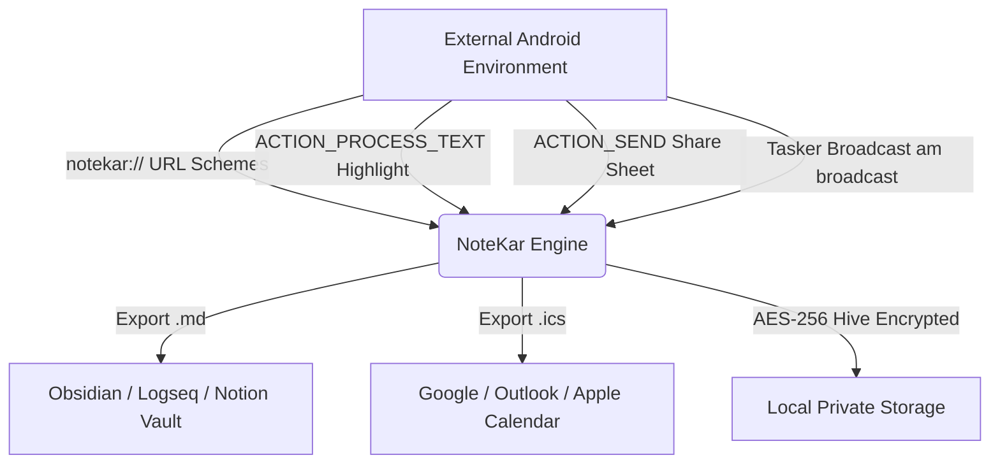

<div align="center">

# ⚡ NoteKar Android

[](https://github.com/dheeraz101/Notekar-Android)

### *The Sovereign Existential Compass & Chronometer Craft for Android*

**Daily 24h Conscious Accounting • The Cost of the Void • Seamless Focus • 100% Private & Offline**

---

[](https://github.com/dheeraz101/Notekar-Android/releases)
[](https://github.com/dheeraz101/Notekar-Android/releases)
[](https://flutter.dev)
[](https://developer.android.com)
[](LICENSE)
[](https://f-droid.org)
[](https://dheeraz101.github.io/Notekar/privacy.html)
[](TRANSLATIONS.md)
[](https://github.com/dheeraz101/Notekar-Android/stargazers)
[](https://github.com/dheeraz101/Notekar-Android/issues)

<p align="center">
  <a href="https://github.com/dheeraz101/Notekar-Android/releases/latest">
    
  </a>
  &nbsp;&nbsp;
  <a href="https://notekarapp.vercel.app/">
    
  </a>
  &nbsp;&nbsp;
  <a href="https://yabp.netlify.app/?verify=https://notekarapp.vercel.app/">
    
  </a>
</p>

</div>

---

> [!IMPORTANT]
> 🧭 **"NoteKar has revisioned itself."**
>
> Moving beyond a minimalist clicker, NoteKar elevates into an existential compass: accounting for
> finite human conscious hours, confronting the cost of the unaccounted void, and perfecting sensory
> chronometer craft. Every second is accounted for; the void is revealed.
>
> 📦 **Download Official APKs
**: [GitHub Releases Page](https://github.com/dheeraz101/Notekar-Android/releases) •
> 🌐 **Companion Web App
**: [notekarapp.vercel.app](https://notekarapp.vercel.app/) • [Web Source Repo](https://github.com/dheeraz101/Notekar)

---

## 🧭 Table of Contents

- [✨ Why NoteKar?](#-why-notekar)
- [📸 Visual UI Gallery](#-visual-ui-gallery)
- [🌟 Core Features & Existential Engine](#-core-features--existential-engine)
    - [⏳ 1. Life Audit & The Cost of the Void](#-1-life-audit--the-cost-of-the-void)
    - [⏱️ 2. Spatial Chronometer & Authentic Bebas Neue Typography](#-2-spatial-chronometer--authentic-bebas-neue-typography)
    - [⚡ 3. Instant Glass Logging & Seamless Continuity](#-3-instant-glass-logging--seamless-continuity)
    - [✍️ 4. WhatsApp-Grade Zero-Lag Note Input](#-4-whatsapp-grade-zero-lag-note-input)
    - [📜 5. Life Ledger Timeline (Redesigned History)](#-5-life-ledger-timeline-redesigned-history)
    - [📊 6. Executive Intelligence Hub (Dashboard)](#-6-executive-intelligence-hub-dashboard)
    - [🌱 7. Sobriety Companion & Milestone Map](#-7-sobriety-companion--milestone-map)
    - [🧘 8. Hourly Time Reflection & Mindfulness](#-8-hourly-time-reflection--mindfulness)
    - [📱 9. Android Home Screen Widget (2x2)](#-9-android-home-screen-widget-2x2)
- [🌉 System Bridges & Automation](#-system-bridges--automation)
- [🛡️ Privacy, Security & Hardware Protection](#️-privacy-security--hardware-protection)
- [🌐 Multilingual & Global Community](#-multilingual--global-community)
- [🛠️ Tech Stack & Architecture](#️-tech-stack--architecture)
- [🤖 F-Droid & Reproducible Build Compliance](#-f-droid--reproducible-build-compliance)
- [💻 Building & Running Locally](#-building--running-locally)
- [🔑 Release Signing & Keystore Setup](#-release-signing--keystore-setup)
- [☕ Support & Community](#-support--community)
- [📄 License & Attribution](#-license--attribution)

---

## ✨ Why NoteKar?

In an era of bloatware, mandatory logins, infinite algorithmic distraction, and cloud surveillance,
**NoteKar** is engineered as an uncompromising, sovereign utility and existential mirror.

```text
┌──────────────────────────────────────────────────────────────────────────────┐
│  ⏳ LIFE AUDIT & THE VOID   │  24h conscious partitions confronting lost days.│
│  ⏱️ SPATIAL CHRONOMETER     │  Optically centered Bebas Neue tall numerals.   │
│  ⚡ ZERO-FRICTION CAPTURE   │  Tap anywhere on glass to log timestamps.       │
│  🔄 UNBROKEN CONTINUITY     │  Live stopwatch preserved across mode toggles.  │
│  ✍️ WHATSAPP-GRADE TYPING   │  Zero-lag note entry with auto-capitalization.  │
│  📜 LIFE LEDGER TIMELINE    │  Apple HIG paired sessions & 1-tap live end.    │
│  📊 EXECUTIVE INTELLIGENCE  │  Circadian rhythm & 90-day heatmap (on-device). │
│  🛡️ 100% OFFLINE SOVEREIGN  │  AES-256 encrypted Hive NoSQL. Zero telemetry.  │
│  🌉 SYSTEM BRIDGES          │  Obsidian MD live export, .ICS calendar sync.   │
│  🌱 SOBRIETY & MINDFULNESS  │  21 neuroscience milestones & lockscreen breath.│
└──────────────────────────────────────────────────────────────────────────────┘
```

---

## 📸 Visual UI Gallery

Designed with an obsession for Apple Human Interface Guidelines (HIG), dynamic tactile feedback,
fluid 120 FPS transitions, and OLED-perfect pitch black surfaces.

|                                            Welcome & Onboarding                                            |                                             VIP Sovereign Theme                                              |                                               Permissions Setup                                               |                                             Home Log Canvas                                             |                                            History & Timeline                                            |
|:----------------------------------------------------------------------------------------------------------:|:------------------------------------------------------------------------------------------------------------:|:-------------------------------------------------------------------------------------------------------------:|:-------------------------------------------------------------------------------------------------------:|:--------------------------------------------------------------------------------------------------------:|
|  |  |  |  |  |
|                                           _Zero-friction start_                                            |                                           _Champagne gold palette_                                           |                                        _Transparent privacy controls_                                         |                                          _Instant tap canvas_                                           |                                         _Rich moment telemetry_                                          |

|                                               Settings Dashboard                                               |                                             Security & Biometrics                                             |                                             Knowledge & Guides                                              |                                            Analytics & Heatmaps                                            |                                               Proactive Reminders                                               |
|:--------------------------------------------------------------------------------------------------------------:|:-------------------------------------------------------------------------------------------------------------:|:-----------------------------------------------------------------------------------------------------------:|:----------------------------------------------------------------------------------------------------------:|:---------------------------------------------------------------------------------------------------------------:|
|  |  |  |  |  |
|                                               _24 modular tools_                                               |                                            _Biometric & PIN vault_                                            |                                          _Offline FAQs & manuals_                                           |                                         _Interactive habit trends_                                         |                                             _Doze-friendly alarms_                                              |

---

## 🌟 Core Features & Existential Engine

### ⏳ 1. Life Audit & The Cost of the Void (Existential Accounting Engine)

NoteKar's most transformative innovation: **confronting the finite nature of human conscious time**.
If you are not logging your hours, time does not pause—it vanishes into the unaccounted void.
NoteKar makes this friction visible with mathematical clarity:

- **Daily 24-Hour Partition Architecture**:
  Every day is rigorously partitioned into three fundamental temporal buckets:
  $$\text{Total Day (24h)} = \text{Sleep} + \text{Logistics (Food, Travel, Routine)} + \text{Conscious Window}$$
- **The Cost of the Void**:
  Conscious hours not accounted for in deliberate focus sessions or intentional moments are
  calculated as the **Void**:
  $$\text{Unaccounted Void} = \text{Conscious Window} - \text{Logged Focus Sessions}$$
- **Multi-Horizon Existential Ledger (6 Horizons)**:
  Examine your time debt across six distinct temporal scopes:
    - **Today**: 24-Hour immediate feedback.
    - **Weekly (7d)**: 168-Hour work & rest review.
    - **Monthly (30d)**: 720-Hour monthly cadence.
    - **Half-Quarterly (6 Weeks / 45d)**: Habit formation and mid-quarter momentum check.
    - **Half-Yearly (26 Weeks / 180d)**: Deep reflection on macro goals and seasonal shifts.
    - **Planetary Yearly (365d)**: Comprehensive audit of conscious solar rotations.
- **Visceral Mortality & Intentionality Metrics**:
    - **Conscious Waking Days Lost**: How many waking days (e.g. 14h blocks) slipped away without a
      trace.
    - **Earth (24h) Days Lost**: Equivalent full planetary rotations consumed by unrecorded time.
    - **Intentionality Ratio**: Visual percentage gauge of conscious time actively captured and
      justified.
- **Interactive Partition Sliders**: Real-time tactile adjustment for baseline sleep (e.g., 8–10h)
  and food/travel logistics (e.g., 2–4h) with haptic resistance.
- **Historical Ledger & Seneca Colophon**: Day-by-day audit chronicle paired with Seneca’s Stoic
  reality reminder (*"Time is the only thing where it is a virtue to be greedy"*).
- **Executive Dashboard Integration**: Dedicated Life Audit card with auto-scaling dynamic horizon
  meters and collision-proof responsive typography.

### ⏱️ 2. Spatial Chronometer & Authentic Bebas Neue Typography

- **Usable Viewport Optical Centering**: The home chronometer face is mathematically positioned at
  the exact optical midpoint of the usable canvas between the floating top insights pill and the
  bottom tool navigation, eliminating artificial vertical bias.
- **Authentic Bebas Neue Numerals**: Replaced artificial matrix transforms with genuine, bundled
  open-source *Bebas Neue* tall typography (61KB offline OFL). Naturally tall, commanding numerals (
  144pt scale) with tabular figures for both the main clock and active Two-Way countdown timers.

### ⚡ 3. Instant Glass Logging & Seamless Continuity

- **One-Tap Glass Capture**: Tap anywhere on the main screen to immediately capture exact timestamps
  with custom tactile haptic pulses.
- **Seamless Two-Way Session Continuity**: Switch dynamically between **Single** mode and **Two-Way
  ** mode mid-flight without resetting the live stopwatch, losing elapsed intervals, or dropping
  draft notes.
- **Dual Operating Modes**:
    - **Single Mode**: Rapid one-shot timestamp counter (`00` to `99`) with automatic rollover,
      optional daily reset, and "Count on Save" badges.
    - **Two-Way Mode**: Track deep work, study, workouts, or shifts by recording distinct `IN` and
      `OUT` interval pairs with duration computations.

### ✍️ 4. WhatsApp-Grade Zero-Lag Note Input

- **Typing on Glass**: Overhauled note input mechanics with sentence auto-capitalization,
  composition truncation guards, and decoupled character state updates.
- **Zero Input Lag**: Completely eliminates keystroke latency and dialog re-renders during
  high-speed typing, delivering buttery-smooth text entry.

### 📜 5. Life Ledger Timeline (Redesigned History)

Designed strictly to Apple Human Interface Guidelines (HIG), the **Life Ledger Timeline** transforms
raw log records into an elegant, unified chronicle of your day:

- **Connected Session Pairing**: Automatically connects chronological `IN` and `OUT` moments into
  paired session cards featuring start/finish nodes, elapsed duration pills (e.g. `2h 15m`), and
  in-line note previews.
- **1-Tap Live Session End**: Ongoing sessions display a pulsing green `LIVE <duration>` badge
  alongside a dedicated red **End** button (`stop_circle_rounded`). Tap **End** right on the card to
  seal the active session in real time with an instant `OUT` moment.
- **Sequential Single Numbering (`00`–`99`)**: Standalone moments feature high-contrast circular
  rail badges displaying sequential 2-digit counters, with optional midnight daily resets.
- **Physical Bed of Red Swipe-to-Delete**: Swipe gestures reveal a solid red backing bed matching
  the card's exact corner radius (16pt sessions, 12pt singles), eliminating gap cutouts, paired with
  a 5-second Dynamic Island countdown undo pill.
- **Redesigned Compact History Mode**: Ultra-dense timeline layout presenting 2x–3x more moments
  with scaled rail markers, micro duration badges, and automatic suppression of empty note
  placeholder boxes.
- **Unified Apple HIG Dialog Architecture**: All multi-choice confirmation prompts, external
  navigation security alerts, and network warnings standardized to native `CupertinoAlertDialog`
  with zero button truncation.
- **Frictionless Filter Pills**: Seamlessly toggle between **All**, **Sessions**, **Singles**, and *
  *With Notes** with instant responsive transitions and zero layout clipping.
- **iOS-Style Calendar Picker**: A fluid monthly calendar sheet featuring solid iOS System Red
  selection circles, past-date selection, and anchored event dots positioned with locked geometric
  centering (zero vertical baseline shift).
- **Trash Bin Safety**: Local soft-delete vault to restore or permanently purge removed records
  anytime.

### 📊 6. Executive Intelligence Hub (Redesigned Dashboard)

The **Executive Intelligence Hub** delivers deep behavioral analytics, habit rhythms, and circadian
insights computed 100% on-device:

- **Time-Scope Switching**: Toggle between **Today**, **Week**, **Month**, and **All Time** with
  fluid, responsive pill controls.
- **Grounded Daily Rhythm Chart**: Daily activity bars are anchored flush to the bottom baseline and
  ascend upward dynamically, ensuring visual equilibrium and eliminating awkward middle-floating
  bars on low-volume days.
- **90-Day High-Density Activity Grid**: GitHub-style color intensity heatmap tracking logging
  consistency across the last 90 days with dedicated streak counters and clear subtitles.
- **Circadian Time-of-Day Bias**: Real-time breakdown of activity distribution across **Morning (
  06–12)**, **Afternoon (12–18)**, **Evening (18–22)**, and **Night (22–06)** windows.
- **Executive Focus Metrics**: Track total session focus hours, average session lengths, and peak
  productivity intervals with local in-memory aggregation.

### 🌱 7. Sobriety Companion & Milestone Map

- **21 Neuroscience-Backed Milestones**: Track habits and clean streaks across 34 narrative themes (
  Science, Warrior, Samurai, Anime, Cyberpunk, and more).
- **Shareable Milestone Peak Cards**: Render high-resolution PNG celebratory milestone cards with
  1-tap sharing via the native Android share sheet.
- **Physics-Based Confetti**: 85-particle celebration engine with 3D paper flutter, gravity
  dynamics, and low-end hardware fallbacks.
- **Urge Surfing Breathing Companion**: Guided 4-7-8 breathing circle to conquer cravings and
  practice nervous system regulation.
- **Streak Shields**: Emergency protection mechanics preventing accidental streak resets.

### 🧘 8. Hourly Time Reflection & Mindfulness

- **Standalone Lockscreen Breathing Alarms**: Full-screen breathing prompts that display directly
  over the lockscreen without unlocking your device or exposing private logs.
- **Active Hours & Sleep Protection**: Configure daily active windows (e.g. 09:00 AM – 10:00 PM)
  with overnight rollover protection.
- **Apple HIG Cupertino Wheel Time Picker**: Smooth wheel selector for scheduling reflection
  reminders and check-in intervals.
- **Customizable Affirmation Mantra**: Display a 60-character personal mantra directly on the
  breathing aura display.

### 📱 9. Android Home Screen Widget (2x2)

- Fast, battery-efficient App Widget to log moments and check streak milestones directly from your
  Android launcher without opening the app.

---

## 🌉 System Bridges & Automation

NoteKar functions as an extensible bridge between your Android OS, note-taking vaults, calendars,
and automation engines.


```mermaid
graph TD
    A[External Android Environment] -->|notekar:// URL Schemes| B(NoteKar Engine)
    A -->|ACTION_PROCESS_TEXT Highlight| B
    A -->|ACTION_SEND Share Sheet| B
    A -->|Tasker Broadcast am broadcast| B
    B -->|Export .md| C[Obsidian / Logseq / Notion Vault]
    B -->|Export .ics| D[Google / Outlook / Apple Calendar]
    B -->|AES-256 Hive Encrypted| E[Local Private Storage]
```

### 🔗 1. Deep Linking URL Schemes (`notekar://`)

Trigger actions from NFC tags, browser bookmarks, or home screen shortcuts:

| Action          | URL Scheme Pattern                      | Description                                       |
|:----------------|:----------------------------------------|:--------------------------------------------------|
| **Quick Log**   | `notekar://log?type=single&note=Coffee` | Logs an instant single moment                     |
| **Check-In**    | `notekar://in?note=Focus%20Work`        | Starts a Two-Way tracking interval                |
| **Check-Out**   | `notekar://out?note=PR%20Merged`        | Closes the active Two-Way interval                |
| **Draft Note**  | `notekar://note?text=Quick%20Idea`      | Opens composer prefilled with text                |
| **Open Screen** | `notekar://open?page=history`           | Navigates directly to History, Stats, or Settings |
| **Breathe**     | `notekar://reflect`                     | Launches the Time Reflection breathing sheet      |

### 📝 2. Global Text Selection Menu (`ACTION_PROCESS_TEXT`)

Highlight any snippet in **Chrome, WhatsApp, Twitter/X, Kindle, or Books** and select **"Log in
NoteKar"** from the system popup menu to capture quotes instantly offline.

### 📤 3. Native Share Target (`ACTION_SEND`)

Send text, URLs, and articles from any app directly to NoteKar with automatic title parsing and
timestamp attribution.

### 📓 4. Obsidian & Logseq Markdown Live Export

Generate clean Markdown journal files formatted with date grouping, session tables, and daily
telemetry:

```markdown
# NoteKar Journal

## 📅 Sunday, August 30, 2026

| Time | Type | Details / Note |
|---|---|---|
| 09:00:15 AM | 🟢 **IN** | Deep Work: Rust Backend |
| 11:30:20 AM | 🔴 **OUT** | Completed Compiler Architecture |
| 02:15:00 PM | ⚡ **SINGLE** | Team sync & architecture review |
```

### 🗓️ 5. Calendar Session Exporter (RFC 5545 `.ics`)

Convert tracked Two-Way intervals into standard `.ics` calendar files with 1-tap import into *
*Google Calendar, Outlook, Samsung Calendar, and Proton Calendar**.

### 🤖 6. Tasker, MacroDroid & Termux Broadcast API

Execute offline background logging via Android intent broadcasts:

```bash
# Log single moment via ADB or Tasker
am broadcast -a app.notekar.notekar.ACTION_LOG_MOMENT --es type single --es note "Deep Work"

# Check-in Two-Way interval
am broadcast -a app.notekar.notekar.ACTION_LOG_MOMENT --es type in --es note "Study Session"

# Check-out Two-Way interval
am broadcast -a app.notekar.notekar.ACTION_LOG_MOMENT --es type out --es note "Finished Chapter 4"
```

---

## 🛡️ Privacy, Security & Hardware Protection

NoteKar operates on a strict **Zero Knowledge / Sovereign Data** architecture:

- 🔒 **AES-256 Hardware Encryption**: All logs and timestamps are stored in a local Hive NoSQL
  database encrypted with keys generated inside the **Android Keystore System**.
- 🛡️ **Biometric & PIN Vault**: Protect app access with fingerprint/face unlock and SHA-256 salted
  PIN codes.
- 👁️ **Recent App Obfuscation**: Android `FLAG_SECURE` prevents screenshots and masks contents in
  the app switcher.
- 🚫 **Zero Analytics & Zero Network Calls**: No telemetry scripts, no third-party trackers, no
  Firebase, and no account creation requirements.
- 💾 **1-Tap Offline Data Portability**: Complete backup, restore, and JSON/CSV export without cloud
  dependencies.

---

## 🌐 Multilingual & Global Community

NoteKar is committed to universal accessibility with full native offline localization:

### 🌟 Officially Supported (7 Live Languages)

| Flag | Language     | Native Name | Code |     Numbers      |   Status   |
|:----:|:-------------|:------------|:----:|:----------------:|:----------:|
| 🇬🇧 | **English**  | English     | `en` |     Standard     | ✅ Complete |
| 🇫🇷 | **French**   | Français    | `fr` |     Standard     | ✅ Complete |
| 🇪🇸 | **Spanish**  | Español     | `es` |     Standard     | ✅ Complete |
| 🇮🇳 | **Hindi**    | हिन्दी      | `hi` | Devanagari (०-९) | ✅ Complete |
| 🇩🇪 | **German**   | Deutsch     | `de` |     Standard     | ✅ Complete |
| 🇯🇵 | **Japanese** | 日本語         | `ja` |     Standard     | ✅ Complete |
| 🇷🇺 | **Russian**  | Русский     | `ru` |     Standard     | ✅ Complete |

### 🚀 50+ Target Community Languages Initiative

We welcome contributions for **Arabic, Portuguese, Italian, Chinese (Simplified/Traditional),
Korean, Turkish, Dutch, Polish, Swedish, Indonesian, Vietnamese, Thai, Ukrainian, Greek, Bengali,
Marathi, Telugu, Tamil, Gujarati, Urdu, Kannada, Malayalam, Punjabi, Swahili**, and more!

👉 **[Read our 3-Step Translation Guide (TRANSLATIONS.md)](TRANSLATIONS.md)**

---

## 🛠️ Tech Stack & Architecture

| Layer                      | Technology                                                    | Details                                        |
|:---------------------------|:--------------------------------------------------------------|:-----------------------------------------------|
| **Language**               | [Dart](https://dart.dev/) & [Kotlin](https://kotlinlang.org/) | Type-safe reactive codebase                    |
| **Framework**              | [Flutter](https://flutter.dev/) (`^3.12.0`)                   | High-performance 120 FPS rendering             |
| **Typography**             | [Bebas Neue](assets/fonts/BebasNeue-Regular.ttf) (OFL)        | Bundled offline tall chronometer font          |
| **Local Storage**          | [Hive](https://pub.dev/packages/hive)                         | AES-256 encrypted NoSQL key-value store        |
| **State Management**       | [Reactive Singletons & ValueNotifiers](https://flutter.dev/)  | Ultra-low memory overhead                      |
| **Design System**          | Custom Apple HIG & iOS 26 High-Radius Style                   | Dynamic glass, haptics, and AMOLED dark mode   |
| **Hardware Compatibility** | Android 5.0+ (API Level 21+)                                  | Doze-compliant, low-end device adaptive engine |

### 📂 Directory Architecture

```text
Notekar - Flutter/
├── .github/workflows/          # Enterprise CI/CD (Lint, Test Coverage, Release Builds)
├── android/                    # Native Android platform layer & Alarm receivers
│   └── app/src/main/kotlin/    # MainActivity.kt, NoteKarAppWidgetProvider.kt
├── assets/fonts/               # Bundled authentic Bebas Neue tall chronometer font
├── fastlane/metadata/          # Structured Play Store metadata and changelogs
├── lib/
│   ├── dialogs/                # Apple HIG modal bottom sheets, Life Audit & changelog dialogs
│   │   └── settings/           # 24 modular settings pages (Bridges, Backups, Icons, etc.)
│   ├── l10n/                   # 7 offline locales (EN, HI, ES, FR, DE, JA, RU) & ARB files
│   ├── models/                 # Domain models (Moment, Palette, SobrietyTheme, Backup)
│   ├── screens/                # Core views (NoteKarHome, WelcomeScreen)
│   ├── services/               # Decoupled services (NotificationEngine, UpdateService)
│   ├── utils/                  # Cryptography, time wastage engine, moment repository
│   └── widgets/                # Reusable UI widgets (ClockFace, PressableScale, Glass)
├── releases/                   # Signed release notes & distribution artifacts
├── versions/                   # Structured JSON version archive (changelog.json)
└── test/                       # 100% passing unit, widget & sensory test suites
```

---

## 🤖 F-Droid & Reproducible Build Compliance

NoteKar Android complies with all official F-Droid free software guidelines:

- ✅ **100% Free & Open Source**: Licensed under the OSI-approved **MIT License**.
- ✅ **No Proprietary Dependencies**: Zero Google Play Services, Firebase SDKs, or proprietary
  binaries.
- ✅ **Zero Telemetry**: No tracking libraries, analytics SDKs, or advertising code.
- ✅ **Structured Fastlane Metadata**: Included in `fastlane/metadata/android/en-US/`.

---

## 💻 Building & Running Locally

### Prerequisites

1. [Flutter SDK](https://docs.flutter.dev/get-started/install) (`^3.12.0` or higher).
2. [Android Studio](https://developer.android.com/studio) with Android SDK (API 21+).
3. Connected Android device with USB Debugging enabled or an active Android Emulator.

### Setup & Run

```bash
# 1. Clone the repository
git clone https://github.com/dheeraz101/Notekar-Android.git
cd "Notekar - Flutter"

# 2. Install Flutter packages
flutter pub get

# 3. Run the test suite
flutter test

# 4. Launch on your connected device
flutter run
```

---

## 🔑 Release Signing & Keystore Setup

> [!NOTE]
> Keystore secrets (`*.jks`, `key.properties`) are excluded from Git for security.

To generate a signed release APK or App Bundle (`.aab`):

1. **Generate a signing keystore**:
   ```bash
   keytool -genkey -v -keystore android/app/upload-keystore.jks -keyalg RSA -keysize 2048 -validity 10000 -alias upload
   ```

2. **Create `android/key.properties`**:
   ```properties
   storePassword=<your-store-password>
   keyPassword=<your-key-password>
   keyAlias=upload
   storeFile=upload-keystore.jks
   ```

3. **Build the production release APK**:
   ```bash
   flutter build apk --release
   ```
   *The generated APK will be output to `build/app/outputs/flutter-apk/app-release.apk`.*

---

## ☕ Support & Community

If NoteKar brings calm and focus to your daily workflow, consider supporting its open-source
journey:

<p align="center">
  <a href="https://www.buymeacoffee.com/dheeraz">
    
  </a>
  &nbsp;&nbsp;
  <a href="https://buymeachai.ezee.li/dheeraz">
    
  </a>
</p>

- 🛡️ **[Privacy Policy](https://dheeraz101.github.io/Notekar/privacy.html)**
- 📜 **[Terms of Service](https://dheeraz101.github.io/Notekar/terms.html)**
- 🐛 **[Report Issues & Feature Ideas](https://github.com/dheeraz101/Notekar-Android/issues)**
- 📖 **[Version Changelog (CHANGELOG.md)](CHANGELOG.md)**

---

## 📄 License & Attribution

- **License**: Distributed under the **[MIT License](LICENSE)**.
- **Initiative**: Proudly created under the *
  *[YABP (Yet Another Boring Project)](https://yabp.netlify.app/?verify=https://notekarapp.vercel.app/)
  ** initiative.
- **Developer**: [Dheeraz](https://github.com/dheeraz101)
- **Made with ❤️ in India.**

