<div align="center">

# ⚡ NoteKar Android

[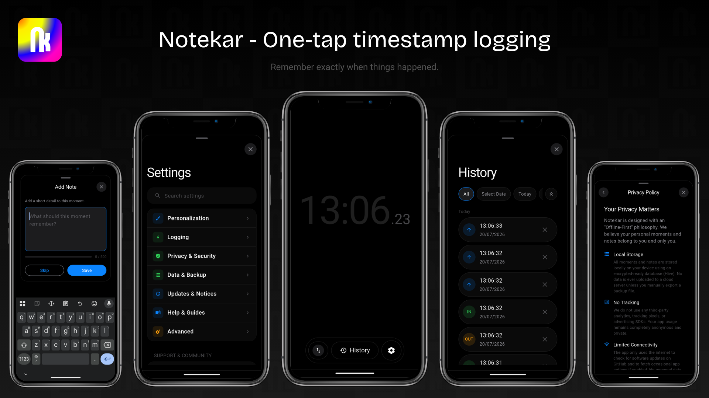](https://github.com/dheeraz101/Notekar-Android)

### *The Sovereign Time Instrument & Existential Compass for Android*

**Daily 24h Conscious Accounting • The Cost of the Void • Seamless Focus • 100% Private & Offline**

---

[](https://github.com/dheeraz101/Notekar-Android/releases)
[](https://github.com/dheeraz101/Notekar-Android/releases)
[](https://developer.android.com)
[](https://flutter.dev)
[](LICENSE)
[](https://notekarapp.vercel.app/privacy.html)
[](https://github.com/dheeraz101/Notekar-Android)

<p align="center">
  <a href="https://github.com/dheeraz101/Notekar-Android/releases/latest">
    
  </a>
  &nbsp;&nbsp;
  <a href="https://notekarapp.vercel.app/">
    
  </a>
  &nbsp;&nbsp;
  <a href="https://github.com/dheeraz101/Notekar-Android/releases">
    
  </a>
</p>

</div>

---

> [!IMPORTANT]
> **"NoteKar has revisioned itself."**  
> Moving beyond a minimalist clicker, NoteKar elevates into an existential compass: accounting for finite human conscious hours, confronting the cost of the unaccounted void, and perfecting sensory chronometer craft. Every second is accounted for; the void is revealed.

---

## 🛡️ Core Pillars of Trust & Data Sovereignty

| 🔒 100% Offline-First | 🚫 Zero Telemetry | ⚡ Sensory Chronometer | 💾 True Data Sovereignty |
| :--- | :--- | :--- | :--- |
| Runs completely air-gapped on your device. Zero servers, zero account sign-ins, zero cloud round-trips. | Zero Google Analytics, zero Firebase, zero crash trackers, zero advertising SDKs. Completely verifiable. | Optically centered tall Bebas Neue numerals with responsive haptic feedback and instant glass tap. | Stored in an ACID-compliant local Isar database. 1-tap export to JSON, CSV, .ICS, and Obsidian Markdown. |

---

## 📸 Visual UI Gallery

<div align="center">

| Welcome & Onboarding | Sovereign Themes | Privacy Controls | Home Chronometer | Life Ledger History |
| :---: | :---: | :---: | :---: | :---: |
| 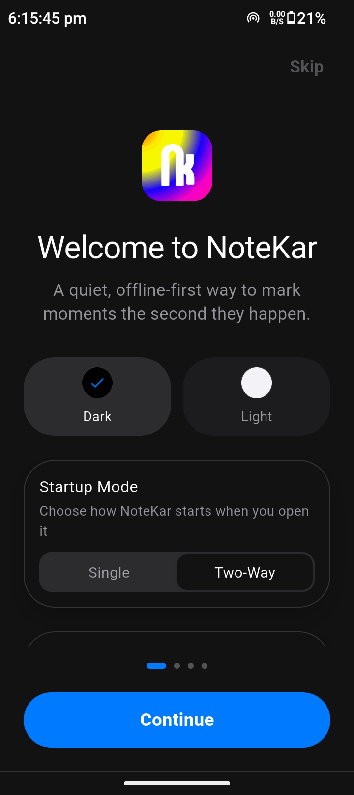 | 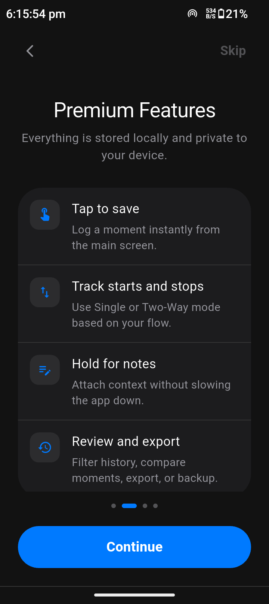 | 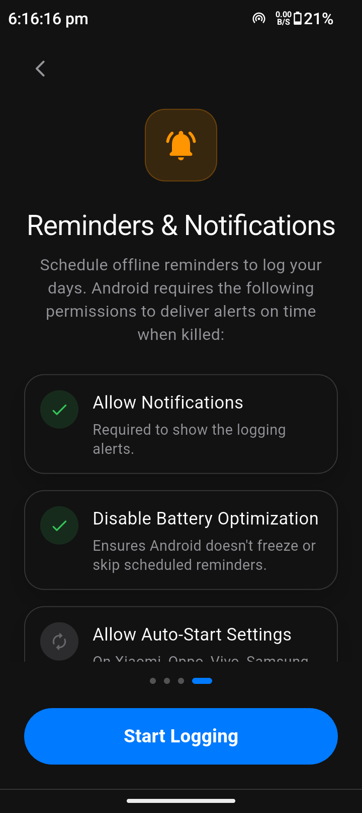 | 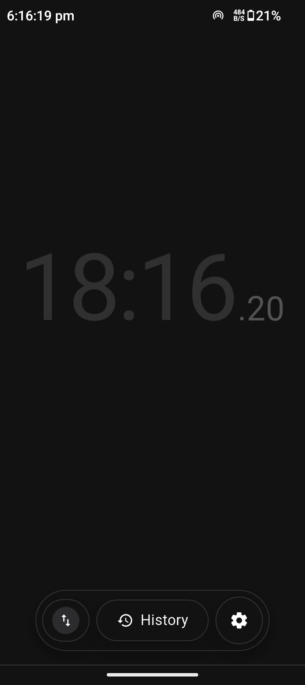 | 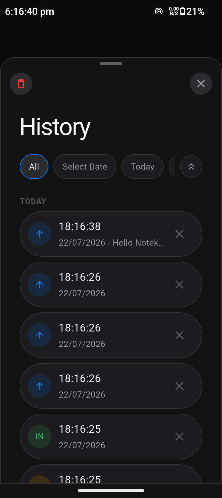 |
| _Zero-friction start_ | _OLED dark & themes_ | _Transparent security_ | _Instant tap canvas_ | _Connected moments_ |

| Settings Dashboard | Security & Biometrics | Offline Guides | Analytics & Trends | Proactive Alarms |
| :---: | :---: | :---: | :---: | :---: |
| 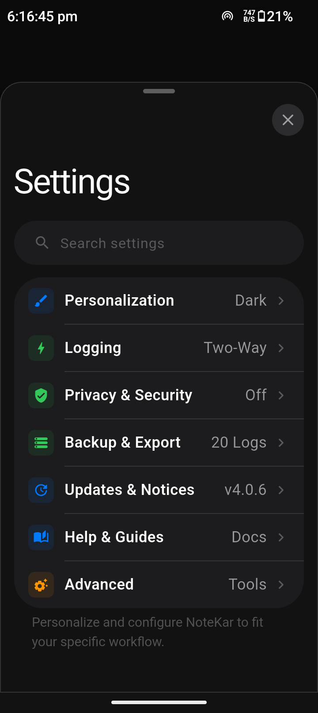 | 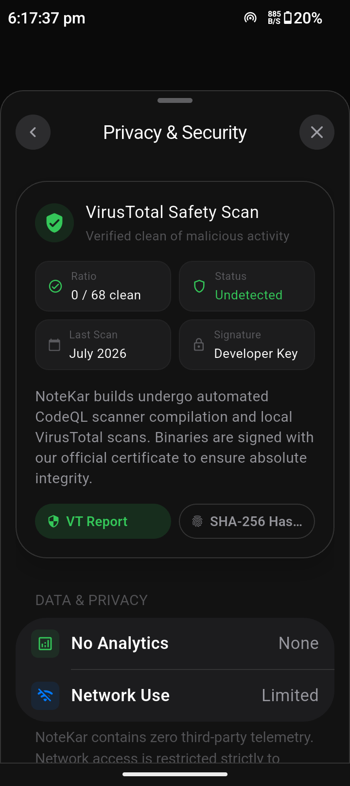 | 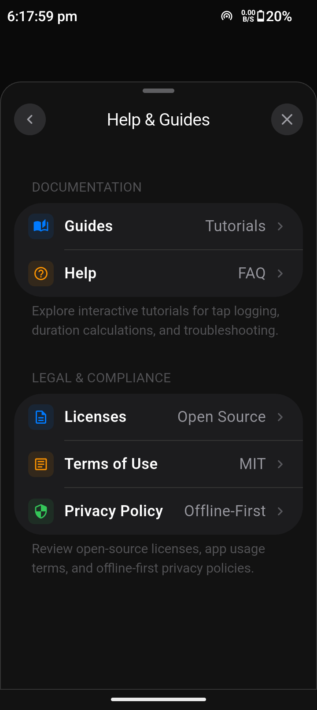 | 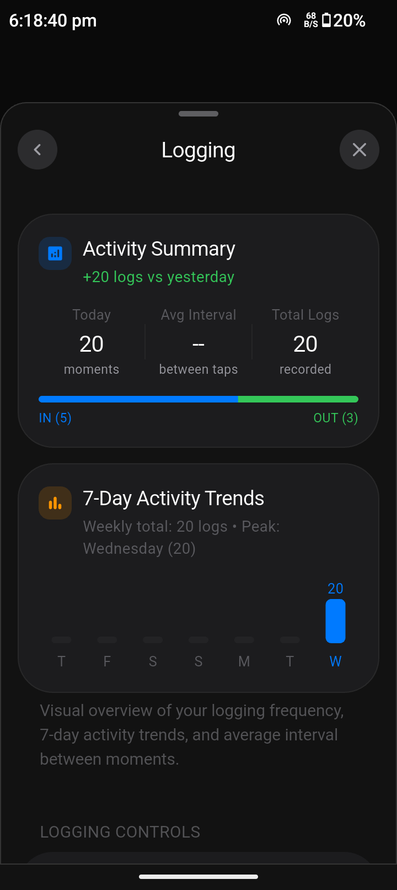 | 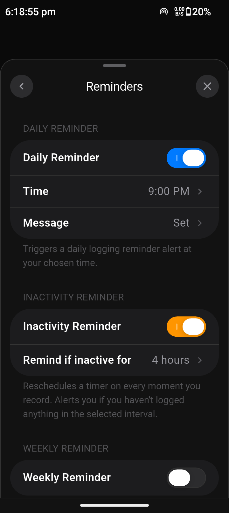 |
| _24 modular tools_ | _Biometric PIN vault_ | _Offline documentation_ | _Interactive trends_ | _Doze-friendly alarms_ |

</div>

---

## 🌟 Flagship Features

### ⏱️ 1. Spatial Chronometer & Classic Sovereign Design
- **Optical Midpoint Centering**: Mathematically positioned at the display's optical midpoint, eliminating vertical optical bias.
- **Authentic Bebas Neue Numerals**: Offline bundled tall typography (`assets/fonts/BebasNeue-Regular.ttf`) scaled to 144pt tabular figures.
- **One-Tap Glass Capture**: Tap anywhere on glass to record timestamps with responsive tactile haptic pulses.
- **Dual Operating Modes**: Single one-shot counters (`00`–`99`) or Two-Way (`IN` / `OUT`) interval tracking with unbroken continuity.
- **Classic 2000s Sovereign Craft**: Classic tactile God Mode insignia, Matrix Phosphor Terminal, Kindle E-Ink Paperwhite, and AMOLED Pitch Black themes.

### ⏳ 2. Universal Interval Ledger (UIL) & Life Audit
- **Multi-Track Category Interval Reconstruction**: Independent multi-track state machine prevents cursor collisions across overlapping categories (`Deep Work`, `Rest & Recovery`, `Study`).
- **Midnight Slicing (Zero Orphan Endpoints)**: Intelligently slices intervals crossing midnight at 23:59:59.999 so each day receives exact proportional conscious hours with zero severed endpoints.
- **$O(N \log N)$ Interval Union**: Merges concurrent claims, giving conscious Rest & Recovery precedence over unmonitored background voids.
- **24-Hour Conscious Accounting**: Partitions every solar day into:
  $$\text{Total Day (24h)} = \text{Sleep} + \text{Logistics} + \text{Conscious Window}$$
- **The Cost of the Void**: Quantifies unrecorded waking time lost to unintentional drift:
  $$\text{Unaccounted Void} = \text{Conscious Window} - \text{Logged Focus Sessions}$$
- **6 Temporal Horizons**: Inspect your intentionality ratio across **Today**, **Weekly (7d)**, **Monthly (30d)**, **Half-Quarterly (45d)**, **Half-Yearly (180d)**, and **Planetary Yearly (365d)**.

### 🎙️ 3. Multimodal Voice Memos & Photo Attachments
- **Dynamic Amplitude Waveform Visualizer**: Real-time microphone amplitude metering bar animation while recording voice notes, confirming active voice input.
- **Full-Width Voice Notes Player**: Interactive audio player pill spanning 100% card width with 1:1 finger waveform scrubbing, 20-bar completion lighting, and 1x / 1.5x / 2x speed cycling with zero paused-state playback leakage.
- **Full-Width Photo Attachments**: High-resolution camera and gallery attachments rendered full-width with collapsible previews and persistent thumbnail caching.

### 📜 4. Life Ledger Timeline & Rest Lifecycle
- **Top-Aligned Continuous Rail Nodes**: Single-entry number circles mathematically aligned with card headers, ensuring pristine vertical continuity even on tall cards with media and long notes.
- **Connected Session Pairing**: Automatically connects chronological `IN` and `OUT` moments into fluid session cards with duration pills.
- **Robust Rest & Recovery Lifecycle**: Strict active-day bounding ensures historical logs never persist as zombie live sessions while preserving instant 1-tap live termination.
- **Undo Safety Bed**: Solid red swipe-to-delete backing with a 5-second Dynamic Island countdown undo pill.
- **iOS-Style Calendar Sheet**: Fluid calendar sheet with solid iOS System Red selection rings, past-date jumps, and event dots.

### 📊 5. Executive Intelligence Hub & Health Balance
- **Cognitive Work-to-Rest Ratio**: Tracks focus hours against restorative intervals with Apple Health-style balance indicators (🟢 Balanced, 🟡 High Intensity, 🔴 Rest Deficit).
- **Dynamic Burn-Down Velocity**: Compares actual completion rate against elapsed days with real-time status pills (🟢 +18% Ahead of Pace, 🟡 On Pace, 🔴 Deficit Rising).
- **Flow State Quality Index**: Analyzes focus session distribution: Deep Focus ($\ge 45\text{m}$), Flow Blocks ($20\text{–}44\text{m}$), and Fragmented Bursts ($<20\text{m}$).
- **Rest Gap Recovery Rate**: Measures conscious voids redeemed via Rest & Recovery vs. unmonitored loss.
- **90-Day Streaks Heatmap & Circadian Bias**: Visual activity density grid and circadian hourly breakdown across Morning, Afternoon, Evening, and Night.

### 🎯 6. Target & Goals Engine with Screen-Wide Confetti
- **Active Goal Selection**: Dedicated Target & Goals selector directly inside persistent notifications, home screen widgets, and target cards.
- **Intentional Pacing & Live Deficit**: Real-time burn-down tracking displaying elapsed focus hours against remaining deficits (`14h 20m / 20h` • `5h 40m to go`).
- **Screen-Wide Confetti & Audio Fanfare**: Full-screen confetti explosion and celebratory audio fanfare whenever a goal target is reached.

### 🔎 7. Search Notes Full-Text & Multimodal Index
- **Unified Multimodal Search**: High-performance full-text search indexing text notes, voice memos, photo attachments, and single/2-way moments.
- **Direct Inline Playback & Tap-to-Edit**: Play voice memos, preview photo attachments, and tap the prominent `Edit` button for instant note refinement.

### 🌱 8. Sobriety Companion & Mindfulness
- **21 Neuroscience Milestones**: Track habits and clean streaks across 34 narrative themes (Science, Samurai, Cyberpunk, etc.).
- **Urge Surfing Breathing Guide**: Guided 4-7-8 breathing circle to conquer cravings and regulate the nervous system.
- **Streak Shields**: Emergency protection mechanics preventing accidental streak resets.

---

## ⚖️ Why NoteKar vs. Traditional Trackers?

| Dimension | Traditional Trackers (Toggl, Clockify) | NoteKar Android |
| :--- | :--- | :--- |
| **Privacy & Telemetry** | Cloud sync, tracking pixels, telemetry SDKs | **100% Offline-First, Zero Telemetry** |
| **Account Requirement** | Mandatory email, phone, or Google sign-in | **Zero Accounts, Immediate Use** |
| **Capture Latency** | Multi-screen forms, category pickers | **1-Tap Glass Instant Capture** |
| **Conscious Accounting** | Passive duration totals | **Life Audit & Cost of the Void** |
| **Data Storage** | Remote proprietary cloud database | **Local Isar DB + SharedPreferences** |
| **Data Portability** | Rate-limited exports, vendor lock-in | **Full JSON, CSV, .ICS & Obsidian MD** |
| **Cost & Freedom** | Tiered monthly subscriptions | **100% Free & Open Source (MIT)** |

---

## 🌉 System Bridges & Integrations

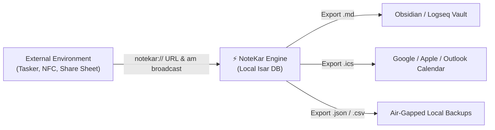
```mermaid
flowchart LR
    External["External Environment<br/>(Tasker, NFC, Share Sheet)"] -->|notekar:// URL & am broadcast| App["⚡ NoteKar Engine<br/>(Local Isar DB)"]
    App -->|Export .md| Obsidian["Obsidian / Logseq Vault"]
    App -->|Export .ics| Calendar["Google / Apple / Outlook Calendar"]
    App -->|Export .json / .csv| Backup["Air-Gapped Local Backups"]
```

<details>
<summary><b>🔗 Deep Linking URL Schemes (<code>notekar://</code>)</b></summary>

| Action | URL Scheme Pattern | Description |
| :--- | :--- | :--- |
| **Quick Log** | `notekar://log?type=single&note=Coffee` | Logs an instant single moment |
| **Check-In** | `notekar://in?note=Focus%20Work` | Starts a Two-Way tracking interval |
| **Check-Out** | `notekar://out?note=PR%20Merged` | Closes the active Two-Way interval |
| **Draft Note** | `notekar://note?text=Quick%20Idea` | Opens composer prefilled with text |
| **Open Screen** | `notekar://open?page=history` | Navigates directly to History, Stats, or Settings |
| **Breathe** | `notekar://reflect` | Launches the Time Reflection breathing sheet |

</details>

<details>
<summary><b>🤖 Tasker, MacroDroid & Termux Automation Broadcast API</b></summary>

> [!NOTE]
> The automation broadcast receiver requires explicit opt-in under **Settings → Integrations → Automation Broadcast API** and includes replay attack protection (`op_id`).

```bash
# Log a single moment via ADB or Tasker
am broadcast -a app.notekar.notekar.ACTION_LOG_MOMENT --es type single --es note "Deep Work" --es op_id "$(date +%s)"

# Check-in a Two-Way focus interval
am broadcast -a app.notekar.notekar.ACTION_LOG_MOMENT --es type in --es note "Study Session" --es op_id "$(date +%s)"

# Check-out a Two-Way interval
am broadcast -a app.notekar.notekar.ACTION_LOG_MOMENT --es type out --es note "Finished Chapter 4" --es op_id "$(date +%s)"
```

</details>

---

## 🛠️ Tech Stack & Directory Architecture

| Layer | Technology | Details |
| :--- | :--- | :--- |
| **Language** | [Dart](https://dart.dev/) & [Kotlin](https://kotlinlang.org/) | Type-safe reactive codebase |
| **Framework** | [Flutter](https://flutter.dev/) (`^3.12.0`) | High-performance 60-120 FPS rendering |
| **Typography** | [Bebas Neue](assets/fonts/BebasNeue-Regular.ttf) (OFL) | Bundled offline tall chronometer font |
| **Local Storage** | [Isar](https://isar.dev/) & SharedPreferences | Fast, ACID-compliant local database engine |
| **Design System** | Custom Apple HIG & iOS 26 High-Radius Style | Dynamic glass, haptics, and AMOLED dark mode |
| **Platform Target** | Android 5.0+ (API Level 21+) | Doze-compliant, 3-tier adaptive hardware engine |

```text
Notekar - Flutter/
├── android/                    # Native Android layer, App Widgets & Broadcast Receivers
├── assets/fonts/               # Bundled authentic Bebas Neue tall chronometer font
├── fastlane/metadata/          # Structured Play Store metadata & changelogs
├── lib/
│   ├── dialogs/                # Apple HIG modal bottom sheets, Life Audit & Goals
│   ├── l10n/                   # 7 offline locales (EN, HI, ES, FR, DE, JA, RU)
│   ├── models/                 # Domain models (Moment, Palette, SobrietyTheme)
│   ├── screens/                # Core screens (NoteKarHome, WelcomeScreen)
│   ├── services/               # Decoupled services (NotificationEngine, UpdateService)
│   └── widgets/                # Reusable UI widgets (ClockFace, PressableScale, Glass)
├── screenshot/                 # High-resolution showcase banner
└── test/                       # 100% passing unit, widget & sensory test suites
```

---

## 💻 Building & Running Locally

```bash
# 1. Clone the repository
git clone https://github.com/dheeraz101/Notekar-Android.git
cd "Notekar - Flutter"

# 2. Install Flutter packages
flutter pub get

# 3. Verify static analysis and test suite
dart analyze lib test
flutter test

# 4. Launch on your connected device or emulator
flutter run
```

<details>
<summary><b>🔑 Production Release Signing & Keystore Instructions</b></summary>

Keystore secrets (`*.jks`, `key.properties`) are strictly excluded from Git. To build a signed release APK:

1. Generate a keystore:
   ```bash
   keytool -genkey -v -keystore android/app/upload-keystore.jks -keyalg RSA -keysize 2048 -validity 10000 -alias upload
   ```
2. Create `android/key.properties`:
   ```properties
   storePassword=<your-store-password>
   keyPassword=<your-key-password>
   keyAlias=upload
   storeFile=upload-keystore.jks
   ```
3. Build the APK:
   ```bash
   flutter build apk --release
   ```

</details>

---

## 🌐 Multilingual & Global Community

NoteKar includes full native offline localization across 7 languages:

| Flag | Language | Code | Numbers | Status |
| :---: | :--- | :---: | :---: | :---: |
| 🇬🇧 | **English** | `en` | Standard | ✅ Complete |
| 🇮🇳 | **Hindi** (हिन्दी) | `hi` | Devanagari (०-९) | 🟡 Updating |
| 🇪🇸 | **Spanish** (Español) | `es` | Standard | 🟡 Updating |
| 🇫🇷 | **French** (Français) | `fr` | Standard | 🟡 Updating |
| 🇩🇪 | **German** (Deutsch) | `de` | Standard | 🟡 Updating |
| 🇯🇵 | **Japanese** (日本語) | `ja` | Standard | 🟡 Updating |
| 🇷🇺 | **Russian** (Русский) | `ru` | Standard | 🟡 Updating |

👉 **[Join our 50+ Target Community Languages Initiative (TRANSLATIONS.md)](TRANSLATIONS.md)**

---

## ☕ Support & Community

If NoteKar brings clarity and intentional focus to your daily existence, consider supporting its open-source journey:

<p align="center">
  <a href="https://www.buymeacoffee.com/dheeraz">
    
  </a>
  &nbsp;&nbsp;
  <a href="https://buymeachai.ezee.li/dheeraz">
    
  </a>
</p>

- 🛡️ **[Privacy Policy](https://notekarapp.vercel.app/privacy.html)** • 📜 **[Terms of Service](https://notekarapp.vercel.app/terms.html)**
- 🐛 **[GitHub Issues & Ideas](https://github.com/dheeraz101/Notekar-Android/issues)** • 📖 **[Changelog](CHANGELOG.md)**

---

## 📄 License & Attribution

- **License**: Distributed under the **[MIT License](LICENSE)**.
- **Initiative**: Proudly created under the **[YABP (Yet Another Boring Project)](https://yabp.netlify.app/?verify=https://notekarapp.vercel.app/)** initiative.
- **Developer**: [Dheeraz](https://github.com/dheeraz101)  
- **Made with ❤️ in India.**
